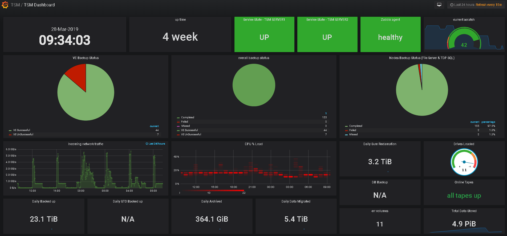

### tsm2zbx
# Zabbix monitoring for Tivoli Storage Manager (TSM).

---
 > ## TL;DR
> > Put this script on any system with both the TSM client and zabbix sender installed.
Update the variables in the configuration section below
Import the template into Zabbix (make sure you change the "MAX_TAPES" and "LOW_SCRATCHVOLS" Macros!!)
Do stuff with the pool stats section if you wish to monitor your storage pools
Verify the schedule section at the bottom of this script meets your needs, I've included my cron entries for reference
Heavly based upon an existing template found here - https://www.zabbix.com/forum/showthread.php?t=25238

----

### Making it work !

 1. Installing IBM TSM Client 8.1.4 on Ubuntu 16.04
Read [here](https://github.com/DukeMobileTech/posts/wiki/Installing-IBM-TSM-Client-8.1.4-on-Ubuntu-16.04) how to install IBM TSM Client 8.1.4 on Ubuntu 16.04. 
and insure `dsmadmc` client installed.
 2. Install Zabbix_Sender client 
 3. Import `zbx_tsm_templates.xml` to `Zabbix` server.
 4. Attached template to `TSM` node.
 5. Download `tsm.sh` script and make it execue `(chmod +x tsm.sh)`.
 6. Add to `Cron` `daily` and `hourly`. see note in file `tsm.sh`.

