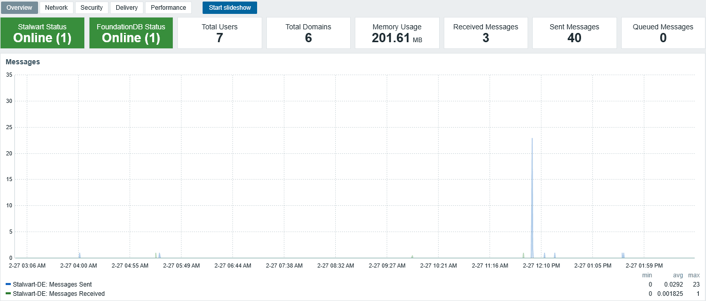

# Stalwart Mail Server by Zabbix Agent 2

## Overview
 
This template monitors a [Stalwart](https://stalw.art/) mail server instance via its built-in Prometheus metrics endpoint using Zabbix Agent 2 (active mode). It collects all metrics through a single master item and extracts individual values with Prometheus preprocessing.

The export contains **two templates**:

| Template | Description |
|----------|-------------|
| **Stalwart** | Core template — assign to every Stalwart host. Monitors the server process, database backends, mail flow, security events, and resource usage. |
| **Stalwart Cluster** | *Optional* — aggregates metrics across all hosts in the `Stalwart` host group using calculated items. Useful for multi-node deployments. |

### Monitored items

**Process monitoring**
- Stalwart process status
- Database backend detection (FoundationDB, MySQL/MariaDB, PostgreSQL, Redis/Valkey)

**Mail flow**
- Messages received / sent
- Queued messages
- DSN sent
- Reports queued
- Spam blocked

**Protocol connections (active & rate)**
- SMTP, IMAP, POP3, HTTP

**Security**
- Authentication successes / failures
- SPF, DKIM, DMARC failures
- TLS handshake errors
- ACME/Let's Encrypt errors
- IPs banned, Auth bans, Brute Force bans, Loiter bans, Threats blocked
- Invalid SMTP commands

**Performance & resources**
- Server memory usage
- Database read / write operations

**Inventory**
- Total users
- Total domains

### Triggers

| Trigger | Severity |
|---------|----------|
| Stalwart process not running | High |
| FoundationDB / MySQL / PostgreSQL / Redis is down (auto-detected) | High |
| High authentication failure rate (>50) | Warning |
| High spam volume (>100) | Warning |
| High message queue depth (>100) | Average |
| High memory usage (>1 GB) | Warning |

### Dashboards



Both templates include a built-in dashboard with five pages:

- **Overview** — Status indicators for Stalwart and its detected database backends, total user and domain counts, memory usage, and graphs for message traffic and service uptime.
- **Network** — Active connection counts and connection-rate graphs for SMTP, IMAP, POP3, and HTTP.
- **Security** — Counters for threats blocked, IPs banned, spam blocked, authentication failures, DMARC warnings, and TLS errors; a ban-activity graph covering five ban types, and a security-events graph covering seven event types.
- **Delivery** — Counters for queued, received, and sent messages, active delivery connections, DSN and report counts; individual graphs for messages received, messages sent, and queue depth.
- **Performance** — Graphs for database read/write operations and server memory usage over time.

## Requirements

- Zabbix Server / Proxy **7.0** or later
- Zabbix Agent 2 installed on the Stalwart host
- Stalwart Mail Server with the Prometheus metrics endpoint enabled
- `curl` available on the monitored host

## Setup

### 1. Enable the Prometheus endpoint in Stalwart

1. Open the Stalwart web admin and navigate to **Telemetry → Metrics**.
2. Set the **Username** to `zabbix`.
3. Generate a long random password **without special characters** and enter it as the **Secret**.
4. Enable the **Enable endpoint** toggle.
5. Click **Save & Reload** on every Stalwart installation.

### 2. Configure Zabbix Agent 2

Create the file `/etc/zabbix/zabbix_agent2.d/stalwart.conf` with the following content (replace `PASSWORD` with the secret you generated above):

```
UserParameter=stalwart.metrics,curl -s -u 'zabbix:PASSWORD' http://127.0.0.1/metrics/prometheus
```

### 3. Restart Zabbix Agent 2

### 4. Import and assign the template

1. In Zabbix, go to **Data collection → Templates** and import `template_stalwart.yaml`.
2. Assign the **Stalwart** template to every host running Stalwart.

### 5. (Optional) Set up cluster monitoring

If you run multiple Stalwart nodes and want aggregated cluster-level metrics:

1. Create a host group called **Stalwart** and add all your Stalwart hosts to it.
2. Create a dedicated (unused) host — for example named `Stalwart-Cluster` — and assign the **Stalwart Cluster** template to it. This host does not need an agent; it only uses calculated items that aggregate data from the `Stalwart` host group.

#### Cluster triggers

| Trigger | Severity |
|---------|----------|
| Stalwart / FoundationDB / MySQL / PostgreSQL / Redis Degraded (node count below total) | Warning |
| Stalwart / FoundationDB / MySQL / PostgreSQL / Redis Disaster (half or more nodes down) | Disaster |

Database cluster triggers only fire when the corresponding backend has been seen running in the last 30 days, preventing false positives for unused backends.

## Author

Joël de Jager