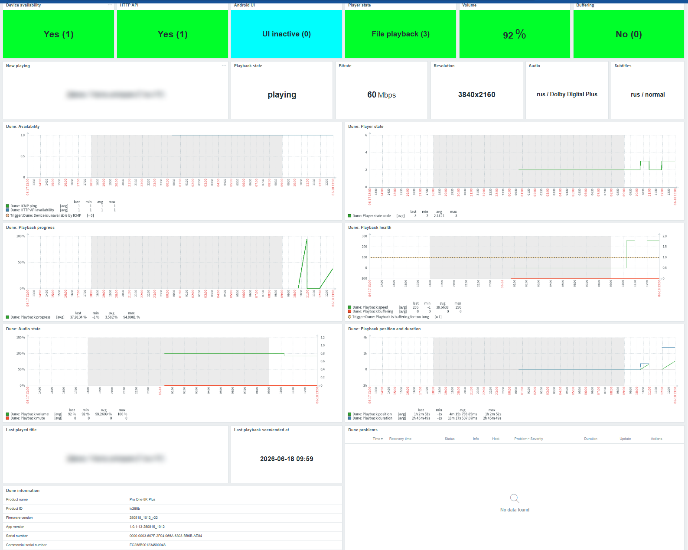

# Zabbix Dune HD HTTP Monitoring


A reusable **Zabbix 7.4** template for monitoring **Dune HD media players** through the built-in HTTP IP Control API.

The template collects device availability, HTTP API availability, player state, playback progress, buffering status, current bitrate, playback metadata, audio/subtitle information, firmware/app versions, serial information, and provides a ready-to-use Zabbix dashboard.

The template was built and tested against **Dune HD Pro One 8K Plus** using the HTTP status endpoint:

```text
/cgi-bin/do?cmd=status&result_syntax=json
```

Current template statistics:

```text
Template version: 1.1
Items: 44
Graphs: 7
Dashboard widgets: 22
```

---

## Template metadata

| Field | Value |
|---|---|
| Author | TyranR |
| Zabbix version | 7.4 |
| Template version | 1.1 |
| Template file | `template_dune_hd_by_http.yaml` |
| Community templates path | `Applications/Media_Players/template_dune_hd_by_http/7.4/` |
| Tested device | Dune HD Pro One 8K Plus |
| Monitoring method | HTTP agent master item with dependent items |
| Protocol / API | Dune HTTP IP Control API |
| Main endpoint | `/cgi-bin/do?cmd=status&result_syntax=json` |
| Default API port | `80` |
| Alternative API port | `11080` for some Google-certified ATV models |
| External scripts | No |
| Zabbix agent on device | No |
| License | MIT |

---

## What this solves

Dune HD media players are usually not monitored like servers or network devices, even though they are often part of a home cinema, demo room, IPTV setup, NAS-based media setup, or small media infrastructure.

This template gives Zabbix a compact operational view of a Dune HD player:

- Is the media player reachable over the network?
- Is the HTTP IP Control API responding?
- Is the player in standby, navigator, file playback, DVD playback, Blu-ray playback, or black screen mode?
- Is playback currently active?
- What is the current playback state?
- What is the playback position, duration, and progress percentage?
- Is playback buffering?
- What is the current playback bitrate?
- What is the current video resolution?
- Which audio and subtitle tracks are selected?
- What is currently playing?
- What was played last?
- When was playback last seen active or approximately ended?
- What are the firmware, app version, product ID, and serial numbers?

---

## Project status

This project is usable and tested with **Dune HD Pro One 8K Plus**.

The template intentionally focuses on the stable main Dune IP Control status API. It does not require SNMP, SSH, root access, Android debugging, or a Zabbix agent installed on the media player.

Version **1.1** includes advanced playback metadata, current-vs-last playback dashboard logic, bitrate/resolution/audio/subtitle monitoring, playback URL collection, and last playback tracking.

---

## Community repository note

This version is prepared for the Zabbix community templates repository.
The template uses an HTTP agent master item and dependent items only.
The template does not require external scripts, SNMP, SSH, Android debugging, or a Zabbix agent installed on the media player.

---

## Current limitations

- Tested with **Dune HD Pro One 8K Plus** only.
- The template uses the Dune HTTP IP Control API, not SNMP.
- No Zabbix agent is installed on the media player.
- Hardware metrics such as CPU, RAM, temperature, storage wear, and Android process metrics are not collected.
- Playback-specific fields are only available when Dune exposes them in the status response.
- `dune.playback_speed`, `dune.playback_duration`, and `dune.playback_position` use `Discard value` when the corresponding JSON field is absent, so graphs may show gaps outside playback.
- `dune.playback_progress_pct` returns `0%` when playback progress cannot be calculated.
- `dune.playback_caption` is the **current now-playing** field and returns `-` outside playback.
- `dune.last_played_title` is a separate long-history field that stores the last observed playback title.
- `dune.playback_state` returns `stopped` outside playback so the dashboard does not keep a stale `playing` value.
- `dune.playback_current_bitrate` returns `0 bps` outside playback so the dashboard does not keep a stale bitrate value.
- `dune.subtitles_track` may contain `-1` when Dune reports that subtitles are available but currently not selected.
- `dune.android_screensaver_active` is not an availability metric. During testing, `android_app_active` behaved like a screensaver/shell-screen flag and may switch to `0` during native media playback.
- `dune.last_playback_ended_at` is an approximation. It stores the last time Zabbix still saw active playback; precision depends on `{$DUNE.UPDATE.INTERVAL}`.
- The timestamp in `dune.last_playback_ended_at` is generated by JavaScript preprocessing on the Zabbix Server or Proxy side, so it depends on the server/proxy/container timezone.
- The additional `/cgi-bin/plugins/remote-control/do?cmd=...` plugin API is intentionally not used. It is less documented and did not work reliably during testing.
- The information dashboard widget uses the `Item history` widget with 6 visible rows and a 15-minute refresh interval. It is a compact inventory-style view, not a true latest-values table.

---

## Screenshots



---

## Features

### Availability

- ICMP reachability check
- HTTP API TCP port availability check
- API data fetch validation
- Trigger dependencies to reduce duplicate alerts

### Player state

- Raw player state from Dune API
- Numeric player state code for graphs and dashboards
- Current playback state
- Previous playback state
- Last playback event
- Screensaver/shell-screen activity flag
- Value mapping for readable player states:
  - Unknown
  - Standby
  - Navigator
  - File playback
  - DVD playback
  - Blu-ray playback
  - Black screen

### Playback monitoring

- Playback speed
- Playback duration
- Playback position
- Playback progress percentage
- Playback buffering flag
- DVD menu flag
- Current playback bitrate
- Video flag
- Scrambling detected flag
- Hangup watchdog activation counter
- Buffering trigger when buffering is reported continuously

### Playback metadata

- Current now-playing title
- Last played title
- Current playback extra caption/chapter
- Full playback URL/path
- Approximate last playback seen/ended time
- Current video width
- Current video height
- Combined video resolution
- Selected audio track index
- Selected audio language
- Selected audio codec
- Selected subtitles track index
- Selected subtitles language
- Selected subtitles codec

### Audio

- Playback volume
- Playback mute state

### Device inventory

- Product name
- Product ID
- Protocol version
- Firmware version
- Dune app version
- Serial number
- Commercial serial number

### Dashboard

Included template dashboard:

```text
Dune overview
```

The dashboard includes:

- Device availability
- HTTP API availability
- Screensaver state
- Player state
- Volume
- Buffering
- Now playing
- Playback state
- Bitrate
- Resolution
- Audio
- Subtitles
- Availability graph
- Player state graph
- Playback progress graph
- Playback health graph
- Audio state graph
- Playback position and duration graph
- Last played title
- Last playback seen/ended at
- Dune information table (`Item history`, 6 rows, 15-minute refresh)
- Dune problems widget

---

## Tested with

- Zabbix Server 7.4
- Zabbix web dashboard widgets from Zabbix 7.4
- Dune HD Pro One 8K Plus
- Dune HTTP IP Control API
- HTTP API port `80`
- JSON status response from `/cgi-bin/do?cmd=status&result_syntax=json`
- Zabbix Server/Proxy with network access to the media player

---

## Repository structure

```text
Applications/Media_Players/template_dune_hd_by_http/
└── 7.4/
    ├── README.md
    ├── template_dune_hd_by_http.yaml
    └── files/
        └── dashboard-dune-overview.png
```

---

## Requirements

- Zabbix 7.4 or newer
- Dune HD media player with HTTP IP Control API available
- Zabbix Server or Zabbix Proxy must be able to reach the player on:
  - ICMP, if you use the included ping check
  - TCP `80` for regular Dune HD models
  - TCP `11080` for Google-certified ATV models, if applicable
- A Zabbix host interface with the Dune IP address so `{HOST.CONN}` resolves correctly

No Zabbix agent is required on the Dune media player.

If your Zabbix Server is outside the local network, use a **Zabbix Proxy** in the same LAN as the Dune player and assign the Dune host to that proxy.

---

## Installation

### 1. Test the Dune HTTP API manually

From the Zabbix Server or Zabbix Proxy network, run:

```bash
curl "http://<dune_ip>/cgi-bin/do?cmd=status&result_syntax=json"
```

Expected result should be a JSON response similar to:

```json
{
  "protocol_version": "6",
  "android_app_active": "1",
  "player_state": "standby",
  "playback_volume": "100",
  "playback_mute": "0",
  "product_id": "tv288b",
  "firmware_version": "250815_1012_r22",
  "app_version": "1.0.1-13-250815_1012",
  "product_name": "Pro One 8K Plus"
}
```

During playback, the response may also include metadata such as:

```json
{
  "player_state": "file_playback",
  "playback_state": "playing",
  "playback_url": "/tmp/mnt/smb/0/Movies/Movie/File.mkv",
  "playback_current_bitrate": "59115452",
  "playback_video_width": "3840",
  "playback_video_height": "2160",
  "audio_track": "10",
  "subtitles_track": "8",
  "playback_caption": "Movie title",
  "playback_extra_caption": "Chapter 01"
}
```

For Google-certified ATV models, try port `11080`:

```bash
curl "http://<dune_ip>:11080/cgi-bin/do?cmd=status&result_syntax=json"
```

---

### 2. Import the template

Import the template in Zabbix:

```text
Data collection → Templates → Import
```

Import:

```text
template_dune_hd_by_http.yaml
```

---

### 3. Create the Dune host

Create a Zabbix host for the media player.

Example:

```text
Host name: Dune8
Visible name: Dune8
Groups: Media players
Templates: Dune HD by HTTP
```

Add a host interface with the Dune IP address. An agent interface can be used only as an IP holder for `{HOST.CONN}`; the media player does not need a Zabbix agent.

Example:

```text
Interface type: Agent
IP address: <dune_ip>
Port: 10050
```

The port is not used by the HTTP API items. The important part is that `{HOST.CONN}` resolves to the Dune IP address.

If the player is in a remote LAN, set:

```text
Monitored by proxy: <your local Zabbix Proxy>
```

---

### 4. Configure host macros

The template defines these macros:

| Macro | Default | Description |
|---|---:|---|
| `{$DUNE.API.PORT}` | `80` | Dune HTTP IP Control API port. Regular models usually use `80`; Google-certified ATV models may use `11080`. |
| `{$DUNE.TIMEOUT}` | `5s` | HTTP agent timeout for Dune API requests. |
| `{$DUNE.UPDATE.INTERVAL}` | `1m` | Update interval for the Dune status endpoint. |

For Google-certified ATV models, override:

```text
{$DUNE.API.PORT}=11080
```

---

## Items

### Availability

| Item | Type | Key | Units / Value | History |
|---|---|---|---|---:|
| Dune: ICMP ping | Simple check | `icmpping` | mapped enum (Dune flag) | 7d |
| Dune: HTTP API availability | Simple check | `net.tcp.service[http,,{$DUNE.API.PORT}]` | mapped enum (Dune flag) | 7d |
| Dune: Status raw | HTTP agent | `dune.status.raw` | text | 7d |
### Device inventory

| Item | Type | Key | Units / Value | History |
|---|---|---|---|---:|
| Dune: Protocol version | Dependent | `dune.protocol_version` | 0/1 or number | 7d |
| Dune: Product name | Dependent | `dune.product_name` | text | 7d |
| Dune: Product ID | Dependent | `dune.product_id` | text | 7d |
| Dune: Firmware version | Dependent | `dune.firmware_version` | text | 7d |
| Dune: App version | Dependent | `dune.app_version` | text | 7d |
| Dune: Serial number | Dependent | `dune.serial_number` | text | 7d |
| Dune: Commercial serial number | Dependent | `dune.commercial_serial_number` | text | 7d |
### Player state

| Item | Type | Key | Units / Value | History |
|---|---|---|---|---:|
| Dune: Android screensaver | Dependent | `dune.android_screensaver_active` | mapped enum (Dune screensaver state) | 7d |
| Dune: Player state | Dependent | `dune.player_state` | text | 7d |
| Dune: Player state code | Dependent | `dune.player_state.code` | mapped enum (Dune player state) | 7d |
| Dune: Playback state | Dependent | `dune.playback_state` | text | 90d |
| Dune: Previous playback state | Dependent | `dune.previous_playback_state` | text | 30d |
| Dune: Last playback event | Dependent | `dune.last_playback_event` | text | 30d |
### Playback

| Item | Type | Key | Units / Value | History |
|---|---|---|---|---:|
| Dune: Playback speed | Dependent | `dune.playback_speed` | number | 7d |
| Dune: Playback duration | Dependent | `dune.playback_duration` | s | 7d |
| Dune: Playback position | Dependent | `dune.playback_position` | s | 7d |
| Dune: Playback progress | Dependent | `dune.playback_progress_pct` | % | 7d |
| Dune: Playback buffering | Dependent | `dune.playback_is_buffering` | mapped enum (Dune flag) | 7d |
| Dune: Playback DVD menu | Dependent | `dune.playback_dvd_menu` | mapped enum (Dune flag) | 7d |
| Dune: Playback volume | Dependent | `dune.playback_volume` | % | 7d |
| Dune: Playback mute | Dependent | `dune.playback_mute` | mapped enum (Dune flag) | 7d |
| Dune: Playback current bitrate | Dependent | `dune.playback_current_bitrate` | bps | 90d |
| Dune: Is video | Dependent | `dune.is_video` | mapped enum (Dune flag) | 90d |
| Dune: Scrambling detected | Dependent | `dune.scrambling_detected` | mapped enum (Dune flag) | 90d |
| Dune: Hangup watchdog activations | Dependent | `dune.hangup_watchdog_activations` | 0/1 or number | 365d |
### Media metadata

| Item | Type | Key | Units / Value | History |
|---|---|---|---|---:|
| Dune: Playback caption | Dependent | `dune.playback_caption` | text | 365d |
| Dune: Last played title | Dependent | `dune.last_played_title` | text | 1825d |
| Dune: Playback extra caption | Dependent | `dune.playback_extra_caption` | text | 365d |
| Dune: Playback URL | Dependent | `dune.playback_url` | text | 1825d |
| Dune: Last playback ended at | Dependent | `dune.last_playback_ended_at` | text | 1825d |
### Video

| Item | Type | Key | Units / Value | History |
|---|---|---|---|---:|
| Dune: Video width | Dependent | `dune.playback_video_width` | 0/1 or number | 90d |
| Dune: Video height | Dependent | `dune.playback_video_height` | 0/1 or number | 90d |
| Dune: Video resolution | Dependent | `dune.playback_video_resolution` | text | 90d |
### Audio and subtitles

| Item | Type | Key | Units / Value | History |
|---|---|---|---|---:|
| Dune: Current audio track index | Dependent | `dune.audio_track` | 0/1 or number | 90d |
| Dune: Current audio | Dependent | `dune.current_audio` | text | 365d |
| Dune: Current audio language | Dependent | `dune.current_audio_language` | text | 365d |
| Dune: Current audio codec | Dependent | `dune.current_audio_codec` | text | 365d |
| Dune: Current subtitles track index | Dependent | `dune.subtitles_track` | number, may be `-1` | 90d |
| Dune: Current subtitles | Dependent | `dune.current_subtitles` | text | 365d |
| Dune: Current subtitles language | Dependent | `dune.current_subtitles_language` | text | 365d |
| Dune: Current subtitles codec | Dependent | `dune.current_subtitles_codec` | text | 365d |

---

### Item grouping and Zabbix tags

The item tables above are grouped for documentation readability. These groups do not always match the internal Zabbix item tags one-to-one.

The template uses `component` tags for filtering, dashboarding, and problem/event context inside Zabbix.

Current `component` tag values include:

| Component tag | Purpose |
|---|---|
| `network` | ICMP/network reachability checks |
| `api` | HTTP API availability and raw status data |
| `inventory` | Product name, product ID, serial numbers |
| `firmware` | Firmware version |
| `application` | Dune application or shell/screen state |
| `player` | High-level player state |
| `playback` | Playback state, progress, bitrate, URL, captions, last played data |
| `video` | Video-related playback fields |
| `audio` | Audio volume, mute state, selected audio track metadata |
| `subtitles` | Selected subtitle track metadata |
| `system` | Miscellaneous system/runtime counters |

For example, the README section `Media metadata` contains items that are tagged as `component=playback` in Zabbix because they are only available as part of playback status data.

---

## HTTP API endpoint

The main master item is:

```text
Name: Dune: Status raw
Key: dune.status.raw
URL: http://{HOST.CONN}:{$DUNE.API.PORT}/cgi-bin/do?cmd=status&result_syntax=json
```

Most metrics are dependent items extracted from this JSON response by JSONPath or JavaScript preprocessing.

---

## Important preprocessing logic

### Player state code

```text
Name: Dune: Player state code
Key: dune.player_state.code
```

The item maps textual `player_state` values to numeric values for graphs and dashboards:

| Value | Meaning |
|---:|---|
| `0` | Unknown |
| `1` | Standby |
| `2` | Navigator |
| `3` | File playback |
| `4` | DVD playback |
| `5` | Blu-ray playback |
| `6` | Black screen |

---

### Current vs last playback title

The template intentionally separates **current now-playing state** and **last played history**.

```text
dune.playback_caption
```

Current dashboard field. It returns the current title during playback and returns `-` outside playback.

```text
dune.last_played_title
```

Long-history field. It stores the last observed playback title and keeps it after playback stops.

This avoids stale values in the `Now playing` dashboard card while still preserving the last played title.

---

### Current playback state and bitrate reset

The current playback row is designed to clear when playback stops:

```text
dune.playback_state
```

returns:

```text
stopped
```

outside active playback.

```text
dune.playback_current_bitrate
```

returns:

```text
0
```

outside active playback.

This prevents the dashboard from showing stale values such as `playing` or `63 Mbps` after the player has already returned to `Navigator`.

---

### Playback progress

```text
Name: Dune: Playback progress
Key: dune.playback_progress_pct
```

The item calculates:

```text
playback_position / playback_duration * 100
```

If playback position or duration is unavailable, the item returns `0` to avoid negative values on the graph.

---

### Optional playback metrics

The following items use `Discard value` when the JSON field is absent:

```text
dune.playback_speed
dune.playback_duration
dune.playback_position
dune.playback_video_width
dune.playback_video_height
```

This prevents standby/non-playback periods from polluting graph min/avg values with artificial fallback values.

Note: `dune.playback_current_bitrate` intentionally returns `0` outside playback because it is used by the current dashboard card.

---

### Current audio and subtitles

The template uses JavaScript preprocessing to resolve the selected audio/subtitle track index into readable values.

Example source fields:

```text
audio_track = 10
audio_track.10.lang = eng
audio_track.10.codec = TrueHD

subtitles_track = 8
subtitles_track.8.lang = eng
subtitles_track.8.type = normal
```

Resulting items:

```text
dune.current_audio = eng / TrueHD
dune.current_subtitles = eng
```

Dune may also report:

```text
subtitles_track = -1
```

This means that subtitle tracks may exist in the file, but no subtitle track is currently selected. For this reason, `dune.subtitles_track` is stored as a numeric value that can accept `-1`.

---

### Last playback seen/ended time

```text
Name: Dune: Last playback ended at
Key: dune.last_playback_ended_at
```

This item is intentionally approximate.

While playback is active, JavaScript preprocessing stores the current Zabbix Server/Proxy-side time in this format:

```text
YYYY-MM-DD HH:MM
```

When playback is not active, the JavaScript step returns a service marker:

```text
__DISCARD__
```

A following Regular expression preprocessing step discards this marker using `Custom on fail: Discard value`.

This prevents the item from becoming unsupported outside playback and keeps the last valid playback timestamp.

The preprocessing chain is:

```text
1. JavaScript
2. Regular expression + Custom on fail: Discard value
```

Regular expression step:

```text
Pattern: ^(?!__DISCARD__$).+
Output: \0
Custom on fail: Discard value
```

With the default update interval:

```text
{$DUNE.UPDATE.INTERVAL} = 1m
```

the end-time precision is roughly one polling interval.

---

## Triggers

| Trigger | Severity | Expression / logic |
|---|---|---|
| Dune: Device is unavailable by ICMP | Average | `icmpping = 0` for 5 minutes |
| Dune: HTTP API is unavailable | Warning | HTTP API port is down while ICMP is available |
| Dune: Failed to fetch status data | Warning | No data from `dune.status.raw` for 5 minutes while ICMP is available |
| Dune: Playback is buffering for too long | Warning | `dune.playback_is_buffering = 1` for 5 minutes |
| Dune: Firmware version has changed | Information | Firmware version changed from the previous value |
| Dune: App version has changed | Information | Dune app version changed from the previous value |

Important note:

```text
dune.android_screensaver_active
```

is intentionally **not** used as a problem trigger. It may switch to `0` during native media playback and should not be treated as a device failure.

---

## Value mappings

### Dune flag

| Value | Meaning |
|---:|---|
| `0` | No |
| `1` | Yes |

### Dune screensaver state

| Value | Meaning |
|---:|---|
| `0` | Inactive |
| `1` | Active |

### Dune player state

| Value | Meaning |
|---:|---|
| `0` | Unknown |
| `1` | Standby |
| `2` | Navigator |
| `3` | File playback |
| `4` | DVD playback |
| `5` | Blu-ray playback |
| `6` | Black screen |

---

## Graphs

The template includes these graphs:

| Graph | Items |
|---|---|
| Dune: Audio state | `dune.playback_volume`, `dune.playback_mute` |
| Dune: Availability | `icmpping`, `net.tcp.service[http,,{$DUNE.API.PORT}]` |
| Dune: Playback bitrate | `dune.playback_current_bitrate` |
| Dune: Playback health | `dune.playback_speed`, `dune.playback_is_buffering` |
| Dune: Playback position and duration | `dune.playback_position`, `dune.playback_duration` |
| Dune: Playback progress | `dune.playback_progress_pct` |
| Dune: Player state | `dune.player_state.code` |

---

## Dashboard layout

Included dashboard:

```text
Dune overview
```

Dashboard blocks:

### Row 1: Status cards

- Device availability
- HTTP API
- Screensaver
- Player state
- Volume
- Buffering

### Row 2: Current playback

- Now playing
- Playback state
- Bitrate
- Resolution
- Audio
- Subtitles

### Row 3: Availability and player state graphs

- Dune availability graph
- Dune player state graph

### Row 4: Playback graphs

- Playback progress graph
- Playback health graph

### Row 5: Audio and timeline graphs

- Audio state graph
- Playback position and duration graph

### Row 6: Last playback and problems

- Last played title
- Last playback seen/ended at
- Dune problems widget

### Row 7: Device information

- Dune information table (`Item history`, 6 rows, 15-minute refresh)

---

## Side effects of storing playback metadata

Version **1.1** intentionally collects richer playback metadata. This is useful for personal monitoring, but it has privacy and history-retention side effects.

### Stored viewing history

The following items can reveal what was played and when:

```text
dune.last_played_title
dune.playback_extra_caption
dune.playback_url
dune.last_playback_ended_at
```

This means the template can effectively store a lightweight viewing history.

### Current fields are not history fields

The following items are current dashboard fields and intentionally reset outside playback:

```text
dune.playback_caption
dune.playback_state
dune.playback_current_bitrate
```

They should not be used as “last played” fields.

### Local paths and filenames

The item:

```text
dune.playback_url
```

may contain:

- local media filenames
- SMB/NFS paths
- folder names
- NAS mount paths
- partial personal library structure

The final private template stores it for:

```text
History: 1825d
Trends: 0
```

This is intentional for personal use, but it may be unsuitable for public screenshots, shared exports, demos, or multi-user Zabbix installations.

### Dune information widget and Item history behaviour

The `Dune information` dashboard block uses an `Item history` widget as a compact inventory-style table.

It is configured to show:

```text
Rows: 6
Refresh interval: 15 minutes
```

The six rows correspond to the static device information fields:

```text
Product name
Product ID
Firmware version
App version
Serial number
Commercial serial number
```

`Item history` is still a historical widget, not a true latest-values table. If the selected dashboard time range contains multiple history samples for the same static fields, duplicate-looking rows may appear. Limiting the widget to 6 rows and using a short/controlled dashboard time range keeps the block compact in normal use.

Dynamic playback items should not be placed inside this widget. For this reason, the dashboard uses separate **Item value** widgets for:

```text
Last played title
Last playback seen/ended at
```

### Timestamp timezone

`dune.last_playback_ended_at` is generated by JavaScript preprocessing, so the timestamp depends on the timezone of the Zabbix Server or Proxy container/process.

If the value is shifted by a few hours, check the timezone.

Use your actual timezone, for example `Europe/Stockholm` if that is your preferred UI/server timezone.

### Storage impact

The added metadata items are lightweight, but long history retention can still increase database usage over time, especially if you monitor many players.

For a public or minimal template, consider reducing history or disabling these items:

```text
dune.playback_url
dune.last_played_title
dune.playback_extra_caption
dune.last_playback_ended_at
dune.current_audio
dune.current_subtitles
```

Recommended public-safe options:

| Option | Effect |
|---|---|
| Disable `dune.playback_url` | Avoids storing paths and filenames. |
| Reduce `dune.playback_url` history to `1d` or `7d` | Keeps short-term diagnostics only. |
| Remove `Last played title` and `Last playback seen/ended at` widgets | Avoids showing viewing history on dashboard. |
| Keep bitrate/resolution/audio codec only | Preserves technical playback diagnostics with less personal metadata. |

---

## Expected behaviour during playback

When no movie is playing, the current playback row should show:

```text
Now playing = -
Playback state = stopped
Bitrate = 0 bps
```

The last playback row should keep the previous values:

```text
Last played title = <previous title>
Last playback seen/ended at = <last active playback timestamp>
```

When a movie starts, the dashboard should change to something like:

```text
Player state = File playback (3)
Playback state = playing
Playback speed = 256
Playback position = increasing
Playback duration = total media length
Playback progress = increasing percentage
Bitrate = current bitrate in bps
Resolution = 3840x2160
Buffering = No (0)
```

If subtitles are available but not selected, Dune may report:

```text
subtitles_track = -1
```

For Blu-ray or DVD playback, player state may be:

```text
Blu-ray playback (5)
DVD playback (4)
```

`Screensaver` may show `Inactive (0)` during playback. This is expected and should not be considered a problem.

---

## Notes about Dune screensaver state

The Dune API status field:

```text
android_app_active
```

is exposed in the template as:

```text
dune.android_screensaver_active
```

During testing, this value behaved like a Dune/Android screensaver or shell-screen activity flag rather than a health metric:

```text
1 = active
0 = inactive, often during native playback
```

Because of this, the template does not use it in availability graphs or availability triggers.

---

## Why the remote-control plugin API is not used

Dune also documents an additional plugin API:

```text
/cgi-bin/plugins/remote-control/do?cmd=...
```

This template does not use it because:

- It is less documented than the main IP Control API.
- It is not needed for the core monitoring use case.
- It did not work reliably during testing on the target device.
- Some commands are closer to browsing/control actions than monitoring.

The template only uses the stable status endpoint:

```text
/cgi-bin/do?cmd=status&result_syntax=json
```

---

## Troubleshooting

### HTTP API does not respond

Check from the Zabbix Server or Proxy:

```bash
curl "http://<dune_ip>/cgi-bin/do?cmd=status&result_syntax=json"
```

If this fails:

- Check the Dune IP address.
- Check that the player is powered on or reachable in standby.
- Check local firewall/routing.
- Check whether your model uses port `11080` instead of `80`.
- Check that Zabbix Server/Proxy can reach the media player.

---

### ICMP is green, but HTTP API is red

Check the macro:

```text
{$DUNE.API.PORT}
```

Regular Dune HD models usually use:

```text
80
```

Some Google-certified ATV models may use:

```text
11080
```

---

### Now playing still shows an old movie

Check that the `Now playing` widget uses:

```text
dune.playback_caption
```

and that the item returns `-` when no playback is active.

Do not use `dune.last_played_title` for the `Now playing` card.

---

### Last played title is empty

Check that the `Last played title` widget uses:

```text
dune.last_played_title
```

This item is populated only after playback has been active at least once since the item was created or imported.

---

### Playback state still shows playing after playback ended

Check that:

```text
dune.playback_state
```

uses the current-state JavaScript preprocessing and returns:

```text
stopped
```

outside active playback.

---

### Bitrate still shows an old value

Check that:

```text
dune.playback_current_bitrate
```

returns:

```text
0
```

outside active playback.

---

### Subtitles track index shows `-1`

This is expected when Dune reports that subtitle tracks exist but none is currently selected.

Example:

```text
subtitles_track = -1
subtitles_track.0.lang = eng
```

In this case, `dune.subtitles_track` should accept `-1`, and the human-readable `dune.current_subtitles` item should be empty or `-`.

If Zabbix shows a numeric type error for `dune.subtitles_track`, change the item type from `Numeric (unsigned)` to `Numeric (float)`.

---

### Playback progress stays at 0

This is normal when no media is playing or when Dune does not expose `playback_position` and `playback_duration` in the current state.

Validate manually during playback:

```bash
curl "http://<dune_ip>/cgi-bin/do?cmd=status&result_syntax=json"
```

Look for:

```text
playback_position
playback_duration
```

---

### Playback speed has gaps on the graph

This is expected. The template discards unavailable playback metrics when Dune does not expose those fields. This keeps graph min/avg values clean.

---

### Dune information widget shows “No data found” or duplicate rows

The information widget uses static inventory-like values such as product name, firmware version, app version, product ID, and serial numbers.

It is implemented as an `Item history` widget, limited to:

```text
Rows: 6
Refresh interval: 15 minutes
```

If the widget shows `No data found` immediately after import, wait until the next history sample or temporarily increase the dashboard time range.

If it shows duplicate-looking rows, this is because `Item history` displays historical rows, not unique latest values. Keep the widget limited to 6 rows and use a short/controlled dashboard time range to keep the inventory block compact.

For a strict one-row-per-field layout, replace this widget with separate `Item value` widgets.

---

### Last playback time is shifted by several hours

Check the timezone of the Zabbix Server or Proxy process/container. The item is generated by JavaScript preprocessing and uses the runtime timezone.

For Docker, check:

```bash
docker exec -it zabbix-server date
docker exec -it zabbix-proxy date
```

Then set `TZ` to your desired timezone and restart the relevant container.

---

### Last playback ended at shows a preprocessing error

Check that `dune.last_playback_ended_at` uses two preprocessing steps:

```text
1. JavaScript
2. Regular expression with Custom on fail: Discard value
```

The JavaScript step must not throw an error when playback is inactive. It should return a service marker instead:

```text
__DISCARD__
```

The Regular expression step should discard this marker.

Expected Regular expression step:

```text
Pattern: ^(?!__DISCARD__$).+
Output: \0
Custom on fail: Discard value
```

This prevents errors such as:

```text
Preprocessing failed: No active playback
```

If this error appears, the item probably still uses an older JavaScript version with:

```text
throw 'No active playback'
```

Replace that logic with the `__DISCARD__` marker approach.

---

### Screensaver shows inactive during playback

This is expected. The value may switch to `0` while native playback is active.

Do not treat this item as a problem unless your own use case specifically requires the screensaver/shell screen to stay active.

---

### Graphs show old `-1` values

Older template versions used `-1` as a fallback for unavailable playback fields. If you changed to `Discard value`, old `-1` points will remain in history until they leave the selected dashboard time range.

Use a shorter dashboard time range to verify new behaviour.

---

## Security notes

- Do not expose the Dune HTTP API to the public Internet.
- Prefer monitoring through a local Zabbix Proxy inside the same LAN.
- Restrict access to the Dune IP Control API at the network level if possible.
- The template does not send control commands such as play, stop, standby, or remote-control key presses.
- The template only reads status data from the Dune API.
- Treat `dune.playback_url` as potentially sensitive because it can expose local paths and media filenames.
- Review screenshots before publishing them, because the dashboard can show now-playing titles and last-played history.

---

## Contributing

Issues and pull requests are welcome.

Useful contributions include:

- Testing with other Dune HD models
- Testing Google-certified ATV models on port `11080`
- Improving dashboard layouts
- Adding screenshots from other devices
- Improving player state mapping
- Verifying behaviour with Blu-ray, DVD, IPTV, and file playback modes
- Documenting which advanced playback fields are exposed by other Dune models

---

## Roadmap

Possible future improvements:

- Optional public-safe template variant without playback URL/history
- Better handling of Blu-ray/DVD-specific states
- Optional Grafana dashboard
- More model compatibility testing
- Optional discovery or documentation for ATV model differences
- Better dashboard variants for wall-mounted media-room monitoring

---

## Changelog

### 1.1

- Added advanced playback metadata collection.
- Added current playback state, previous playback state, and last playback event.
- Added current playback bitrate.
- Added video width, height, and combined resolution.
- Added selected audio and subtitle metadata.
- Documented `subtitles_track = -1` as the Dune API value for subtitles available but not selected.
- Added current now-playing title and separate last played title.
- Added playback caption and extra caption.
- Added playback URL with long history for private use.
- Added approximate last playback seen/ended timestamp.
- Fixed `dune.last_playback_ended_at` preprocessing outside active playback by replacing JavaScript errors with a `__DISCARD__` marker and a Regular expression discard step.
- Added current-vs-last dashboard behaviour:
  - `Now playing` clears to `-` outside playback.
  - `Playback state` clears to `stopped` outside playback.
  - `Bitrate` clears to `0 bps` outside playback.
  - `Last played title` keeps the previous playback title.
- Renamed/reinterpreted `android_app_active` as screensaver/shell-screen state.
- Added dashboard row for now playing, playback state, bitrate, resolution, audio, and subtitles.
- Added dashboard widgets for last played title and last playback seen/ended at.
- Documented the compact `Dune information` widget configuration with 6 rows and a 15-minute refresh interval.
- Added `Dune: Playback bitrate` graph.
- Documented privacy and storage side effects of collecting playback metadata.

### 1.0

- Initial HTTP API monitoring template.
- Added availability checks, player state, playback progress, playback health, audio state, device information, triggers, graphs, and dashboard.

---

## License

This template is distributed under the MIT license used by the Zabbix community templates repository.
