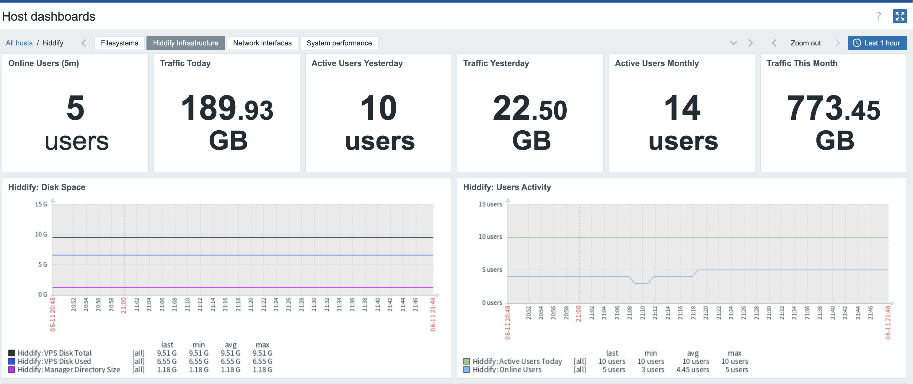

# Zabbix Hiddify Monitoring


Reusable Zabbix 7.4 template for deep monitoring of a VPN server powered by Hiddify Manager, its systemd core components, and client connectivity.

---

## Template metadata

| Field | Value |
|---|---|
| Author | TyranR |
| Zabbix version | 7.4 |
| Template version | 2.0 |
| Template file | `template_hiddify_manager.yaml` |
| Community templates path | `Applications/VPN/template_hiddify_manager/7.4/` |
| Target system | Hiddify Manager VPN node |
| Tested platform | Ubuntu / Debian node running Hiddify Manager |
| Monitoring method | Zabbix Agent 2, HTTP agent master item, dependent items, simple checks, and web scenario |
| External scripts | No |
| License | MIT |

---

## Current template statistics

```text
Template version: 2.0
Items: 41
Triggers: 9
Graphs: 6
Web scenarios: 1
Dashboard widgets: 18
```

---

## Community repository note

This version is prepared for the Zabbix community templates repository.

The template keeps the native Zabbix web scenario for checking the Hiddify panel, but the community export does not reference generated web monitoring items directly in triggers, graphs, or dashboard widgets. This avoids import validation issues on a clean Zabbix instance.

Generated web scenario metrics are still created by Zabbix after import and can be viewed in Latest data for the monitored host.

No custom external scripts are required.


## What this solves

Managing modern multi-protocol VPN instances (like Hiddify) requires keeping tabs on numerous background components (Singbox, Xray, HAProxy, Nginx, Redis) simultaneously. 
Unexpected core crashes or port blocks directly disrupt client handshakes. The template uses one HTTP Agent master item for Hiddify API telemetry and combines it with native Zabbix Agent 2 checks for services, ports, processes, and filesystem metrics.

## Project status

This project is currently under active development.
The core service tracking, user statistical items, and threshold-driven operational dashboards are fully functional. Advanced aggregate monitoring for multiple VPN nodes is planned for future releases.

## Current limitations

- User statistics depend on the availability and responsiveness of the Hiddify Manager API.
- Individual process tracking for Nginx or HAProxy might show negligible baseline memory allocations on empty nodes.
- High-frequency graph grids may experience minor staircase effects if data points shift slightly during long collection intervals.

## Screenshots

### Hiddify Infrastructure Overview




## Features

### Ecosystem Core Monitoring

- **Systemd service states:** Runtime service status (`active`/`inactive`) tracking for Hiddify Panel, Singbox Core, Xray Core, Nginx, HAProxy, and Redis.
- **Edge Availability:** Live network status of the primary client connection port (`443`).
- **Web UI Availability & Latency:** Real-time multi-step web scenario tracking that measures HTTP response codes, download speed and response time for the Hiddify Admin interface.

### Statistical & Hardware Data

- **User Activity:** Live count of concurrent `Online Users`, accompanied by historical breakdown counters for Users Today, Yesterday, and Monthly.
- **Process Memory Analytics:** Tracks RAM usage for Singbox, Xray, Panel, and HAProxy from Hiddify API telemetry, plus native Zabbix Agent process memory tracking for `hiddify-core`.
- **Disk Allocation:** Total storage tracking alongside targeted physical path monitoring for the Hiddify Manager directory.
- **Bandwidth Metrics:** Precise network metrics capturing real-time incoming and outgoing bandwidth speeds (Download/Upload).

---

## Tested with

- Zabbix Server 7.4
- Zabbix Agent 2
- Ubuntu / Debian node running active Hiddify Manager
- Dependent items processing powered by custom JavaScript and JSONPath

---

## Repository structure

```text
Applications/VPN/template_hiddify_manager/
└── 7.4/
    ├── README.md
    ├── template_hiddify_manager.yaml
    └── files/
        ├── dashboard-overview1.png
        ├── dashboard-overview2.png
        └── dashboard-overview3.png
```

---

## Requirements

No custom external scripts are required by the template.  

---

## Zabbix setup

### 1. Import Template

Import the main dashboard-ready template into your Zabbix infrastructure:
1. Open your Zabbix Web Interface and navigate to **Data collection** ➡️ **Templates**.
2. Click the **Import** button located in the top right corner of the screen.
3. Choose and upload the template configuration file: `template_hiddify_manager.yaml`.

### 2. Host Configuration

Create a new Zabbix Host instance representing your VPN server node, or link the template to an existing one:

```text
Host name: My Hiddify Server
Groups: VPN Nodes / Linux servers
Templates: Hiddify Manager
Interfaces: Add your Zabbix Agent interface (enter the IP address or DNS of your VPN node)
```

---

## Macros & Telemetry Mapping

The template uses your defined host-level user macros to dynamically construct endpoint targets and pass secure parameters directly to the internally executed HTTP Agent master item.

### User Macros Configuration

| Macro | Type | Default Value / Example | Description |
|---|---|---|---|
| `{$HIDDIFY.DOMAIN}` | Text | `vpn.example.com` | Your public panel connection domain name. |
| `{$HIDDIFY.PROXY.PATH}` | Secret text | `q1w2e3r4t5y6u7i8o9p0` | Secure random path identifier fragment. |
| `{$HIDDIFY.USER.UUID}` | Secret text | `abcdefgh-b2b2-c3c3-d4d4-e5g6h6j7k8l9n7` | Administrative access token query string. |

---

## Items

The template deployment processes a collection of **41 operational items** in total. It relies on a single Master Item (`hiddify.api.status`) that securely establishes an encrypted connection and retrieves the structural JSON telemetry payload exactly once per collection interval. All other sub-metrics are instantly processed as resource-saving Dependent Items via fast JSONPath filtering and lightweight JavaScript.

### Core Architecture Items (Examples)

The following table highlights the key dependent items that map your infrastructure's core endpoints:

| Item | Type | Key | Value type | Inside Preprocessing / Notes |
|---|---|---|---|---|
| Hiddify: Core Panel Status | Dependent | `hiddify.service.panel.numeric` | Numeric unsigned | JavaScript status parser mapping (`active` ➡️ `1`) |
| Hiddify: Singbox Core Status | Dependent | `hiddify.service.singbox.numeric` | Numeric unsigned | JavaScript status parser mapping (`active` ➡️ `1`) |
| Hiddify: Port 443 Availability | Simple check | `net.tcp.service[tcp,,443]` | Numeric unsigned | Network socket validation binary state (`1` ➡️ up, `0` ➡️ down) |
| Hiddify: Online Users | Dependent | `hiddify.api.online_users` | Numeric unsigned | JSONPath extraction: `$.usage_history.m5.online` |
| Hiddify: Active Users Today | Dependent | `hiddify.api.users.today` | Numeric unsigned | JSONPath extraction: `$.usage_history.today.online` |
| Hiddify: Singbox Memory Usage | Dependent | `proc.mem[hiddify-core,,,,rss]` | Numeric float | Native process allocation mapped to bytes calculation |

### Web Monitoring Items

The template automatically deploys a native Zabbix Web Scenario that performs an external HTTP/HTTPS handshake with your panel using the `{$HIDDIFY.DOMAIN}` and `{$HIDDIFY.PROXY.PATH}` user macros.

Zabbix creates the following generated web monitoring metrics after import. The community export intentionally does not use these generated items in triggers, graphs, or dashboard widgets to keep the template import-safe on a clean Zabbix instance:

| Item / Metric | Type | Key | Value type | Description / Processing |
|---|---|---|---|---|
| Hiddify: Web UI Access Status | Web item | `web.test.rspcode[Hiddify Panel Web UI Access,Check Admin Login Page]` | Numeric unsigned | Captures the HTTP response code, expected `200`. |
| Hiddify: Web UI Download Speed | Web item | `web.test.in[Hiddify Panel Web UI Access,Check Admin Login Page,bps]` | Numeric float | Tracks the raw download speed of the admin interface page in bps. |
| Hiddify: Web UI Fail Step | Web item | `web.test.fail[Hiddify Panel Web UI Access]` | Numeric unsigned | Displays `0` if the web scenario passes successfully, or the failed step number. |
| Hiddify: Web UI Response Time | Web item | `web.test.time[Hiddify Panel Web UI Access,Check Admin Login Page,resp]` | Numeric float | Measures the response time in seconds for the admin login page. |

---

## Triggers

The template includes **9 pre-configured triggers** implementing a production-ready event and performance tracking severity model. These triggers instantly catch service outages, port availability issues, abnormal memory usage, web interface failures, and excessive log directory growth before they impact your clients.

### Core Operational Triggers

| Event / Operational Condition                           | Severity | Expression                                                                                                  |
| ------------------------------------------------------- | -------- | ----------------------------------------------------------------------------------------------------------- |
| Hiddify: Management Panel UI is Down                    | High     | `last(/Hiddify Manager/systemd.unit.info[hiddify-panel.service,ActiveState])<>"active"`   |
| Hiddify: Core Service (Singbox) is Down                 | High     | `last(/Hiddify Manager/systemd.unit.info[hiddify-singbox.service,ActiveState])<>"active"` |
| Hiddify: Core Service (Xray) is Down                    | High     | `last(/Hiddify Manager/systemd.unit.info[hiddify-xray.service,ActiveState])<>"active"`    |
| Hiddify: Load Balancer (HAProxy) is Down                | High     | `last(/Hiddify Manager/systemd.unit.info[hiddify-haproxy.service,ActiveState])<>"active"` |
| Hiddify: Web Server (Nginx) is Down                     | High     | `last(/Hiddify Manager/systemd.unit.info[hiddify-nginx.service,ActiveState])<>"active"`   |
| Hiddify: Database Service (Redis) is Down               | High     | `last(/Hiddify Manager/systemd.unit.info[hiddify-redis.service,ActiveState])<>"active"`   |
| Hiddify: Port 443 (Reality/TLS) is Not Responding       | High     | `last(/Hiddify Manager/net.tcp.service[tcp,,443])=0`                                      |
| Hiddify: Singbox process memory usage is unusually high | Average  | `last(/Hiddify Manager/proc.mem[hiddify-core,,,,rss])>1G`                                 |
| Hiddify: Log files directory size exceeds limit         | Warning  | `last(/Hiddify Manager/vfs.dir.size[/opt/hiddify-manager/log/system])>2G`                 |

*Note: All triggers are configured with default thresholds suitable for most production servers, but they can be overridden or customized via Zabbix template inheritance.*


---

## Dashboard layout

The project ships with **1 pre-packaged out-of-the-box dashboard** called `Hiddify Infrastructure` designed to provide instant infrastructure visibility. It features interactive status indicators and **6 monitoring graphs**.

### Row 1: KPI Operational Status Cards

Modern threshold-driven `Item value` widgets providing live state monitoring for background services and connectivity endpoints:
* **Monitored states:** Hiddify Core Panel, Singbox Core Service, HAProxy Daemon, Nginx Web Server, and Client Port Availability.

*Recommended widget threshold layout for service indicators:*
* **Value `1`** ➡️ Green background status (`active`)
* **Value `0`** ➡️ Red background status (`inactive` / `down`)

---

### Row 2: Performance and Latency Trends

#### Graph 1: Hiddify: Users Activity
Visualizes the real-time relation between concurrent live connections and cumulative user handshakes throughout the day.
* **Metrics included:**
  * `Hiddify: Live Online Users` (`hiddify.api.online_users`) ➡️ **Blue line**
  * `Hiddify: Today Active Users` (`hiddify.api.users.today`) ➡️ **Light Green line**
* **Graph settings:**
  * **Y-axis MIN value:** `Fixed ➡️ 0` (prevents timeline grid decimal artifacts).

#### Graph 2: Hiddify: Network Speed & Bandwidth
Tracks exact incoming and outgoing traffic processing speeds to prevent channel starvation or identify heavy load spikes.
* **Metrics included:**
  * `Hiddify: Network Download Speed` ➡️ **Bright Green line / Filled region**
  * `Hiddify: Network Upload Speed` ➡️ **Cyan / Blue line / Filled region**
* **Graph settings:**
  * **Draw style:** `Filled region` with 20% transparent color opacity.
  * **Y-axis MIN value:** `Calculated`.

---

### Row 3: Hardware Inventory Stack

#### Graph 3: Hiddify: Singbox Memory Usage
Monitors the exact memory allocation footprint of the underlying Singbox proxy routing engine to identify potential memory leaks or core process exhaustion.
* **Metrics included:**
  * `Hiddify: Singbox Memory Usage` (`proc.mem[hiddify-core,,,,rss]`) ➡️ **Dark Green line**
  * `Hiddify: Port 443 Availability` (`net.tcp.service[tcp,,443]`) ➡️ **Helper background grid mapping**
* **Graph settings:**
  * **Y-axis MIN value:** `Fixed ➡️ 0`.
  * **Units:** Configured to `B` (Bytes) with auto-scaling to MB/GB in legends.

---

## Troubleshooting

### Graph displays decimal points for metric users (e.g., 4.5 users)

This occurs automatically when value fluctuations across a grid timeline remain minimal.

To override this layout:
1. Open your Dashboard view and click **Edit dashboard**.
2. Access the target widget's setup properties.
3. Switch the **Y axis MIN value** parameter from *Calculated* to **Fixed** and type `0`.
4. Save adjustments. The graph canvas will re-align to display integer steps.

### Graph legends show varying decimal digits length

Raw JSON payloads often pass floating values with mismatched precision lengths.
Ensure that each problem item has a JavaScript formatting step appended right inside its **Preprocessing** tab:

```javascript
return Number(value).toFixed(2);
```

---
## License

This template is provided under the MIT License as part of the Zabbix community templates repository.
