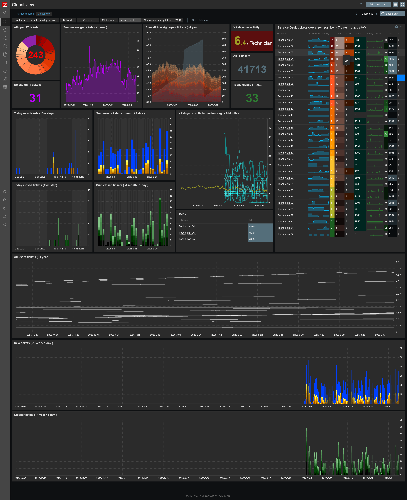

# Zabbix template – ALVAO Service Desk dashboard and history

Zabbix 7.4 templates that read ticket statistics from **[ALVAO Service Desk](https://www.alvao.com/)** through the **ALVAO REST API** and keep their history in Zabbix. You get team totals (open, unassigned, new and closed today, …) and **personal statistics for every solver**, ready for dashboards, graphs and triggers.

*Example dashboard built from the data of these templates: open / unassigned tickets, tickets without activity, new and closed tickets per day, and a per-technician overview table.*

- 🕵️ **The screenshot is anonymized.** In the real dashboard you see the **real name of each technician** instead of *Technician 01, 02, …* (taken from ALVAO by the user discovery). **Click a name** to open that technician's host and see the full history of their tickets in Zabbix.
- 🧩 **The dashboard is not part of the template.** Zabbix can't export a global dashboard together with a template, so it isn't in this repository. If you'd like a dashboard like this, I can help you build one to fit your needs. Get in touch: 📧 [info@duprtech.sk](mailto:info@duprtech.sk)

## ✨ Highlights

- 👥 **Automatic discovery of users (solvers)**: users are discovered from ALVAO **by an OData filter** (for example everyone in the IT department). Each user gets their own Zabbix host with personal statistics, and new colleagues appear automatically.
- 📊 **Team overview**: all open tickets, **unassigned tickets**, new and closed today, tickets without activity for 7 days
- 📈 **History and trends**: see how the backlog and workload change over days and months, which ALVAO itself doesn't show this way
- 🔁 **Change requests counted separately** from regular tickets
- 🌐 **No agent needed**: everything runs as HTTP agent items on the Zabbix server / proxy

## What you can track

Because every technician has their own host with history, you can see not only the current state but also **how each technician works with tickets over time**:

- ⏳ **Tickets left without a response**: how many open tickets a technician hasn't touched for more than 7 days (no activity), and how this number grows or drops over weeks
- 📂 **Open vs. resolved**: how many tickets a technician has open right now, how many they closed or resolved today, and their daily average
- ⚡ **Reaction to new tickets**: new tickets in the last 15 minutes, and how many of them are still **unassigned**, so you see whether the team picks them up quickly
- 📊 **Workload comparison**: who carries the most open tickets, who closes the most, and who has the most tickets without activity (sortable table, TOP 3)
- 🔁 **Change requests** tracked separately from regular tickets
- 📈 **Long-term trends**: backlog, new and closed tickets per day over months, useful for team reviews and planning

Need more, for example response and resolution times, SLA breaches or statistics per service or location? Get in touch: 📧 [info@duprtech.sk](mailto:info@duprtech.sk)

### Very flexible: filter it your way

All data comes from ALVAO REST API queries with **OData filters**, so you decide what is counted. Without changing any code you can filter by almost any ticket or user field, for example:

| What | Example filter |
|------|----------------|
| Only some **services** | `startswith(serviceName,'IT')`, `serviceName eq 'Helpdesk'` |
| Only some **processes** / ticket types | `not startswith(processName,'Request for change')` |
| Only some **states** | `stateName ne 'Closed' and stateName ne 'Resolved'` |
| Only some **teams / departments** (users) | `startswith(department,'IT')`, `department eq 'Service Desk'` |
| Exclude **service / admin accounts** | `not startswith(name,'x')` |
| Only **active** users | `isDisabled eq false` |

Change the user filter with the macro `{$ALVAO.USERS.FILTER}`, the service and change-request names with `{$ALVAO.SERVICE.PREFIX}` and `{$ALVAO.CHANGE.PROCESS}`, and anything else in the `$filter` query field of the HTTP items. You can also clone an item and filter it differently, for example one item per service, location or priority.

## Contents

| File | Description |
|------|-------------|
| `template_alvao_service_desk.yaml` | Zabbix **7.4** export with 2 templates: `APP Alvao service desk` and `APP Alvao service desk users` |

### `APP Alvao service desk` (link to one host, for example "ALVAO")

**Team items**

| Item | Description |
|------|-------------|
| Alvao all open IT tickets | Sum of open tickets of all discovered users |
| Alvao all no assign | Open tickets **without a solver** in services starting with `{$ALVAO.SERVICE.PREFIX}` |
| Alvao today new tickets 15m ago no assign | New unassigned tickets in the last 15 minutes |
| Alvao all today new IT tickets | Sum of tickets created today |
| Alvao all today closed IT tickets | Sum of tickets closed / resolved today |
| Alvao all IT tickets | Sum of all tickets of all discovered users |
| Alvao avg no resolved IT tickets | Average number of open tickets without activity for 7 days per user |
| Alvao all closed IT tickets | Sum of closed tickets (*disabled by default*) |

**Discovery rule `Alvao get users`** (once a day): reads `/users` with the OData filter `{$ALVAO.USERS.FILTER}` and creates a host **`Alvao user <id>`** (visible name = user's name) for each user, in host group `Alvao users`, linked to `APP Alvao service desk users`.

### `APP Alvao service desk users` (linked automatically, don't link by hand)

Per user (every 15 minutes):

| Item | Description |
|------|-------------|
| Alvao open tickets | Open tickets of the user (without change requests) |
| Alvao open change requests | Open change requests of the user |
| Alvao today new tickets / 15m ago | Open tickets created today / in the last 15 minutes |
| Alvao today closed tickets / 15m ago | Tickets closed or resolved today / in the last 15 minutes |
| Alvao closed tickets | All closed / resolved tickets of the user |
| Alvao closed tickets per day max / avg per day | Closed today (daily maximum) and its average |
| Alvao no resolved tickets | Open tickets without activity for more than 7 days |
| Alvao all tickets | All tickets of the user |

The team items in the first template are calculated from these per-user items (`last_foreach` over all discovered hosts).

## Requirements

- Zabbix server / proxy **7.4** or newer, with HTTPS access to the ALVAO server
- **ALVAO REST API**. ⚠️ The REST API is a **paid ALVAO module**, it is not part of every ALVAO licence. Ask your ALVAO partner to license and enable it.
- An **ALVAO account for Zabbix** with Basic authentication enabled for the REST API and read access to:
  - **users** (for discovery)
  - **tickets of all services and solvers** you want to monitor

## Installation

1. **Enable the ALVAO REST API** and check that it works, for example in a browser:
   `https://alvao.example.com/AlvaoRestApi/v1/users?$top=1`
2. **Create the ALVAO user for Zabbix** (for example `zabbix.api`) with read-only access as described above.
3. **Import the template**: *Data collection → Templates → Import* → `template_alvao_service_desk.yaml`
4. **Set the macros** (see below). Best as **global macros** (*Administration → Macros*), because the discovered user hosts need them too. Set `{$API_PASS}` as type **Secret text**.
5. **Create a host** (for example `ALVAO`, no interface needed) and link `APP Alvao service desk`.
6. Run the discovery rule *Alvao get users* with *Execute now*. The user hosts appear in host group `Alvao users`.

## Macros

| Macro | Default | Description |
|-------|---------|-------------|
| `{$ALVAO.API.URL}` | `https://alvao.example.com/AlvaoRestApi/v1` | ALVAO REST API base URL |
| `{$API_USER}` | `zabbix.api` | ALVAO API user |
| `{$API_PASS}` | *(secret)* | ALVAO API password |
| `{$ALVAO.USERS.FILTER}` | `startswith(department,'IT') and isDisabled eq false` | **OData filter of the users to discover** |
| `{$ALVAO.USERS.MAX}` | `100` | Maximum number of discovered users |
| `{$ALVAO.SERVICE.PREFIX}` | `IT` | Service name prefix for the unassigned tickets |
| `{$ALVAO.CHANGE.PROCESS}` | `Request for change` | Process name prefix of change requests |

### Setting the user filter correctly

`{$ALVAO.USERS.FILTER}` decides **who gets a host in Zabbix**, so set it to match only real solvers. It is an [OData `$filter`](https://www.odata.org/getting-started/basic-tutorial/#filter) on ALVAO users, for example:

| Goal | Filter |
|------|--------|
| Active users of the IT department | `startswith(department,'IT') and isDisabled eq false` |
| … without admin / service accounts starting with `x` | `startswith(department,'IT') and not startswith(name,'x') and isDisabled eq false` |
| Two departments | `(startswith(department,'IT') or startswith(department,'Helpdesk')) and isDisabled eq false` |

Test the filter first in a browser: `https://alvao.example.com/AlvaoRestApi/v1/users?$filter=<your filter>`. A too broad filter (for example without `isDisabled eq false`) creates hosts for every ALVAO user.

### Service and process names

- The ticket filters use the ALVAO state names **`Closed`, `Resolved`, `Deleted`**. If your ALVAO uses other (for example localized) state names, edit the `$filter` query fields of the HTTP items in the templates.
- `{$ALVAO.SERVICE.PREFIX}` and `{$ALVAO.CHANGE.PROCESS}` must match the beginning of your service and process names in ALVAO.

## Notes

- Each user host makes 4 API requests every 15 minutes, so 30 users = about 480 requests per hour. Check that your ALVAO server handles it, or raise the update interval.
- The raw requests return at most **100 open** and **50 closed** tickets per user (`$top`). Counts based on these lists (today new / closed, without activity) are capped at that number. Totals (*open tickets*, *closed tickets*, *all tickets*) use `@odata.count` and are exact.
- *Today* and *15 minutes ago* are evaluated in the time zone of the Zabbix server / proxy. Keep it the same as on the ALVAO server.
- Users who leave or no longer match the filter are kept for 366 days (LLD lifetime), so their history stays available.
- The templates have no triggers by default. A common one to add: unassigned tickets older than 15 minutes (`last(/APP Alvao service desk/alvao.today.new.tickets.15m)>0`).

## Custom work & support

Need something extra? I can extend or customize these templates for your company's needs, for example dashboards for the team leader, SLA and response time statistics, per-service or per-location statistics, triggers and notifications. Feel free to get in touch: 📧 [info@duprtech.sk](mailto:info@duprtech.sk)

If this work makes sense to you, give the repo a ⭐ star or support me on Ko-fi ☕

I'm adding more tools and templates over time, so feel free to [follow me on GitHub](https://github.com/DuprTECH) to see what's new.

## More scripts, improvements and frequent updates

This folder holds a snapshot of the template. **More scripts, improvements and frequent updates are on my GitHub:**

- 🆕 newer versions and frequent updates
- 🐞 bug fixes
- 🧩 extra scripts and improvements for the template

👉 **Repository:** https://github.com/DuprTECH/Zabbix-ALVAO-Service-Desk-dashboard-and-history  
👤 **My GitHub:** https://github.com/DuprTECH
