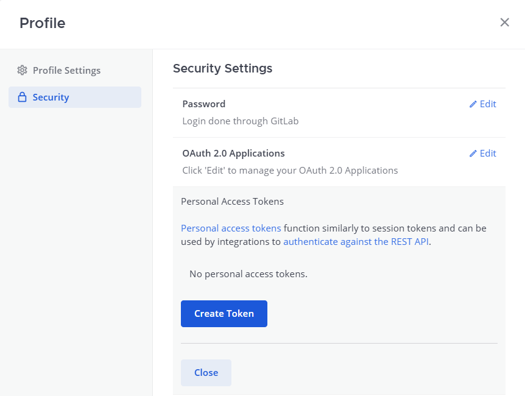
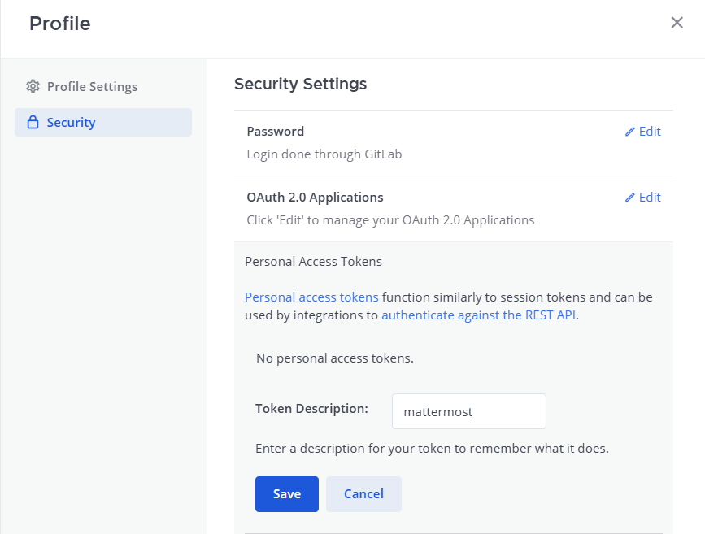
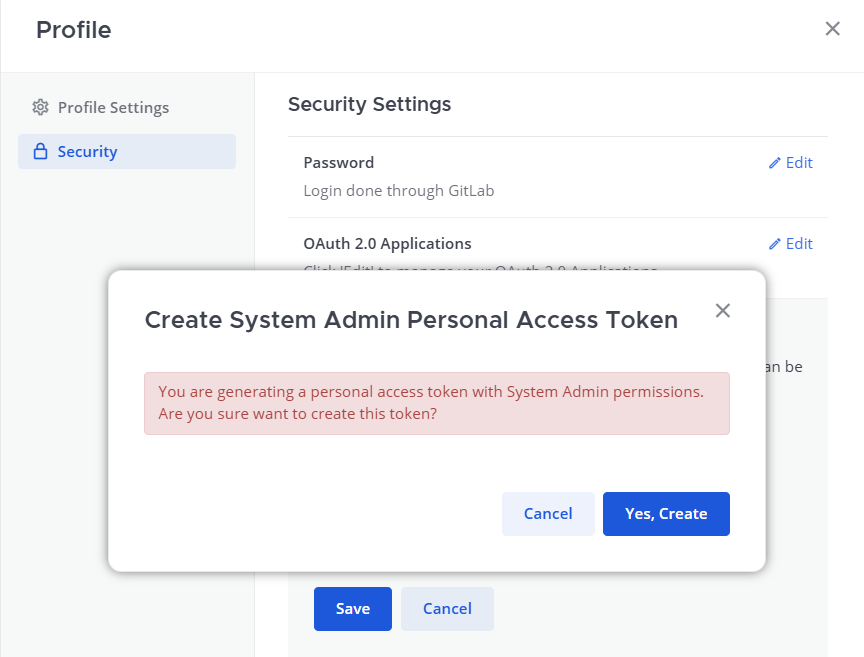
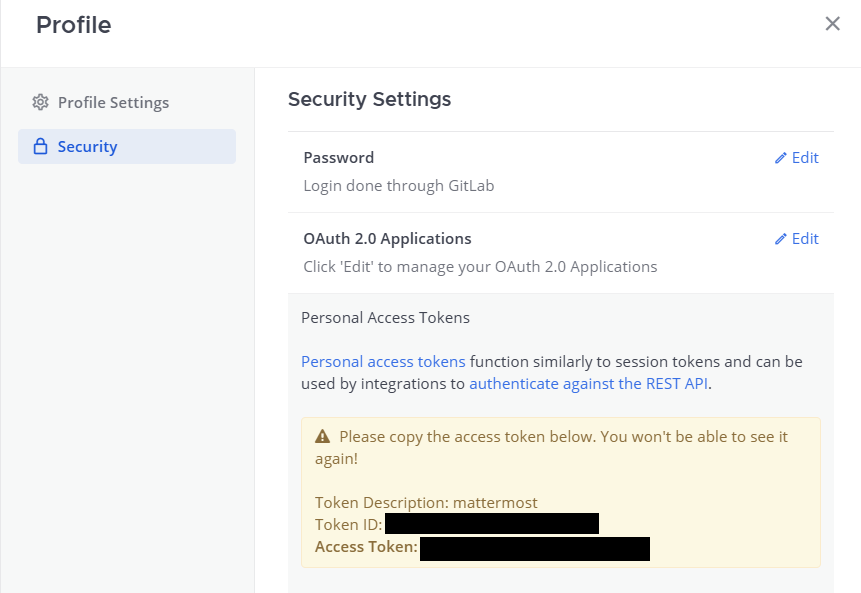
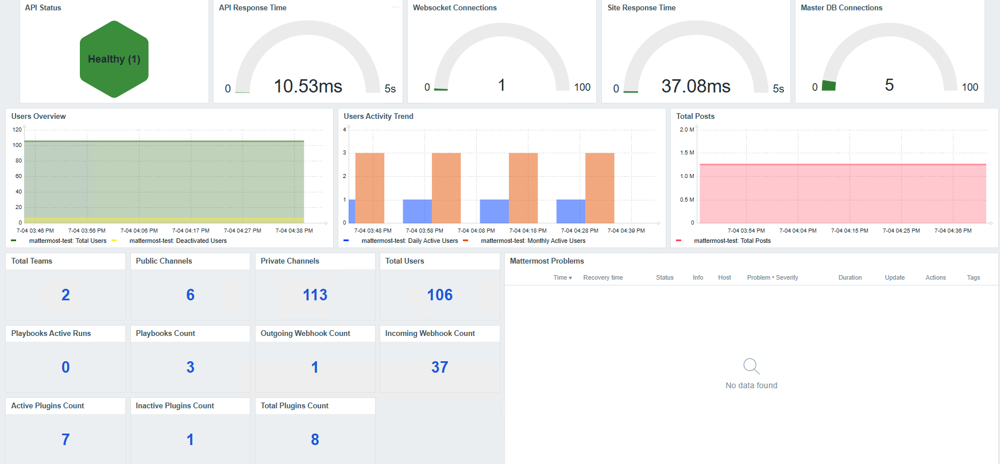

# Mattermost by HTTP for Zabbix


Production-ready Mattermost monitoring template for Zabbix 7.x using HTTP Agent.

---

## Overview

This template provides monitoring and observability for Mattermost environments using native Zabbix HTTP Agent checks.

Features include:

- Mattermost API health monitoring
- Website availability monitoring (Web Scenario)
- API response time monitoring
- User / team / channel / post analytics
- Database connection monitoring
- WebSocket monitoring
- System health metrics
- Trigger dependency handling
- Prebuilt dashboard

---

## Requirements

- Zabbix 7.0+
- Mattermost 10.x / 11.x
- Mattermost Personal Access Token (PAT)

---

## Supported Versions

| Product | Version |
|---|---|
| Zabbix | 7.0 |
| Mattermost | 11.7.x |

---

## Installation

### Step 1 — Import Template

In Zabbix UI navigate to:

```text
Configuration → Templates → Import
```

Import:

```text
template_mattermost_http.yaml
```

---

### Step 2 — Configure Macros

Macros can be configured either:

- at host level (recommended for multi-instance deployments)
- at template level (recommended for single-instance deployments)

---

## Required Macros

| Macro | Default | Description |
|---|---|---|
| `{$MM.URL}` | `https://mattermost.example.com` | Mattermost base URL |
| `{$MM.TOKEN}` | (required) | Mattermost Personal Access Token |

---

## Optional Macros

These macros are optional and can be adjusted depending on your environment and monitoring requirements.

| Macro | Default | Description |
|---|---|---|
| `{$MM.API.RESPONSE.CRIT}` | `3` | Critical threshold for API response time |
| `{$MM.DB.CONNECTIONS.CRIT}` | `100` | Critical threshold for database connections |
| `{$MM.PLAYBOOKS.ACTIVE.WARN}` | `5` | Warning threshold for active playbook runs |
| `{$MM.TIMEOUT}` | `10s` | HTTP request timeout |
| `{$MM.WEB.RESPONSE.WARN}` | `3` | Website response time warning threshold |

---

> Only `{$MM.URL}` and `{$MM.TOKEN}` must be configured manually.  
> All other macros provide default production-safe values.

---

### Step 3 — Create Mattermost Personal Access Token

To connect to the Mattermost API, create a Personal Access Token.

1. Log in to Mattermost

2. Open:

```text
Profile Settings
```

3. Navigate to:

```text
Security → Personal Access Tokens
```





4. Click:

```text
Create Token
```



5. Copy and securely store the generated token.



---

### Step 4 — Link Template to Host

Link the template to your Mattermost host in Zabbix.

---

### Step 5 — Verify Data Collection

In Zabbix UI navigate to:

```text
Monitoring → Latest data
```

Filter by your Mattermost host and verify that data is being collected.

Example items:

- Mattermost API Status
- Mattermost Analytics Raw
- Mattermost Total Posts

---

## Dashboard

The template includes a prebuilt host dashboard.

In Zabbix UI navigate to:

```text
Monitoring → Hosts → <Mattermost Host> → Dashboards
```

Dashboard includes:

- API health status
- Website availability
- User activity metrics
- Channel statistics
- System performance metrics
- Problem overview panel



---

## Triggers

This template includes predefined triggers for Mattermost availability and performance monitoring.

### High Severity

| Trigger | Description |
|---|---|
| Mattermost API is unavailable | API endpoint is unreachable or returns invalid response |
| Mattermost API response time is high | API response time exceeded configured threshold |
| Mattermost website is unavailable | Web scenario failed or HTTP checks failed |
| Mattermost DB connections are high | Database connection usage exceeded threshold |
| Mattermost WebSocket connections are zero | No active WebSocket connections detected |

---

### Average Severity

| Trigger | Description |
|---|---|
| Mattermost website response time is high | Website response time exceeded warning threshold |

---

### Warning Severity

| Trigger | Description |
|---|---|
| High number of active playbook runs | Active playbook runs exceeded configured threshold |

---

## Notes

- Trigger thresholds are configurable via template macros
- Trigger dependencies are used to reduce alert storms
- Website monitoring and API monitoring are intentionally separated
- Sensitive values should be stored as Secret text macros in Zabbix
- This template is designed for production environments

---

## Directory Structure

```text
template_mattermost_http/
└── 7.0/
    ├── template_mattermost_http.yaml
    ├── README.md
    └── files/
        └── screenshots/
            ├── dashboard.png
            ├── pesonal-access-token1.png
            ├── pesonal-access-token2.png
            ├── pesonal-access-token3.png
            └── pesonal-access-token4.png
```

---

## License

MIT License

---

## Author

Soroush Mehmandoust