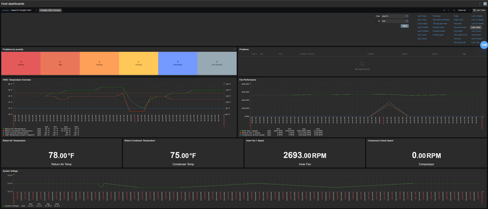

# ICEqube CMKT HVAC Monitoring Template for Zabbix

A comprehensive Zabbix monitoring template for ICEqube CMKT precision cooling units used in telecommunications and data center environments. This template provides complete visibility into HVAC health, performance, and fault conditions through native SNMP monitoring.

## Features

### Black-Box Availability Monitoring
- **ICMP Ping** - Network layer reachability verification with packet loss and response time tracking
- **SNMP Availability** - SNMP agent health check with automatic fault detection
- Immediate alerting on device or network failures

### Comprehensive Fault Detection (10 Fault Items)
- **Fan Faults** - Inner fan and external (condenser) fan failure detection
- **Compressor Fault** - Critical refrigeration system failure alerts with diagnostic fault codes
- **Temperature Sensor Failures** - Return air and condenser temperature sensor monitoring
- **Temperature Alarms** - High/low temperature threshold breach detection
- **Condenser High Temperature Alarm** - Critical heat rejection failure alerts
- **Filter Maintenance** - Air filter replacement scheduling
- **Communication Faults** - Internal HVAC controller communication monitoring

### Performance Metrics (11 Items)
- **Fan Speed Monitoring** - Real-time RPM tracking for inner fan, external fan, and compressor
- **Temperature Monitoring** - Return air and condenser temperature in Fahrenheit
- **System Voltage** - Electrical power supply monitoring
- **Operational States** - Running status for fans, heating, refrigeration, and alarm relay
- **Compressor Fault Code** - Detailed diagnostic code for compressor issues

### Configuration & Settings (9 Items)
- **Temperature Setpoints** - Start cooling/heating temperature thresholds
- **Alarm Thresholds** - High/low temperature alarm setpoints
- **Full Speed Temperature** - Maximum cooling trigger point
- **Alarm Controls** - Global, audible, and compressor alarm enable/disable

### Inventory & State Tracking (3 Items)
- **System Description** - Hardware model and firmware version tracking
- **System Name** - Device hostname identification
- **System Location** - Physical location reference for technician dispatch

## Monitored Parameters


### Fault & Alarm Items
| Item | Description | Update Interval |
|------|-------------|-----------------|
| Communication Fault | Internal HVAC controller communication status | 1 minute |
| Compressor Fault | Compressor failure state | 1 minute |
| Condenser High Temperature Alarm | Critical condenser overheating detection | 1 minute |
| Condenser Temperature Sensor Failure | Condenser temperature sensor fault | 1 minute |
| External Fan 1 Fault | External (condenser) fan failure | 1 minute |
| High Temperature Alarm | High temperature threshold breach | 1 minute |
| Inner Fan 1 Fault | Inner fan failure detection | 1 minute |
| Low Temperature Alarm | Low temperature threshold breach | 1 minute |
| Replace Filter Alarm | Air filter replacement needed | 1 minute |
| Temperature Sensor Failure | Return air temperature sensor fault | 1 minute |

### Performance Metrics
| Item | Description | Update Interval |
|------|-------------|-----------------|
| Alarm Relay Status | Alarm relay state (Normal/Alarm) | 1 minute |
| Compressor Actual Speed | Real-time compressor RPM | 1 minute |
| Compressor Fault Code | Diagnostic fault code | 1 minute |
| Exterior Fan 1 Speed | External fan RPM | 1 minute |
| External Fan 1 Running State | External fan operational status | 1 minute |
| Heating Running State | Heating system status | 1 minute |
| Inner Fan 1 Running State | Inner fan operational status | 1 minute |
| Inner Fan 1 Speed | Inner fan RPM | 1 minute |
| Refrigeration Running Status | Cooling system status | 1 minute |
| Return Air Temperature | Current return air temperature (°F) | 1 minute |
| Return Condenser Temperature | Current condenser temperature (°F) | 1 minute |

### Configuration Items
| Item | Description | Update Interval |
|------|-------------|-----------------|
| Alarm Enable | Global alarm enable/disable | 1 hour |
| Audible Alarm Enable | Audible alarm enable/disable | 1 hour |
| Compressor Alarm Enable | Compressor-specific alarm enable | 1 hour |
| Full Speed Temperature | Temperature at which fans run full speed | 1 hour |
| High Temperature Alarm Setpoint | High temperature alarm threshold | 1 hour |
| Low Temperature Alarm Setpoint | Low temperature alarm threshold | 1 hour |
| Start Cooling Temperature | Temperature to start cooling | 1 hour |
| Start Heat Temperature | Temperature to start heating | 1 hour |
| System Voltage | Input voltage monitoring | 5 minutes |

### System Inventory


| Item | Description | Update Interval |
|------|-------------|-----------------||
| System description | Hardware model and firmware version | 1 hour |
| System location | Physical location information | 1 hour |
| System name | Device hostname | 1 hour |

## Template Triggers


The template includes 13 triggers following Zabbix best practices with 100% manual closure capability.

### Severity Distribution
- **DISASTER (1)** - Compressor failure (complete cooling loss)
- **HIGH (8)** - Fan failures, sensor failures, condenser overheating, ICMP/SNMP loss
- **WARNING (4)** - System restart, filter replacement, SNMP timeout

### Critical Triggers (DISASTER)

#### Compressor Fault
**Severity:** DISASTER  
**Expression:** `last(/ICEqube CMKT HVAC/compressor_fault)=1`  
**Impact:** Complete loss of cooling capacity - zero refrigeration capability, critical temperature rise imminent, equipment damage risk within minutes, potential service outage.

### High Priority Triggers (HIGH)

#### Inner Fan 1 Fault
**Severity:** HIGH  
**Expression:** `last(/ICEqube CMKT HVAC/inner_fan_fault)=1`  
**Impact:** Inner (evaporator) fan has failed - 50-70% reduction in cooling capacity, poor air circulation, hot spots in equipment, compressor cycling issues.

#### External Fan 1 Fault
**Severity:** HIGH  
**Expression:** `last(/ICEqube CMKT HVAC/external_fan_fault)=1`  
**Impact:** External (condenser) fan has failed - high head pressure, reduced cooling capacity, compressor stress and overheating, potential compressor shutdown.

#### Temperature Sensor Failure & Condenser Temperature Sensor Failure
**Severity:** HIGH  
**Impact:** Critical temperature sensor has failed - unit cannot regulate temperature properly, may run continuously or not at all, risk of freezing or overheating, false alarms possible.

#### Condenser High Temperature Alarm
**Severity:** HIGH  
**Expression:** `last(/ICEqube CMKT HVAC/condenser_high_temp_alarm)=1`  
**Impact:** Condenser temperature exceeds safe operating limit - high refrigerant pressure, compressor stress and potential failure, reduced cooling capacity, safety cutout may trigger.

#### ICMP Ping Loss & SNMP Agent Unavailable
**Severity:** HIGH  
**Impact:** Network connectivity lost to HVAC unit - no monitoring data collection, cannot verify HVAC operational status, blind to potential failures, may indicate power loss.

### Warning Triggers (WARNING)

#### High Temperature Alarm & Low Temperature Alarm
**Severity:** WARNING  
**Impact:** Space temperature outside configured alarm thresholds - equipment at risk if prolonged, cooling/heating system not maintaining setpoint, may indicate degraded HVAC performance.

#### Replace Filter Alarm
**Severity:** WARNING  
**Impact:** Air filter requires replacement - reduced airflow efficiency, increased energy consumption, additional strain on fan motor, degraded air quality.

#### SNMP Availability Timeout
**Severity:** WARNING  
**Expression:** `max(/ICEqube CMKT HVAC/zabbix[host,snmp,available],{$SNMP.TIMEOUT})=0`  
**Impact:** Intermittent SNMP communication issues detected - data collection gaps, incomplete monitoring coverage, potential trigger delays.

#### System Restart Detected
**Severity:** WARNING  
**Expression:** `last(/ICEqube CMKT HVAC/system_uptime)<10m`  
**Impact:** HVAC controller has recently restarted - brief monitoring interruption, possible configuration reset, may indicate power or stability issues.

## User Macros

The template provides three customizable macros for flexible threshold configuration:

| Macro | Default Value | Description |
|-------|---------------|-------------|
| `{$SNMP.TIMEOUT}` | 5m | Time to wait before considering SNMP unavailable |
| `{$ICMP.LOSS.WARN}` | 20 | ICMP packet loss warning threshold (percentage) |
| `{$ICMP.RESPONSE_TIME.WARN}` | 0.15 | ICMP response time warning threshold (seconds) |

These macros can be customized at the template or host level without modifying the template itself.

## Value Mappings

The template includes five value mappings for human-readable status display:

### CMKT Running State
- 0 → Stopped
- 1 → Running

### CMKT Alarm State
- 0 → Normal
- 1 → Alarm

### CMKT Fault State
- 0 → Normal
- 1 → Fault

### CMKT Enable State
- 0 → Disabled
- 1 → Enabled

### CMKT Compressor Fault Code
- 0 → No Fault
- 1 → Overload
- 2 → Locked Rotor
- 3 → Thermal Protection
- 4-255 → Various manufacturer-specific codes

### zabbix.host.available
- 0 → Not available
- 1 → Available
- 2 → Unknown

## Normal Operating Ranges

### Temperature
- **Return Air**: 65-78°F (typical data center)
- **Condenser**: 90-120°F (ambient dependent)
- **Temperature Differential**: 10-20°F (return vs. condenser)

### Fan Speeds
- **Inner Fan**: 800-2000 RPM (load dependent)
- **External Fan**: 600-1800 RPM (ambient dependent)
- **Compressor**: 1500-3600 RPM (varies by model)

### Electrical
- **System Voltage**: 110-125 VAC (120V nominal)
- **Voltage Tolerance**: ±10% typical

### Alarm Setpoints (Typical)
- **Low Temperature Alarm**: 55-60°F
- **High Temperature Alarm**: 80-85°F
- **Start Cooling**: 72-75°F
- **Start Heating**: 65-68°F
- **Full Speed**: 78-82°F

## Dashboard

The template includes a pre-built dashboard: **ICEqube HVAC Overview**



Dashboard widgets provide:
- Current temperature readings
- Fan speed gauges
- Fault status indicators
- Running state display
- Alarm status
- System voltage
- Temperature trends

## Graphs


Three built-in graphs for historical analysis:

### 1. HVAC Temperature Overview
- Return air temperature trend
- Condenser temperature trend
- Visual correlation analysis
- Height: 400px

### 2. Fan Performance
- Inner fan speed
- External fan speed
- Comparative analysis
- Height: 300px

### 3. System Voltage
- Voltage trend over time
- Stability monitoring
- Power quality analysis

## Requirements

### Zabbix Server
- Zabbix 7.2 or newer
- SNMP support enabled

### Network Requirements
- ICMP (ping) access to HVAC unit
- SNMP access (UDP port 161)
- SNMPv2c or SNMPv3 support

### ICEqube CMKT Requirements
- SNMP enabled on unit
- Network connectivity configured
- Valid SNMP community string or SNMPv3 credentials

### Supported Hardware
- ICEqube CMKT precision cooling units
- Firmware: Multiple versions supported
- Enterprise OID: 1.3.6.1.4.1.49595.131 (CMKT-MIB)

## Installation & Setup

### Step 1: Import Template
1. Navigate to Configuration → Templates in Zabbix web interface
2. Click **Import**
3. Select `template_iceqube_cmkt.yaml`
4. Click **Import**

### Step 2: Create/Configure Host
1. Navigate to Configuration → Hosts
2. Create new host or select existing
3. Configure host settings:
   - **Host name**: Descriptive name (e.g., "TelecomHut-HVAC-01")
   - **Groups**: Add to appropriate host groups
   - **Interfaces**: 
     - Add SNMP interface
     - Set IP address of HVAC unit
     - Port: 161 (default)

### Step 3: Configure SNMP Credentials
1. In host configuration, go to **Macros** tab
2. Add inherited and host macros:
   - `{$SNMP_COMMUNITY}` = your SNMP community string
   - Or configure SNMPv3 credentials if using SNMPv3

### Step 4: Link Template
1. In host configuration, go to **Templates** tab
2. Click **Select** and choose "ICEqube CMKT HVAC"
3. Click **Add**
4. Click **Update** to save host configuration

### Step 5: Verify Data Collection
1. Navigate to Monitoring → Latest data
2. Filter by your host name
3. Verify items are collecting data (check for green values)
4. Typical collection start time: 1-5 minutes

### Step 6: Customize Thresholds (Optional)
1. Navigate to Configuration → Hosts
2. Select your host
3. Go to **Macros** tab
4. Override template macros as needed:
   - `{$SNMP.TIMEOUT}` - Adjust if network latency high
   - `{$ICMP.LOSS.WARN}` - Adjust packet loss threshold
   - `{$ICMP.RESPONSE_TIME.WARN}` - Adjust response time threshold

### Step 7: Configure Actions/Notifications
Set up alerting based on trigger severity:

**DISASTER Triggers:**
- Immediate page to on-call HVAC technician
- SMS/phone call notification
- Escalation if not acknowledged within 15 minutes

**HIGH Triggers:**
- Email to HVAC team
- Create high-priority ticket
- Escalate if not acknowledged within 30 minutes

**WARNING Triggers:**
- Email notification
- Create standard priority ticket
- No escalation needed

## Use Cases

### Telecommunications Huts/Shelters
Monitor precision cooling for outdoor telecommunications equipment shelters where HVAC failure can lead to equipment overheating and service outages.

**Critical Requirements:**
- Remote monitoring (unmanned sites)
- Immediate fault detection
- Clear escalation procedures
- Technician dispatch automation

### Data Centers & Server Rooms
Track cooling performance in mission-critical environments where temperature control directly impacts uptime and equipment longevity.

**Monitoring Focus:**
- Temperature stability
- Cooling capacity trends
- Predictive maintenance
- Energy efficiency

### Edge Computing Sites
Remote monitoring of unmanned sites where HVAC issues require immediate detection and technician dispatch.

**Challenges Addressed:**
- No on-site staff
- Environmental exposure
- Quick fault identification
- Automated alerting

### Network Operations Center (NOC)
Provides NOC operators with:
- Clear fault identification and severity
- Detailed troubleshooting procedures
- Escalation paths and response timelines
- Historical performance trending
- Proactive maintenance scheduling

## Self-Contained Design

This template is completely self-contained and requires **no external scripts or dependencies**:

✓ Native Zabbix SNMP monitoring  
✓ Built-in value mappings  
✓ Integrated trigger logic  
✓ Embedded documentation  
✓ No external scripts required  
✓ No additional software needed  

All monitoring is performed using:
- Native SNMP get operations
- Zabbix internal items
- Simple ICMP checks
- Built-in expression evaluation

## SNMP Implementation Details

### Protocol Support
- SNMPv2c (recommended)
- SNMPv3 (supported)

### OID Structure
- **Enterprise OID**: 1.3.6.1.4.1.49595.131 (CMKT-MIB)
- **Standard MIB-2**: System information (sysDescr, sysName, sysLocation)
- **Modern Syntax**: Uses Zabbix 7.2+ get[OID] format

### Collection Method
- Direct OID queries (no MIB files required)
- Numeric OIDs for maximum compatibility
- No external dependencies

### Item Statistics
- **Total Items**: 35
- **SNMP Items**: 33 (CMKT enterprise MIB + MIB-2)
- **Internal Items**: 1 (SNMP availability)
- **Simple Items**: 1 (ICMP ping)

### Collection Intervals
- **Fault Items**: 1 minute (rapid fault detection)
- **Performance Metrics**: 1 minute (real-time monitoring)
- **Configuration Items**: 1 hour (infrequent changes)
- **System Information**: 30 seconds to 1 hour
- **ICMP Ping**: 1 minute

### History Retention
- **Faults/Alarms**: 90 days (compliance/trend analysis)
- **Performance Metrics**: 7 days (operational monitoring)
- **Configuration**: 90 days (change tracking)
- **System Info**: 90 days (inventory management)


## Maintenance Best Practices

### Baseline Establishment
1. Monitor for 30 days to establish normal patterns
2. Document typical temperature ranges for your environment
3. Note normal fan speed ranges
4. Record typical system voltage
5. Establish seasonal variation patterns

### Proactive Monitoring
- **Temperature Trends**: Watch for gradual temperature creep (indicates degraded performance)
- **Fan Speed Analysis**: Declining speeds may indicate bearing wear
- **Voltage Monitoring**: Track for power quality issues
- **Fault Correlation**: Match fault codes with maintenance records
- **Filter Scheduling**: Replace proactively (don't wait for alarm)

### Preventive Maintenance Schedule

**Monthly:**
- Review filter status
- Check fan speed trends
- Verify temperature control accuracy
- Review alarm history

**Quarterly:**
- Clean condenser coils (if needed)
- Inspect fan motors
- Check electrical connections
- Verify refrigerant levels

**Annually:**
- Complete HVAC service
- Replace filters regardless of alarm
- Lubricate fan motors (if applicable)
- Test all alarm functions
- Verify setpoint accuracy

### Template Updates

When updating this template:
1. **Preserve customizations**:
   - Export current macros
   - Document trigger modifications
   - Save custom dashboards

2. **Test before production**:
   - Import to test environment
   - Verify data collection
   - Test all triggers
   - Review dashboard functionality

3. **Version control**:
   - Document changes
   - Track template versions
   - Maintain changelog

4. **Rollback plan**:
   - Keep previous template version
   - Export host configurations
   - Test restore procedure

## Support & Documentation

### MIB References
- **CMKT-MIB-V1**: Enterprise MIB definition for ICEqube CMKT units
- **SNMPv2-MIB**: Standard MIB-2 system information
- **RFC 1213**: MIB-II standard objects

*Note: MIB files are for reference only. Template uses numeric OIDs and does not require MIB files for operation.*

### Zabbix Resources
- [Zabbix Template Guidelines](https://www.zabbix.com/documentation/current/manual/appendix/templates)
- [SNMP Monitoring](https://www.zabbix.com/documentation/current/manual/config/items/itemtypes/snmp)
- [Trigger Expression](https://www.zabbix.com/documentation/current/manual/config/triggers/expression)

### Vendor Documentation
- ICEqube Technical Manual
- CMKT Installation Guide
- SNMP Configuration Guide
- Maintenance Procedures

## Zabbix Template Guideline Compliance

This template follows all official Zabbix template development guidelines:

✓ **Black-box availability monitoring** - ICMP + SNMP availability checks  
✓ **Fault monitoring** - Comprehensive fault detection with vendor diagnostics  
✓ **Performance monitoring** - USE methodology (Utilization, Saturation, Errors)  
✓ **Inventory and state** - System information and uptime tracking  
✓ **Flexible configuration** - User macros for threshold customization  
✓ **No external dependencies** - Native SNMP only  
✓ **Single resource scope** - One HVAC unit per template  
✓ **Proper value mappings** - Human-readable status display  
✓ **Manual trigger closure** - 100% of triggers support manual acknowledgment  
✓ **Comprehensive documentation** - Detailed inline and README documentation  

## Version History

### v2.0 - Zabbix Guidelines Compliance Update (November 25, 2025)
- ✓ Added ICMP ping availability monitoring
- ✓ Added SNMP agent availability monitoring
- ✓ Added MIB-2 system inventory items (sysDescr, sysName, sysLocation)
- ✓ Added system restart detection trigger
- ✓ Implemented user macros for threshold flexibility
- ✓ Added SNMP availability value mapping
- ✓ Enhanced all trigger descriptions with NOC procedures
- ✓ Enabled manual closure on 100% of triggers
- ✓ Updated to Zabbix 7.2 get[OID] syntax
- ✓ Added comprehensive dashboard
- ✓ Total: 35 items, 13 triggers, 5 value maps, 3 macros

### v1.0 - Initial Release
- 30 CMKT enterprise OID items
- 10 fault/alarm triggers
- 4 value mappings
- Template tags and metadata
- Basic monitoring functionality

## Template Statistics

### Item Breakdown
- **Fault Detection**: 10 items (1m intervals)
- **Performance Metrics**: 11 items (1m intervals)
- **Configuration**: 9 items (1h intervals)
- **System Inventory**: 3 items (1h intervals)
- **Availability**: 2 items (ICMP + SNMP)

### Trigger Breakdown
- **DISASTER**: 1 trigger (compressor failure)
- **HIGH**: 8 triggers (fan failures, sensors, connectivity)
- **WARNING**: 4 triggers (restart, filter, timeouts)
- **Manual Close**: 13/13 triggers (100%)

### Collection Efficiency
- **High-frequency (1m)**: 21 items (critical monitoring)
- **Medium-frequency (5m)**: 1 item (system voltage)
- **Low-frequency (1h)**: 12 items (configuration + inventory)
- **Variable**: 1 item (ICMP availability)

## Contributing

Contributions are welcome! To contribute:

1. Fork the repository
2. Create a feature branch (`git checkout -b feature/improvement`)
3. Make your changes
4. Test thoroughly in a development environment
5. Document your changes
6. Commit with clear messages (`git commit -m 'Add new feature'`)
7. Push to your branch (`git push origin feature/improvement`)
8. Create a Pull Request

### Contribution Guidelines
- Follow Zabbix template best practices
- Test all changes before submitting
- Update documentation for new features
- Maintain backward compatibility when possible
- Include version notes in template description

## License

This template is available under the MIT License.

## Author

````bash
://echo@dla.network [oZark oRChes✝ra✝'d]
````

[☕ Buy me a coffee](https://www.buymeacoffee.com/p_pepp)

---

**Template Type:** Resource Monitoring (HVAC)  
**Vendor:** CMKT  
**Device:** ICEqube Precision Cooling Unit  
**Monitoring Method:** SNMP (Native)  
**Zabbix Version:** 7.2+  
**Last Updated:** November 25, 2025
