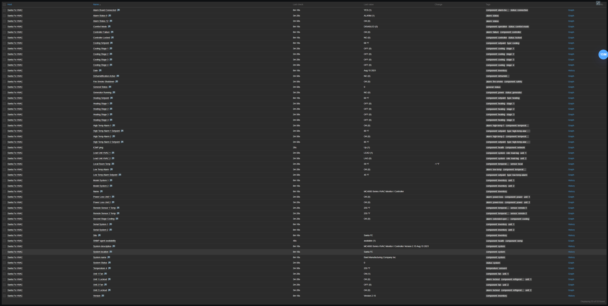
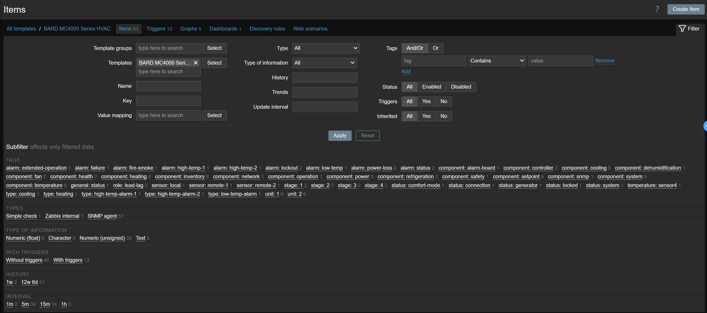
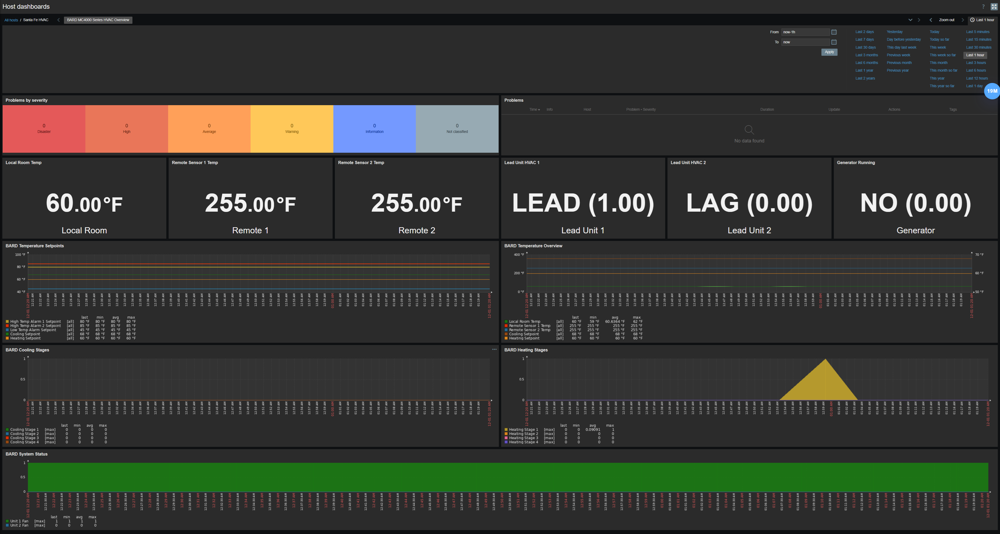
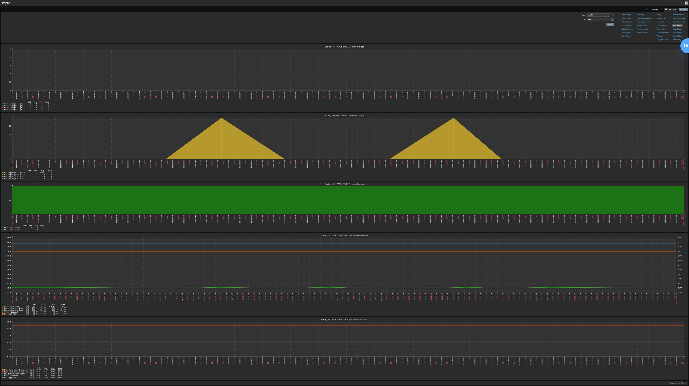

# BARD MC4000 Series HVAC Monitoring Template for Zabbix

A comprehensive Zabbix monitoring template for BARD MC4000 Series precision HVAC controllers used in telecommunications shelters, data centers, and critical infrastructure environments. This template provides complete visibility into dual-unit HVAC systems with multi-stage cooling/heating, redundancy management, and comprehensive fault detection.

## Features

### Black-Box Availability Monitoring
- **ICMP Ping** - Network layer reachability verification with packet loss and response time tracking
- **SNMP Availability** - SNMP agent health check with automatic fault detection
- Immediate alerting on device or network failures

### Comprehensive Fault Detection (10 Alarm Items)
- **Fire/Smoke Shutdown** - Critical safety system monitoring with emergency shutdown detection
- **Controller Failure** - System controller health monitoring for primary control failures
- **Temperature Alarms** - High/Low temperature threshold breach detection (2 alarm levels)
- **Power Loss Detection** - AC power monitoring for both HVAC units (Unit 1 & Unit 2)
- **Unit Lockout Alarms** - Pressure lockout condition detection for both units
- **Second Stage Cooling Alarm** - Extended cooling operation alerts

### Performance Metrics (18 Items)
- **Temperature Monitoring** - Local room + 2 remote sensors in Fahrenheit
- **Multi-Stage Operation** - Real-time status for 4 cooling + 4 heating stages
- **System Status** - Lead/Lag unit role tracking, fan operation states
- **Dehumidification** - Active dehumidification status monitoring

### Configuration & Settings (5 Items)
- **Temperature Setpoints** - Cooling and heating setpoint tracking
- **Alarm Thresholds** - High/Low temperature alarm setpoints (3 levels)

### Inventory & State Tracking (8 Items)
- **System Information** - Site name, product name, version, date
- **Unit Details** - Model and serial numbers for both HVAC systems
- **System Description** - SNMP standard system information (sysDescr)
- **System Name** - Device hostname identification (sysName)
- **System Location** - Physical location reference for technician dispatch (sysLocation)

### System Control Indicators (5 Items)
- **Generator Running** - Backup power status monitoring
- **Alarm Board Connected** - Remote alarm panel connectivity
- **Comfort Mode** - Comfort mode enable/disable status
- **Controller Locked** - Configuration lockout status
- **Lead Unit Tracking** - Automatic lead/lag unit role identification

## Monitored Parameters



### Alarm & Fault Items
| Item | Description | Update Interval |
|------|-------------|-----------------|
| Fire Smoke Shutdown | Critical safety alarm - fire or smoke detected | 5 minutes |
| Controller Failure | Primary controller failure detection | 15 minutes |
| High Temp Alarm 1 | First level high temperature alarm | 5 minutes |
| High Temp Alarm 2 | Second level high temperature alarm | 5 minutes |
| Low Temp Alarm | Low temperature threshold breach | 5 minutes |
| Power Loss Unit 1 | AC power loss detection for Unit 1 | 5 minutes |
| Power Loss Unit 2 | AC power loss detection for Unit 2 | 5 minutes |
| Unit 1 Lockout | Pressure lockout condition Unit 1 | 5 minutes |
| Unit 2 Lockout | Pressure lockout condition Unit 2 | 5 minutes |
| Second Stage Cooling | Extended cooling operation alarm | 5 minutes |

### Performance Metrics
| Item | Description | Update Interval |
|------|-------------|-----------------|
| Local Room Temp | Local room temperature sensor | 5 minutes |
| Remote Sensor 1 Temp | Remote temperature sensor 1 | 5 minutes |
| Remote Sensor 2 Temp | Remote temperature sensor 2 | 5 minutes |
| Cooling Stage 1-4 | Four-stage cooling operation status | 5 minutes |
| Heating Stage 1-4 | Four-stage heating operation status | 5 minutes |
| Dehumidification Active | Active dehumidification status | 5 minutes |
| Unit 1 Fan | Fan operational status Unit 1 | 5 minutes |
| Unit 2 Fan | Fan operational status Unit 2 | 5 minutes |
| Lead Unit HVAC 1 | Lead/Lag role for Unit 1 | 5 minutes |
| Lead Unit HVAC 2 | Lead/Lag role for Unit 2 | 5 minutes |

### Configuration Items
| Item | Description | Update Interval |
|------|-------------|-----------------|
| Cooling Setpoint | Temperature setpoint for cooling activation | 15 minutes |
| Heating Setpoint | Temperature setpoint for heating activation | 15 minutes |
| High Temp Alarm 1 Setpoint | First level high temperature alarm threshold | 5 minutes |
| High Temp Alarm 2 Setpoint | Second level high temperature alarm threshold | 5 minutes |
| Low Temp Alarm Setpoint | Low temperature alarm threshold | 5 minutes |

### System Inventory



| Item | Description | Update Interval |
|------|-------------|-----------------|
| Site | Site identification name | 15 minutes |
| Name | Product name | 15 minutes |
| Version | Firmware version | 15 minutes |
| Date | System date | 15 minutes |
| Model System 1 | Model number for HVAC Unit 1 | 15 minutes |
| Model System 2 | Model number for HVAC Unit 2 | 15 minutes |
| Serial System 1 | Serial number for HVAC Unit 1 | 15 minutes |
| Serial System 2 | Serial number for HVAC Unit 2 | 15 minutes |
| System description | MIB-2 system description | 1 hour |
| System name | MIB-2 system hostname | 1 hour |
| System location | MIB-2 physical location | 1 hour |

### System Status Indicators
| Item | Description | Update Interval |
|------|-------------|-----------------|
| Generator Running | Backup generator operational status | 5 minutes |
| Alarm Board Connected | Remote alarm board connectivity status | 15 minutes |
| Comfort Mode | Comfort mode enabled status | 15 minutes |
| Controller Locked | Configuration lockout status | 15 minutes |

## Template Triggers


The template includes 15 triggers following Zabbix best practices with 100% manual closure capability.

### Severity Distribution
- **DISASTER (2)** - Fire/smoke shutdown, controller failure (complete system loss)
- **HIGH (6)** - Power loss, unit lockout, ICMP/SNMP loss
- **AVERAGE (7)** - Temperature alarms, generator running, controller locked

### Critical Triggers (DISASTER)

#### Fire Smoke Shutdown
**Severity:** DISASTER  
**Expression:** `last(/BARD MC4000 Series HVAC/bard.alarm.fireSmoke)=1`  
**Impact:** CRITICAL SAFETY ALARM - All HVAC operations halted due to fire/smoke detection. Equipment protection and life safety protocols activated. Requires immediate emergency response and evacuation if confirmed.

#### Controller Failure
**Severity:** DISASTER  
**Expression:** `last(/BARD MC4000 Series HVAC/bard.alarm.controllerFailure)=1`  
**Impact:** HVAC control system failure - automated temperature control, multi-stage operations, and alarm monitoring may be compromised. Loss of controller means loss of automated HVAC control.

### High Priority Triggers (HIGH)

#### Power Loss Unit 1 & Unit 2
**Severity:** HIGH  
**Impact:** Unit has lost AC power - cooling/heating capacity reduced by 50%. System operating on single unit only. Loss of redundancy means if remaining unit fails, complete HVAC loss occurs.

#### Unit 1 Lockout & Unit 2 Lockout
**Severity:** HIGH  
**Impact:** Unit is in pressure lockout condition due to refrigeration system pressure fault. Operating on remaining unit only - 50% capacity. Requires HVAC technician service.

#### ICMP Ping Loss
**Severity:** HIGH  
**Expression:** `max(/BARD MC4000 Series HVAC/icmpping,#3)=0`  
**Impact:** HVAC controller is unreachable via network. Cannot collect monitoring data. HVAC system may be offline or network connectivity is lost.

### Average Priority Triggers (AVERAGE)

#### High Temperature Alarm 1 & 2
**Severity:** AVERAGE  
**Impact:** Space temperature has exceeded configured high temperature alarm thresholds. Equipment at risk if prolonged. May indicate degraded HVAC performance.

#### Low Temperature Alarm
**Severity:** AVERAGE  
**Impact:** Space temperature has fallen below configured low temperature threshold. Risk of condensation or equipment operating below specifications.

#### Generator Running
**Severity:** AVERAGE  
**Impact:** Backup generator is running, indicating commercial power loss or power quality issue. Monitor duration and frequency.

#### Controller Locked
**Severity:** AVERAGE  
**Impact:** Controller configuration is locked, preventing settings changes. Normal security feature but may impede troubleshooting.

#### SNMP Availability Timeout
**Severity:** WARNING  
**Expression:** `max(/BARD MC4000 Series HVAC/zabbix[host,snmp,available],{$SNMP.TIMEOUT})=0`  
**Impact:** All HVAC monitoring data collection has stopped. Temperature, alarm status, and system operation data is not being updated.

## User Macros

The template provides five customizable macros for flexible threshold configuration:

| Macro | Default Value | Description |
|-------|---------------|-------------|
| `{$SNMP.TIMEOUT}` | 5m | Time to wait before considering SNMP unavailable |
| `{$ICMP.LOSS.WARN}` | 20 | ICMP packet loss warning threshold (percentage) |
| `{$ICMP.RESPONSE_TIME.WARN}` | 0.15 | ICMP response time warning threshold (seconds) |
| `{$TEMP.HIGH.WARN}` | 85 | High temperature warning threshold (°F) |
| `{$TEMP.LOW.WARN}` | 55 | Low temperature warning threshold (°F) |
| `{$SNMP_COMMUNITY}` | public | SNMP community string (override per host) |

These macros can be customized at the template or host level without modifying the template itself.

## Value Mappings

The template includes 15 value mappings for human-readable status display:

### BARD Alarm Status
- 0 → OK
- 1 → ALARM

### BARD ON/OFF Status
- 0 → OFF
- 1 → ON

### BARD YES/NO Status
- 0 → NO
- 1 → YES

### BARD DISABLED/ENABLED Status
- 0 → DISABLED
- 1 → ENABLED

### BARD Lead/Lag Status
- 0 → LAG
- 1 → LEAD

### BARD Cooling Stage / Heating Stage / Fan Status
- 0 → OFF
- 1 → ON

### Service State (ICMP)
- 0 → Down
- 1 → Up

### zabbix.host.available (SNMP)
- 0 → Not available
- 1 → Available
- 2 → Unknown

## Normal Operating Ranges

### Temperature (Typical Data Center/Telecom Shelter)
- **Local Room**: 65-78°F
- **Remote Sensors**: 65-80°F (varies by sensor placement)
- **Temperature Differential**: 5-10°F between sensors

### Setpoints (Typical)
- **Cooling Setpoint**: 72-75°F
- **Heating Setpoint**: 65-68°F
- **High Temp Alarm 1**: 80-85°F
- **High Temp Alarm 2**: 85-90°F
- **Low Temp Alarm**: 55-60°F

### Multi-Stage Operation
- **Stage 1 Cooling**: Activates at cooling setpoint
- **Stage 2-4 Cooling**: Activates progressively if temperature continues to rise
- **Stage 1 Heating**: Activates at heating setpoint
- **Stage 2-4 Heating**: Activates progressively if temperature continues to fall

### Lead/Lag Operation
- Units alternate lead/lag roles for even wear
- Lead unit handles initial stages
- Lag unit activates for additional capacity
- Automatic failover if lead unit fails

## Dashboard

The template includes a pre-built dashboard: **BARD MC4000 Series HVAC Overview**



Dashboard widgets provide:
- Active problems by severity summary
- Current temperature readings (Local Room, Remote 1, Remote 2)
- Lead/Lag unit status indicators
- Generator running status
- Temperature setpoints graph
- Temperature overview graph with all sensors
- Cooling stages graph (4 stages)
- Heating stages graph (4 stages)
- System status (fan operations)
- Problems list with tags

## Graphs



Five built-in graphs for historical analysis:

### 1. BARD Temperature Overview
- Local room temperature trend
- Remote sensor 1 temperature
- Remote sensor 2 temperature
- Cooling setpoint (right axis)
- Heating setpoint (right axis)
- Height: 400px

### 2. BARD Temperature Setpoints
- High temperature alarm 1 setpoint
- High temperature alarm 2 setpoint
- Low temperature alarm setpoint
- Cooling setpoint
- Heating setpoint
- Height: 250px

### 3. BARD Cooling Stages
- Cooling stage 1-4 status
- Stacked filled regions showing active stages
- Height: 300px

### 4. BARD Heating Stages
- Heating stage 1-4 status
- Stacked filled regions showing active stages
- Height: 300px

### 5. BARD System Status
- Unit 1 fan status
- Unit 2 fan status
- Fan operational state tracking

## Requirements

### Zabbix Server
- Zabbix 7.2 or newer
- SNMP support enabled

### Network Requirements
- ICMP (ping) access to BARD MC4000 controller
- SNMP access (UDP port 161)
- SNMPv2c or SNMPv3 support

### BARD MC4000 Requirements
- SNMP enabled on controller
- Network connectivity configured
- Valid SNMP community string or SNMPv3 credentials
- Controller firmware supporting TTMI-MIB (Enterprise OID 1.3.6.1.4.1.44433)

### Supported Hardware
- BARD MC4000 Series Controllers (MC4001, MC4002, etc.)
- TRI-TECH MANUFACTURING controllers
- Enterprise OID: 1.3.6.1.4.1.44433 (TTMI-MIB)

## Installation & Setup

### Step 1: Import Template
1. Navigate to Configuration → Templates in Zabbix web interface
2. Click **Import**
3. Select `template_bard_4000_series_hvac.yaml`
4. Click **Import**

### Step 2: Create/Configure Host
1. Navigate to Configuration → Hosts
2. Create new host or select existing
3. Configure host settings:
   - **Host name**: Descriptive name (e.g., "DataCenter-HVAC-MC4001")
   - **Groups**: Add to appropriate host groups (HVAC, BARD, etc.)
   - **Interfaces**: 
     - Add SNMP interface
     - Set IP address of BARD MC4000 controller
     - Port: 161 (default)

### Step 3: Configure SNMP Credentials
1. In host configuration, go to **Macros** tab
2. Add inherited and host macros:
   - `{$SNMP_COMMUNITY}` = your SNMP community string
   - Or configure SNMPv3 credentials if using SNMPv3

### Step 4: Link Template
1. In host configuration, go to **Templates** tab
2. Click **Select** and choose "BARD MC4000 Series HVAC"
3. Click **Add**
4. Click **Update** to save host configuration

### Step 5: Verify Data Collection
1. Navigate to Monitoring → Latest data
2. Filter by your host name
3. Verify items are collecting data (check for green values)
4. Typical collection start time: 1-5 minutes

### Step 6: Customize Thresholds (Optional)
1. Navigate to Configuration → Hosts
2. Select your host
3. Go to **Macros** tab
4. Override template macros as needed:
   - `{$SNMP.TIMEOUT}` - Adjust if network latency high
   - `{$ICMP.LOSS.WARN}` - Adjust packet loss threshold
   - `{$ICMP.RESPONSE_TIME.WARN}` - Adjust response time threshold
   - `{$TEMP.HIGH.WARN}` - Adjust high temperature threshold
   - `{$TEMP.LOW.WARN}` - Adjust low temperature threshold

### Step 7: Configure Actions/Notifications
Set up alerting based on trigger severity:

**DISASTER Triggers:**
- Immediate page to on-call HVAC technician + facility manager
- SMS/phone call notification
- Escalation if not acknowledged within 10 minutes

**HIGH Triggers:**
- Email to HVAC team
- Create high-priority ticket
- Escalate if not acknowledged within 30 minutes

**AVERAGE Triggers:**
- Email notification
- Create standard priority ticket
- Review during next maintenance window

## Use Cases

### Telecommunications Shelters
Monitor dual-redundant HVAC systems in outdoor telecommunications equipment shelters where cooling failure can lead to equipment overheating and service outages.

**Critical Requirements:**
- Remote monitoring (unmanned sites)
- Immediate fault detection
- Lead/lag unit status for redundancy verification
- Technician dispatch automation

### Data Centers & Server Rooms
Track multi-stage cooling/heating performance in mission-critical environments where temperature control and system redundancy directly impact uptime.

**Monitoring Focus:**
- Temperature stability across multiple sensors
- Multi-stage cooling/heating patterns
- Redundancy verification (lead/lag roles)
- Power loss detection
- Predictive maintenance

### Critical Infrastructure Sites
Remote monitoring of unmanned critical sites where HVAC issues require immediate detection, automatic failover verification, and technician dispatch.

**Challenges Addressed:**
- No on-site staff
- Dual-unit redundancy monitoring
- Multi-stage operation visibility
- Quick fault identification
- Automated alerting

### Network Operations Center (NOC)
Provides NOC operators with:
- Clear fault identification and severity
- Lead/Lag unit status for redundancy verification
- Multi-stage cooling/heating operation visibility
- Detailed troubleshooting procedures
- Escalation paths and response timelines
- Historical performance trending
- Proactive maintenance scheduling

## Self-Contained Design

This template is completely self-contained and requires **no external scripts or dependencies**:

✓ Native Zabbix SNMP monitoring  
✓ Built-in value mappings (15 maps)  
✓ Integrated trigger logic  
✓ Embedded documentation  
✓ No external scripts required  
✓ No additional software needed  

All monitoring is performed using:
- Native SNMP get operations
- Zabbix internal items
- Simple ICMP checks
- Built-in expression evaluation

## SNMP Implementation Details

### Protocol Support
- SNMPv2c (recommended)
- SNMPv3 (supported)

### OID Structure
- **Enterprise OID**: 1.3.6.1.4.1.44433 (TTMI-MIB)
- **Vendor**: TRI-TECH MANUFACTURING / BARD HVAC
- **Standard MIB-2**: System information (sysDescr, sysName, sysLocation)
- **Modern Syntax**: Uses Zabbix 7.2+ get[OID.0] format

### Collection Method
- Direct OID queries (no MIB files required)
- Numeric OIDs for maximum compatibility
- No external dependencies

### Item Statistics
- **Total Items**: 53
- **SNMP Items**: 50 (BARD enterprise MIB + MIB-2)
- **Internal Items**: 1 (SNMP availability)
- **Simple Items**: 1 (ICMP ping)
- **History Retention**: 90 days for alarms, 7 days for ICMP

### Collection Intervals
- **Alarm Items**: 5 minutes (rapid fault detection)
- **Temperature Metrics**: 5 minutes (real-time monitoring)
- **Configuration Items**: 15 minutes (infrequent changes)
- **System Information**: 15 minutes to 1 hour
- **ICMP Ping**: Default interval

### Trigger Statistics
- **Total Triggers**: 15
- **Manual Close**: 100% enabled
- **DISASTER**: 2 triggers
- **HIGH**: 6 triggers
- **AVERAGE**: 7 triggers

## Maintenance Best Practices

### Baseline Establishment
1. Monitor for 30 days to establish normal patterns
2. Document typical temperature ranges for your environment
3. Note normal multi-stage cooling/heating patterns
4. Record lead/lag unit rotation frequency
5. Establish seasonal variation patterns

### Proactive Monitoring
- **Temperature Trends**: Watch for gradual temperature creep (indicates degraded performance)
- **Multi-Stage Analysis**: Monitor stage activation frequency and duration
- **Lead/Lag Rotation**: Verify units alternate roles properly for even wear
- **Power Events**: Track power loss events to identify electrical issues
- **Lockout Events**: Refrigeration lockouts indicate maintenance needs

### Preventive Maintenance Schedule

**Monthly:**
- Review alarm history
- Check temperature trends
- Verify lead/lag rotation is occurring
- Monitor multi-stage operation patterns
- Review generator running events

**Quarterly:**
- Inspect both HVAC units physically
- Clean condenser coils (if needed)
- Verify refrigerant levels
- Check electrical connections
- Test alarm functions

**Annually:**
- Complete HVAC service on both units
- Replace air filters
- Lubricate motors (if applicable)
- Test all safety switches
- Verify setpoint accuracy
- Update firmware if needed

### Template Updates

When updating this template:
1. **Preserve customizations**:
   - Export current macros
   - Document trigger modifications
   - Save custom dashboards

2. **Test before production**:
   - Import to test environment
   - Verify data collection
   - Test all triggers
   - Review dashboard functionality

3. **Version control**:
   - Document changes
   - Track template versions
   - Maintain changelog

4. **Rollback plan**:
   - Keep previous template version
   - Export host configurations
   - Test restore procedure

## Troubleshooting

### No Data Collection
1. Verify SNMP enabled on BARD MC4000 controller
2. Test SNMP access: `snmpwalk -v2c -c <community> <ip> 1.3.6.1.4.1.44433.1.1`
3. Check firewall rules (UDP 161)
4. Verify host SNMP interface configuration
5. Review Zabbix server logs for SNMP errors
6. Confirm controller is powered and network connected

### False Positives
- Adjust user macros for site-specific thresholds
- Review trigger expressions for environmental factors
- Consider increasing timeout values for unstable networks
- Use trigger dependencies to suppress cascading alarms
- Verify temperature sensors are properly calibrated

### Missing Items
Some OIDs may not be supported on all MC4000 firmware versions:
- Check TTMI-MIB documentation for firmware compatibility
- Disable unsupported items rather than deleting (preserves template integrity)
- Update item descriptions to note firmware requirements
- Contact BARD support for MIB documentation

### Temperature Discrepancies
- Verify sensor placement (local vs. remote)
- Check for sensor failures in alarm items
- Calibrate sensors if readings are consistently off
- Review sensor wiring for loose connections

### Lead/Lag Not Rotating
- Verify both units have power
- Check for unit lockouts preventing rotation
- Review controller settings for rotation schedule
- May be intentional if one unit has issues

## Support & Documentation

### MIB References
- **TTMI-MIB**: Enterprise MIB definition for BARD MC4000 Series
- **Enterprise OID**: 1.3.6.1.4.1.44433
- **Vendor**: TRI-TECH MANUFACTURING / BARD HVAC
- **SNMPv2-MIB**: Standard MIB-2 system information
- **RFC 1213**: MIB-II standard objects

*Note: MIB files are for reference only. Template uses numeric OIDs and does not require MIB files for operation.*

### Zabbix Resources
- [Zabbix Template Guidelines](https://www.zabbix.com/documentation/current/manual/appendix/templates)
- [SNMP Monitoring](https://www.zabbix.com/documentation/current/manual/config/items/itemtypes/snmp)
- [Trigger Expression](https://www.zabbix.com/documentation/current/manual/config/triggers/expression)

### Vendor Documentation
- BARD HVAC Documentation - WWW.BARDHVAC.COM
- MC4000 Series Technical Manual
- SNMP Configuration Guide
- Maintenance Procedures

## Zabbix Template Guideline Compliance

This template follows all official Zabbix template development guidelines:

✓ **Black-box availability monitoring** - ICMP + SNMP availability checks  
✓ **Fault monitoring** - Comprehensive fault detection with vendor diagnostics  
✓ **Performance monitoring** - Multi-stage operation tracking, temperature monitoring  
✓ **Inventory and state** - System information and dual-unit tracking  
✓ **Flexible configuration** - User macros for threshold customization  
✓ **No external dependencies** - Native SNMP only  
✓ **Single resource scope** - One HVAC controller per template  
✓ **Proper value mappings** - 15 value maps for human-readable status display  
✓ **Manual trigger closure** - 100% of triggers support manual acknowledgment  
✓ **Comprehensive documentation** - Detailed inline and README documentation  

## Version History

### v1.0 - Initial Release
- 48 BARD enterprise OID items
- 13 alarm/fault triggers
- 10 value mappings
- Basic template structure

### v2.0 - Production Enhancement (December 1, 2025)
- ✓ Added ICMP ping availability check
- ✓ Added SNMP agent availability monitoring
- ✓ Added 3 MIB-2 system inventory items (sysDescr, sysName, sysLocation)
- ✓ Standardized item keys to bard.category.item format
- ✓ Implemented 6 user macros for threshold flexibility
- ✓ Enhanced all trigger descriptions with detailed NOC procedures
- ✓ 100% manual closure enabled on all triggers
- ✓ Added comprehensive temperature, cooling/heating stage graphs
- ✓ Added NOC dashboard with system overview
- ✓ Updated to Zabbix 7.2 get[OID.0] syntax
- ✓ Added trigger dependencies (SNMP depends on ICMP)
- ✓ Total: 53 items, 15 triggers, 15 value maps, 6 macros, 5 graphs, 1 dashboard

## Template Statistics

### Item Breakdown
- **Alarm Detection**: 10 items (5m-15m intervals)
- **Temperature Metrics**: 4 items (5m intervals)
- **Multi-Stage Operation**: 8 items (4 cooling + 4 heating, 5m intervals)
- **Configuration**: 5 items (5m-15m intervals)
- **System Inventory**: 11 items (15m-1h intervals)
- **System Status**: 5 items (5m-15m intervals)
- **Fan Status**: 2 items (5m intervals)
- **Lead/Lag Tracking**: 2 items (5m intervals)
- **Availability**: 2 items (ICMP + SNMP)
- **MIB-2 System**: 3 items (1h intervals)

### Trigger Breakdown
- **DISASTER**: 2 triggers (fire/smoke, controller failure)
- **HIGH**: 6 triggers (power loss x2, unit lockout x2, ICMP/SNMP loss)
- **AVERAGE**: 7 triggers (temp alarms, generator, controller locked)
- **Manual Close**: 15/15 triggers (100%)

### Collection Efficiency
- **High-frequency (5m)**: 33 items (critical monitoring)
- **Medium-frequency (15m)**: 12 items (configuration + inventory)
- **Low-frequency (1h)**: 3 items (MIB-2 system info)
- **Variable**: 2 items (ICMP + SNMP availability)
- **Total SNMP Operations**: ~50 per collection interval

## Contributing

Contributions are welcome! To contribute:

1. Fork the repository
2. Create a feature branch (`git checkout -b feature/improvement`)
3. Make your changes
4. Test thoroughly in a development environment
5. Document your changes
6. Commit with clear messages (`git commit -m 'Add new feature'`)
7. Push to your branch (`git push origin feature/improvement`)
8. Create a Pull Request

### Contribution Guidelines
- Follow Zabbix template best practices
- Test all changes before submitting
- Update documentation for new features
- Maintain backward compatibility when possible
- Include version notes in template description

## License

This template is available under the MIT License.

## Author

```bash
://echo@dla.network [oZark oRChes✝ra✝'d]
```

[☕ Buy me a coffee](https://www.buymeacoffee.com/p_pepp)

---

**Template Type:** Resource Monitoring (HVAC)  
**Vendor:** BARD / TRI-TECH MANUFACTURING  
**Device:** MC4000 Series Controllers  
**Monitoring Method:** SNMP (Native)  
**Zabbix Version:** 7.2+  
**Last Updated:** December 1, 2025
