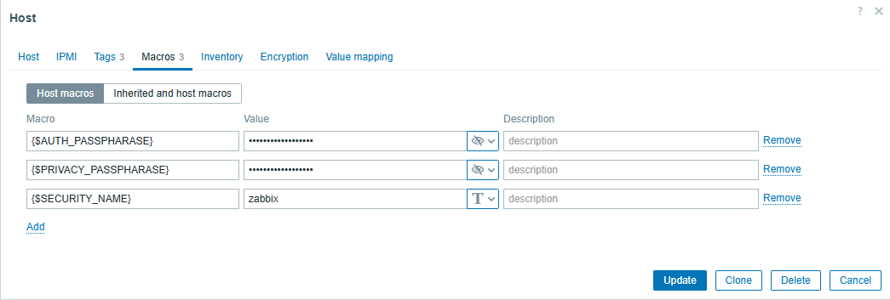
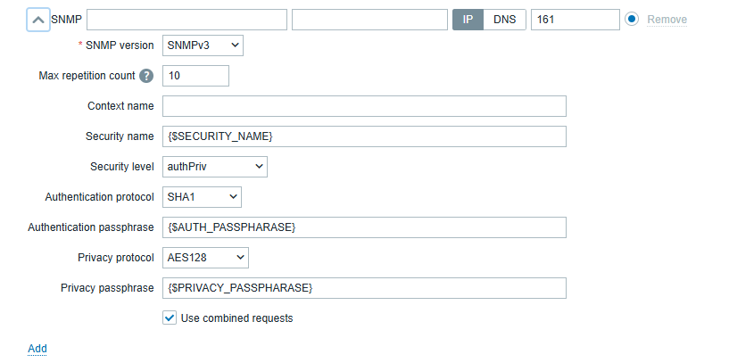

# FortiAnalyzer by SNMP

## Overview

This template monitors Fortinet FortiAnalyzer appliances through SNMP. It uses numeric OIDs, so Fortinet MIB files are not required on the Zabbix server or proxy.

The template provides system, log-processing, ADOM, managed-device, storage, disk I/O, and high-availability monitoring. Dynamic resources are monitored through low-level discovery.

## Tested environment

| Component | Version or configuration |
|---|---|
| Zabbix Server | 7.0.31 |
| FortiAnalyzer platform | VM64 |
| FortiAnalyzer version | v7.6.7 build 3737 |
| SNMP version | SNMPv3 |
| Security level | `authPriv` |
| Authentication protocol | SHA1 |
| Privacy protocol | AES128 |
| OID format | Numeric |

## Requirements

- Zabbix 7.0 or later
- A FortiAnalyzer appliance with SNMP enabled
- SNMP connectivity from the Zabbix server or proxy
- An SNMP interface configured on the Zabbix host
- SNMPv2c or SNMPv3 credentials supported by the target appliance

The tested environment uses SNMPv3 with `authPriv`. Credentials and environment-specific addresses are not stored in the template.

## Recommended SNMPv3 credential configuration

Define the SNMPv3 credentials as host-level macros so that secrets remain outside the template export.

| Host macro | Type | Value |
|---|---|---|
| `{$SECURITY_NAME}` | Text | SNMPv3 security name |
| `{$AUTH_PASSPHRASE}` | Secret text | SNMPv3 authentication passphrase |
| `{$PRIVACY_PASSPHRASE}` | Secret text | SNMPv3 privacy passphrase |

Store the authentication and privacy passphrases as **Secret text**. Do not define credential values in the template or commit them to the repository.

Configure the host SNMP interface as follows:

| SNMP interface field | Value |
|---|---|
| SNMP version | SNMPv3 |
| Security name | `{$SECURITY_NAME}` |
| Security level | `authPriv` |
| Authentication protocol | SHA1 |
| Authentication passphrase | `{$AUTH_PASSPHRASE}` |
| Privacy protocol | AES128 |
| Privacy passphrase | `{$PRIVACY_PASSPHRASE}` |

This allows the template to be reused while each monitored host retains its own SNMPv3 identity and secrets.

## Setup

1. Import [`template_fortianalyzer_by_snmp.yaml`](template_fortianalyzer_by_snmp.yaml).
2. Create or open the FortiAnalyzer host.
3. Add an SNMP interface using the FortiAnalyzer management address.
4. Configure the required SNMP credentials on the host interface.
5. Link the `FortiAnalyzer by SNMP` template to the host.
6. Wait for the initial polling and low-level discovery cycles.
7. Review the collected values under **Monitoring → Latest data**.

## Monitored metrics

### System monitoring

| Item | Key |
|---|---|
| System name | `faz.system.name` |
| System object ID | `faz.system.object_id` |
| Serial number | `faz.system.serial` |
| Firmware version | `faz.system.firmware` |
| Uptime | `faz.system.uptime` |
| CPU utilization | `faz.system.cpu.util` |
| Memory total | `faz.system.memory.total` |
| Memory used | `faz.system.memory.used` |
| Memory utilization | `faz.system.memory.util` |

### Log processing

| Item | Key |
|---|---|
| Log receiving rate | `faz.log.rate` |
| Log receiving rate average | `faz.log.rate.average` |
| Log indexing rate | `faz.log.indexing.rate` |
| Log indexing lag | `faz.log.indexing.lag` |
| Log volume received today | `faz.log.volume.today` |
| Log volume received yesterday | `faz.log.volume.yesterday` |
| Daily average log volume over seven days | `faz.log.volume.week.average` |

### ADOM and managed-resource summary

| Item | Key |
|---|---|
| ADOM enabled state | `faz.adom.enabled` |
| Configured domain count | `faz.adom.count` |
| Maximum supported domains | `faz.adom.max` |
| Total managed devices | `faz.device.count` |
| Total managed VDOMs | `faz.vdom.count` |

### High availability

| Item | Key |
|---|---|
| HA mode | `faz.ha.mode` |
| HA cluster identifier | `faz.ha.cluster.id` |
| HA peer count | `faz.ha.peer.count` |

## Discovery rules

| Discovery rule | Key | Default interval |
|---|---|---:|
| ADOM discovery | `faz.adom.discovery` | 1h |
| Managed device discovery | `faz.device.discovery` | 1h |
| FortiAnalyzer disk I/O discovery | `faz.disk.io.discovery` | 1h |
| Storage discovery | `faz.storage.discovery` | 1h |

### ADOM discovery

ADOMs without managed devices are excluded by the default discovery filter.

| Item prototype | Key |
|---|---|
| Analytics quota | `faz.adom.analytics.quota[{#SNMPINDEX}]` |
| Analytics retention | `faz.adom.analytics.retention[{#SNMPINDEX}]` |
| Analytics used space | `faz.adom.analytics.used[{#SNMPINDEX}]` |
| Analytics utilization | `faz.adom.analytics.utilization[{#SNMPINDEX}]` |
| Archive quota | `faz.adom.archive.quota[{#SNMPINDEX}]` |
| Archive retention | `faz.adom.archive.retention[{#SNMPINDEX}]` |
| Archive used space | `faz.adom.archive.used[{#SNMPINDEX}]` |
| Archive utilization | `faz.adom.archive.utilization[{#SNMPINDEX}]` |
| Managed devices | `faz.adom.devices[{#SNMPINDEX}]` |
| Log receiving rate | `faz.adom.log.rate[{#SNMPINDEX}]` |
| Log volume received today | `faz.adom.log.volume.today[{#SNMPINDEX}]` |
| Log volume received yesterday | `faz.adom.log.volume.yesterday[{#SNMPINDEX}]` |
| Weekly average log volume | `faz.adom.log.volume.weekly.avg[{#SNMPINDEX}]` |
| Operation mode | `faz.adom.mode[{#SNMPINDEX}]` |
| Policy packages | `faz.adom.policy.packages[{#SNMPINDEX}]` |
| State | `faz.adom.state[{#SNMPINDEX}]` |

### Managed device discovery

| Item prototype | Key |
|---|---|
| Assigned ADOM | `faz.device.adom[{#SNMPINDEX}]` |
| Archive log used space | `faz.device.archive.used[{#SNMPINDEX}]` |
| Configuration state | `faz.device.configuration.state[{#SNMPINDEX}]` |
| Connection state | `faz.device.connection.state[{#SNMPINDEX}]` |
| Database state | `faz.device.database.state[{#SNMPINDEX}]` |
| HA group | `faz.device.ha.group[{#SNMPINDEX}]` |
| HA mode | `faz.device.ha.mode[{#SNMPINDEX}]` |
| Management IP address | `faz.device.ip[{#SNMPINDEX}]` |
| One-hour log rate average | `faz.device.log.rate.hour[{#SNMPINDEX}]` |
| One-day log rate average | `faz.device.log.rate.day[{#SNMPINDEX}]` |
| Seven-day log rate average | `faz.device.log.rate.week[{#SNMPINDEX}]` |
| Model | `faz.device.model[{#SNMPINDEX}]` |
| Operating system build | `faz.device.os.build[{#SNMPINDEX}]` |
| Operating system minor release | `faz.device.os.release[{#SNMPINDEX}]` |
| Operating system major version | `faz.device.os.version[{#SNMPINDEX}]` |
| Serial number | `faz.device.serial[{#SNMPINDEX}]` |
| Support state | `faz.device.support.state[{#SNMPINDEX}]` |
| VDOM state | `faz.device.vdom.enabled[{#SNMPINDEX}]` |

### Storage discovery

The default discovery filter includes `Compact Flash Disk` and `Internal Hard Disk` entries and excludes physical memory and swap entries.

| Item prototype | Key |
|---|---|
| Allocation unit | `faz.storage.allocation_unit[{#SNMPINDEX}]` |
| Total allocation units | `faz.storage.size.units[{#SNMPINDEX}]` |
| Used allocation units | `faz.storage.used.units[{#SNMPINDEX}]` |
| Total space | `faz.storage.total[{#SNMPINDEX}]` |
| Used space | `faz.storage.used[{#SNMPINDEX}]` |
| Storage utilization | `faz.storage.util[{#SNMPINDEX}]` |

### Disk I/O discovery

| Item prototype | Key |
|---|---|
| Disk I/O utilization | `faz.disk.io.util[{#SNMPINDEX}]` |

## Triggers

| Category | Included triggers |
|---|---|
| CPU | High and critically high CPU utilization |
| Memory | High and critically high memory utilization |
| Storage | High and critically high storage utilization |
| Disk I/O | High and critically high disk I/O utilization |
| ADOM archive | High and critically high archive utilization |
| ADOM analytics | High and critically high analytics utilization |
| Log indexing | High and critically high indexing lag |
| Availability | SNMP data collection failure and restart detection |
| Managed devices | Connection failure and configuration synchronization failure |
| High availability | HA enabled without an available peer |

Warning triggers depend on their corresponding critical triggers to prevent duplicate problems.

## Macros

| Macro | Default | Description |
|---|---:|---|
| `{$FAZ.ADOM.LOG.UTIL.WARN}` | 80 | Warning threshold for ADOM archive and analytics log utilization, in percent |
| `{$FAZ.ADOM.LOG.UTIL.CRIT}` | 90 | Critical threshold for ADOM archive and analytics log utilization, in percent |
| `{$FAZ.CPU.UTIL.WARN}` | 80 | Warning threshold for CPU utilization, in percent |
| `{$FAZ.CPU.UTIL.CRIT}` | 90 | Critical threshold for CPU utilization, in percent |
| `{$FAZ.DISK.IO.UTIL.WARN}` | 80 | Warning threshold for disk I/O utilization, in percent |
| `{$FAZ.DISK.IO.UTIL.CRIT}` | 90 | Critical threshold for disk I/O utilization, in percent |
| `{$FAZ.DISK.UTIL.WARN}` | 80 | Warning threshold for storage utilization, in percent |
| `{$FAZ.DISK.UTIL.CRIT}` | 90 | Critical threshold for storage utilization, in percent |
| `{$FAZ.LOG.INDEXING.LAG.WARN}` | 300 | Warning threshold for log indexing lag, in seconds |
| `{$FAZ.LOG.INDEXING.LAG.CRIT}` | 900 | Critical threshold for log indexing lag, in seconds |
| `{$FAZ.MEMORY.UTIL.WARN}` | 80 | Warning threshold for memory utilization, in percent |
| `{$FAZ.MEMORY.UTIL.CRIT}` | 90 | Critical threshold for memory utilization, in percent |
| `{$FAZ.SNMP.NODATA.TIME}` | 10m | Maximum interval without SNMP data before an availability problem is generated |

## Graphs and dashboard

The template includes graphs and graph prototypes for system utilization, log processing, log volume, ADOM utilization, storage utilization, and disk I/O utilization.

It also includes a dashboard covering system resources, log processing, ADOMs, managed devices, HA status, and active problems.

## Known limitations

| Limitation | Details |
|---|---|
| Tested FortiAnalyzer version | Currently validated only against FortiAnalyzer VM64 v7.6.7 build 3737 |
| HA validation | HA-related trigger behavior has not been validated against an active HA cluster |
| HA discovery | HA peer discovery is not currently included |
| Hardware sensors | Hardware-specific sensors are not included because testing was performed on a virtual appliance |

## Author

**Soroush Mehmandoust**

- GitHub: [soroushmhd](https://github.com/soroushmhd)