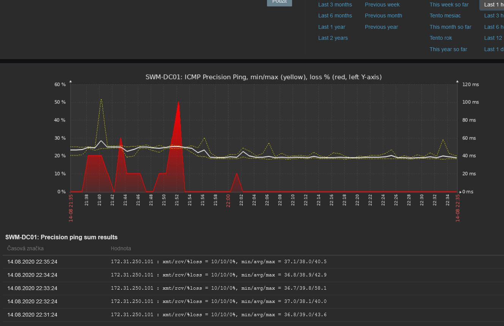

# Zabbix template – Advanced ICMP Ping (SmokePing-style)

Zabbix 7.4 template that extends the classic ICMP ping. Inspired by [SmokePing](https://oss.oetiker.ch/smokeping/): instead of a single ping it sends a **batch of ICMP requests at once** (default 10) with `fping` and evaluates **min / avg / max response time, packet loss and jitter (max/min ratio)**. You can see unstable links, not just links that are down.



## ✨ Highlights

- 📶 **Batch ping**: 10 ICMP requests per check (configurable), so short packet loss and latency spikes don't get lost between checks
- 📊 **Min / avg / max and loss in one graph**: min/max as yellow dashed lines, avg as a bold line, loss in red on the left Y-axis
- 〰️ **Jitter detection**: a trigger fires when the max response time is more than N times the min
- 🧩 **Module template**: link it to any host next to its regular template

## Contents

| File | Description |
|------|-------------|
| `template_advanced_icmp_ping.yaml` | Zabbix **7.4** export with the template `Module advanced ICMP Ping` |
| `files/Advanced_ping.sh` | External script that runs `fping` |
| [`../5.0/template_advanced_icmp_ping.xml`](../5.0/template_advanced_icmp_ping.xml) | Original template for **Zabbix 5.0** (no longer maintained) |

### `Module advanced ICMP Ping`

**Items**

| Item | Key | Units |
|------|-----|-------|
| Advanced ping sum results (raw fping output, master item) | `Advanced_ping.sh["{HOST.IP}","{$ADV_FPING_POOL_COUNT}"]` | text |
| Advanced ping min | `advanced.ping.min` | ms |
| Advanced ping avg | `advanced.ping.avg` | ms |
| Advanced ping max | `advanced.ping.max` | ms |
| Advanced ping loss | `advanced.ping.loss` | % |
| Advanced ping sent | `advanced.ping.xmt` | |
| Advanced ping received | `advanced.ping.rcv` | |

The script runs once and all the other items are taken from its output (dependent items), so each check sends only one batch of pings.

**Triggers**

| Trigger | Severity | Condition |
|---------|----------|-----------|
| Unavailable by ICMP ping | High | no reply in the last 3 batches |
| High ICMP ping loss | Warning | loss > `{$ADV_ICMP_LOSS_WARN}` in the last 2 batches |
| High ICMP ping response time | Warning | avg over 5 min > `{$ADV_ICMP_RESPONSE_TIME_WARN}` ms |
| High ICMP ping time differences (Min/Max) | Warning | avg max / avg min over 5 min > `{$ADV_ICMP_MAX_TIME_MULTIPLE}` |

The warnings depend on *Unavailable by ICMP ping*, so when the host is down you only get one alert.

**Graph**: `ICMP Advanced Ping, min/max (yellow), loss % (red, left Y-axis)`

**Dashboard**: `Advanced ICMP PING` (template dashboard, available on every linked host): the graph plus the last raw fping results

## Requirements

- Zabbix server / proxy **7.4** or newer (for Zabbix 5.0 use the template in [`../5.0/`](../5.0/))
- `fping` installed on the server / proxy that runs the check

## Installation

1. **Install fping** on the Zabbix server / proxy:
   ```bash
   apt install fping        # Debian / Ubuntu
   dnf install fping        # RHEL / Rocky / Alma
   ```
2. **Copy the script** to the external scripts directory and make it executable:
   ```bash
   cp files/Advanced_ping.sh /usr/lib/zabbix/externalscripts/
   chmod a+x /usr/lib/zabbix/externalscripts/Advanced_ping.sh
   ```
   The directory is set by `ExternalScripts` in `zabbix_server.conf` / `zabbix_proxy.conf`.
3. **Test it** as the zabbix user:
   ```bash
   sudo -u zabbix /usr/lib/zabbix/externalscripts/Advanced_ping.sh 8.8.8.8 10
   # 8.8.8.8 : xmt/rcv/%loss = 10/10/0%, min/avg/max = 11.2/11.9/13.4
   ```
4. **Import the template**: *Data collection → Templates → Import* → `template_advanced_icmp_ping.yaml`
5. **Link** `Module advanced ICMP Ping` to your hosts and adjust the macros if needed.

> The master item has its own **30 s timeout**, so you don't need to change `Timeout` in `zabbix_server.conf` (the Zabbix 5.0 version needed that).

## Macros

| Macro | Default | Description |
|-------|---------|-------------|
| `{$ADV_FPING_POOL_COUNT}` | `10` | Number of ICMP requests in one batch |
| `{$ADV_ICMP_LOSS_WARN}` | `20` | Maximum tolerated packet loss (%) |
| `{$ADV_ICMP_RESPONSE_TIME_WARN}` | `200` | Maximum tolerated average response time (ms) |
| `{$ADV_ICMP_MAX_TIME_MULTIPLE}` | `10` | Maximum tolerated ratio between max and min response time |

## Notes

- The script sends one ping every 2 s, so 10 pings take about 20 s. Keep `{$ADV_FPING_POOL_COUNT}` at 14 or lower, or the check won't finish within the 30 s timeout.
- The check uses `{HOST.IP}`, so the host needs an interface with an IP address.
- When the host doesn't answer at all, fping doesn't print min/avg/max. Those values are skipped and only loss / received are stored.
- **Upgrading from the Zabbix 5.0 version**: the template name and item keys are the same, so importing the new file updates the existing template and keeps your history. Changes compared to 5.0:
  - The loss trigger uses `{$ADV_ICMP_LOSS_WARN}` (it was hard-coded to 10 %).
  - Min / avg / max items no longer become *Not supported* when the host is down.
  - The item timeout is now set on the item itself.
  - The screen was removed (screens don't exist in Zabbix 7.x). It is replaced by the template dashboard *Advanced ICMP PING*.

## Custom work & support

Need something extra? I can extend or customize this template for your company's needs, for example new metrics, triggers, dashboards or integration with your environment. Feel free to get in touch: 📧 [info@duprtech.sk](mailto:info@duprtech.sk)

If this work makes sense to you, give the repo a ⭐ star or support me on Ko-fi ☕

I'm adding more tools and templates over time, so feel free to [follow me on GitHub](https://github.com/DuprTECH) to see what's new.

[](https://ko-fi.com/duprtech)

## Contributors

Thanks to [KLESYS](https://github.com/KLESYS) for improvements to the documentation.

## More scripts, improvements and frequent updates

This folder holds a snapshot of the template. **More scripts, improvements and frequent updates are on my GitHub:**

- 🆕 newer versions and frequent updates
- 🐞 bug fixes
- 🧩 extra scripts and improvements for the template

👉 **Repository:** https://github.com/DuprTECH/Zabbix-AdvancedPING  
👤 **My GitHub:** https://github.com/DuprTECH
