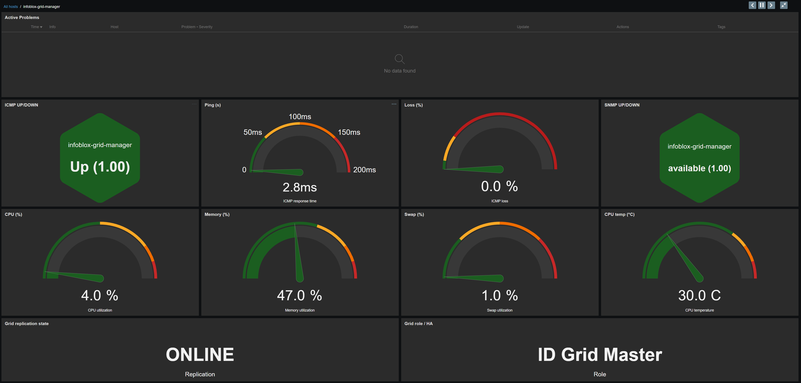
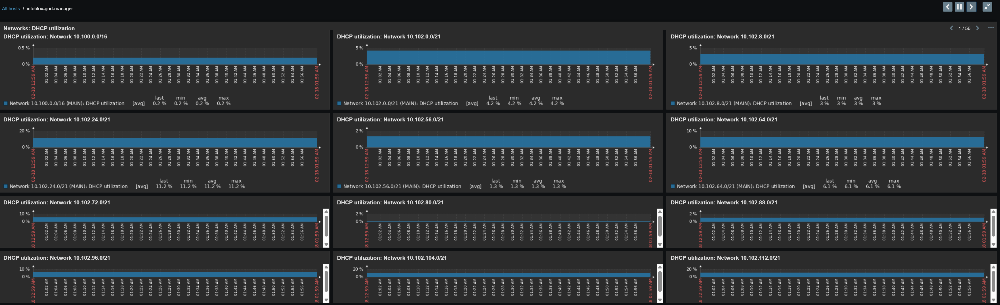
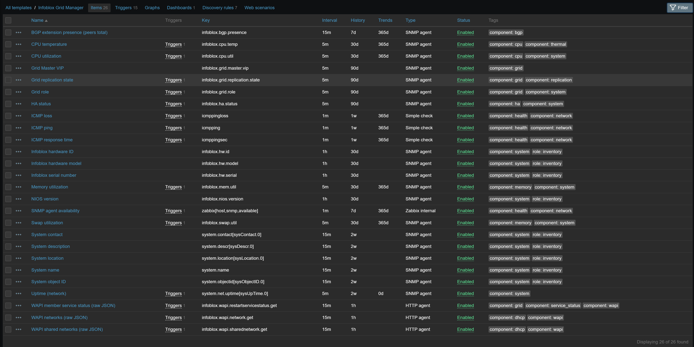
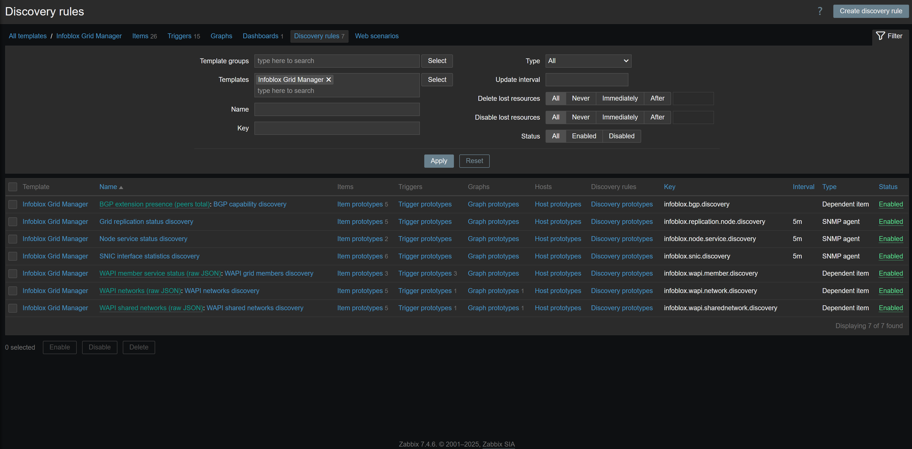
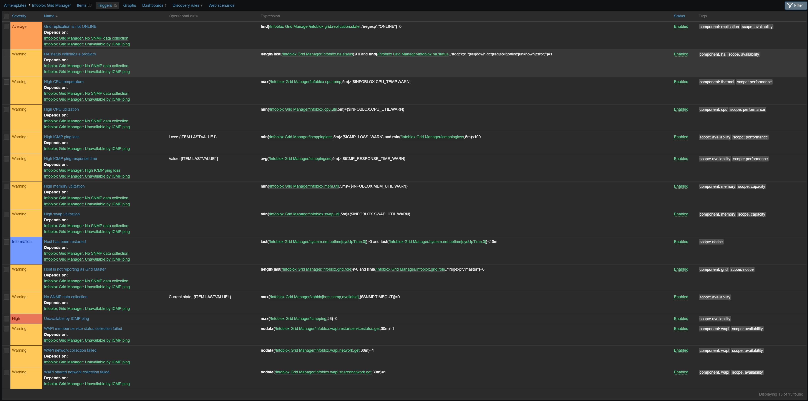

# Infoblox Grid Manager Monitoring Template for Zabbix 7.4

[](https://www.zabbix.com/)
[](https://www.infoblox.com/)
[]()

**Author:** `://echo@dla.network [oZark oRChes✝ra✝'d]` | [](https://github.com/DLA-neTWorK)

**Version:** 1.0.1 (2026-03-12)

## Overview

Production-focused monitoring template for Infoblox Grid Manager on Zabbix 7.4.

This template combines:

- SNMP telemetry for platform health, role, HA status, replication indicators, node service checks, and SmartNIC statistics
- WAPI telemetry for DHCP utilization and member runtime service status across the grid
- ICMP reachability checks for fast availability detection

The design is optimized for operations teams that need both appliance-level health and centralized DHCP/service visibility from the Grid Master.

### Tested Scope

- Zabbix: 7.4 template export format
- Infoblox WAPI profile in template defaults: `v2.13` (macro `{$INFOBLOX.WAPI.URL}`)
- Deployment mode: intended for Grid Master attachment to provide grid-wide member/service visibility

## Key Features

- ✅ **Hybrid Monitoring Model** - ICMP + SNMP + HTTPS WAPI for resilient visibility
- ✅ **Grid-Centric Telemetry** - Grid role, replication state, HA status, and member runtime service status
- ✅ **DHCP Capacity Analytics** - Per-network and shared-network utilization plus host counts via WAPI
- ✅ **SmartNIC Monitoring** - lan1/lan2/ha Rx, Tx, and drop metrics (bps and pps)
- ✅ **Inventory and Platform Coverage** - Hardware model, serial, hardware ID, NIOS version, system metadata
- ✅ **Operational Dashboard** - 2 pages with 13 widgets for status + DHCP utilization drilldown
- ✅ **Noise-Reduced Alerting** - Trigger dependencies and clear transport/data-collection separation
- ✅ **Controlled LLD Alert Rollout** - Runtime service prototypes enabled, capacity prototypes disabled by default
- ✅ **WAPI Scalability Controls** - Configurable WAPI max-results with bounded response-field selection for service status calls
- ✅ **Truncation Risk Guardrails** - Count-based alerts when WAPI responses reach configured max-results cap
- ✅ **Credential-Safe Defaults** - Template exports use placeholder WAPI credentials to avoid accidental secret leakage

## Monitoring Capabilities

### Availability and Core Health

- ICMP ping, packet loss, and response time
- SNMP agent availability
- CPU utilization
- CPU temperature
- Memory utilization
- Swap utilization
- Host restart detection (sysUpTime)

### Grid and High Availability

- Grid role (master/member context)
- Grid Master VIP
- Grid replication state
- HA status
- Per-node replication details:
	- replication status
	- queue sent/receive depth
	- last replication send/receive timestamps

### Node Service Health (LLD)

Node service status discovery (`ibMemberNodeServiceStatusTable`) creates per-service status and detail items for checks such as:

- node status
- disk usage
- LAN/HA/MGMT ports
- memory
- replication service
- RAID health (array/disks/battery)
- fans and power supplies
- NTP synchronization
- CPU/system temperature and CPU usage
- BGP/OSPF services (where present)

### Network and SmartNIC (LLD)

SmartNIC discovery includes:

- Rx bps / Rx pps
- Tx bps / Tx pps
- Drop bps / Drop pps

### DHCP and Service Runtime from WAPI (LLD)

WAPI master items fetch JSON once per interval, then dependent LLD/item prototypes fan out:

- Grid member runtime services:
	- DNS status
	- DHCP status
	- Reporting status
- Network-level DHCP utilization and host counts
- Shared-network DHCP utilization and host counts

Additional dependent telemetry monitors WAPI response object counts for:

- `network`
- `sharednetwork`
- `restartservicestatus`

and triggers warning events when any result count reaches `{$INFOBLOX.WAPI.MAX_RESULTS}` (possible truncation).

## Dashboard

Template dashboard name: `Infoblox Grid Manager`

- Pages: 2
- Widgets: 13

### Overview Page

Main NOC view for status, latency, loss, CPU/memory/swap/temp, and role/replication indicators.





### DHCP Utilization Page

Graph-prototype page showing discovered utilization charts for:

- IPv4 networks
- shared networks

### Dashboard Benefits

- ✅ **Operational Focus** - Overview page centralizes availability, system pressure, and grid state indicators
- ✅ **Capacity Visibility** - DHCP page scales with discovered networks/shared networks automatically via graph prototypes
- ✅ **NOC-Friendly Layout** - Widget composition supports fast triage from symptom to probable fault domain

## Evidence Screenshots

### Non-LLD Items



### LLD Discovery Rules



### Non-LLD Triggers



## Trigger Summary

### Non-LLD Triggers

The template ships with non-LLD operational triggers for:

- availability (ICMP, SNMP)
- performance (ping latency/loss, CPU, memory, swap)
- grid/HA state correctness
- data collection failures on WAPI master items
- recent restart detection

Severity profile is mostly `WARNING`, with key connectivity escalated to `HIGH` and replication state to `AVERAGE`.

### LLD Trigger Prototypes

LLD trigger prototypes are focused on:

- per-member DNS/DHCP/Reporting status problems
- DHCP network/shared-network capacity thresholds

Important default behavior:

- Capacity trigger prototypes for network and shared-network utilization are disabled by default.
- Enable LLD trigger prototypes selectively based on your DHCP policy, subnet design, and alert tolerance.

All LLD trigger prototypes in this template use `manual_close=YES` to support explicit NOC acknowledgment workflows.

### Trigger Inventory

#### Non-LLD Trigger Set

| Trigger | Severity | Default |
|---|---|---|
| Unavailable by ICMP ping | HIGH | Enabled |
| High ICMP ping loss | WARNING | Enabled |
| High ICMP ping response time | WARNING | Enabled |
| No SNMP data collection | WARNING | Enabled |
| Host has been restarted | INFO | Enabled |
| High CPU utilization | WARNING | Enabled |
| High CPU temperature | WARNING | Enabled |
| High memory utilization | WARNING | Enabled |
| High swap utilization | WARNING | Enabled |
| Grid replication is not ONLINE | AVERAGE | Enabled |
| Host is not reporting as Grid Master | WARNING | Enabled |
| HA status indicates a problem | WARNING | Enabled |
| WAPI network collection failed | WARNING | Enabled |
| WAPI shared network collection failed | WARNING | Enabled |
| WAPI member service status collection failed | WARNING | Enabled |
| WAPI network result count reached max_results | WARNING | Enabled |
| WAPI shared network result count reached max_results | WARNING | Enabled |
| WAPI member service status result count reached max_results | WARNING | Enabled |

#### LLD Trigger Prototypes

| Trigger Prototype | Severity | Default |
|---|---|---|
| Member {#MEMBER}: DNS status problem | WARNING | Enabled |
| Member {#MEMBER}: DHCP status problem | WARNING | Enabled |
| Member {#MEMBER}: Reporting status problem | WARNING | Enabled |
| Network {#NETWORK}: High utilization | INFO | Disabled |
| Shared network {#SHAREDNETWORK_NAME}: High utilization | INFO | Disabled |

### Severity Matrix

#### Default Enabled Triggers

| Severity | Count | Examples |
|---|---|---|
| HIGH | 1 | Unavailable by ICMP ping |
| AVERAGE | 1 | Grid replication is not ONLINE |
| WARNING | 18 | SNMP unavailable, CPU/memory/swap thresholds, WAPI collection failures, result-cap truncation warnings, member DNS/DHCP/Reporting status problems |
| INFO | 1 | Host has been restarted |

#### Disabled by Default

| Severity | Count | Scope |
|---|---|---|
| INFO | 2 | DHCP capacity trigger prototypes (network and shared-network) |

### Trigger Design Philosophy

- Dependencies suppress cascade noise when transport checks fail first (for example, ICMP down before SNMP/WAPI symptoms).
- Grid-logic checks remain visible separately from transport failures to preserve operational context.
- Capacity alerts are opt-in by default to prevent premature noise in environments with intentional high utilization.

## Installation Guide

### Prerequisites

- Zabbix Server 7.4 or higher
- Infoblox Grid Master reachable from Zabbix server
- SNMP enabled on Infoblox
- WAPI account with read permissions for required objects
- Network connectivity:
	- ICMP
	- UDP 161 (SNMP)
	- TCP 443 (WAPI HTTPS)

### Step 1: Import Template

1. Import `infoblox-grid-manager-template.yaml` in Zabbix:
	 - Configuration -> Templates -> Import
2. Confirm template name appears as `Infoblox Grid Manager`.

### Step 2: Create/Select Host

1. Configuration -> Hosts -> Create host
2. Set host interface/IP for SNMP and `HOST.CONN`
3. Link template `Infoblox Grid Manager`

### Step 3: Configure Required Macros

Set at host or template level:

| Macro | Default | Description |
|---|---|---|
| `{$INFOBLOX.WAPI.URL}` | `https://{HOST.CONN}/wapi/v2.13` | WAPI base URL with version |
| `{$INFOBLOX.WAPI.USER}` | `__SET_IN_HOST_MACRO__` | WAPI username (set at host/group level) |
| `{$INFOBLOX.WAPI.PASSWORD}` | `__SET_IN_HOST_MACRO__` | WAPI password (set at host/group level) |
| `{$INFOBLOX.WAPI.MAX_RESULTS}` | `5000` | Maximum objects requested per WAPI call |

### Step 4: Tune Alert Threshold Macros

| Macro | Default | Description |
|---|---|---|
| `{$ICMP_LOSS_WARN}` | `20` | ICMP loss warning percent |
| `{$ICMP_RESPONSE_TIME_WARN}` | `0.15` | ICMP response-time warning (seconds) |
| `{$INFOBLOX.CPU_TEMP.WARN}` | `70` | CPU temperature warning |
| `{$INFOBLOX.CPU_UTIL.WARN}` | `90` | CPU utilization warning percent |
| `{$INFOBLOX.MEM_UTIL.WARN}` | `90` | Memory utilization warning percent |
| `{$INFOBLOX.SWAP_UTIL.WARN}` | `50` | Swap utilization warning percent |
| `{$INFOBLOX.DHCP.SUBNET.USED.WARN}` | `80` | DHCP subnet utilization warning percent |
| `{$INFOBLOX.DHCP.SHAREDNET.USED.WARN}` | `80` | DHCP shared-network utilization warning percent |
| `{$SNMP.TIMEOUT}` | `5m` | SNMP unavailable evaluation window |

### Step 5: Verify Data Collection

1. Check latest data for:
	 - `icmpping`, `icmppingloss`, `icmppingsec`
	 - `zabbix[host,snmp,available]`
	 - `infoblox.cpu.util`, `infoblox.mem.util`, `infoblox.grid.role`
2. Confirm WAPI master items receive JSON:
	 - `infoblox.wapi.network.get`
	 - `infoblox.wapi.sharednetwork.get`
	 - `infoblox.wapi.restartservicestatus.get`
3. Confirm LLD starts producing entities for:
	 - node service status
	 - replication nodes
	 - SNIC interfaces
	 - WAPI members/networks/shared networks

## Troubleshooting

### No SNMP Data

Symptoms:

- SNMP availability item is 0
- role/HA/CPU/memory items have no data

Checks:

1. Verify SNMP on Infoblox and ACLs for Zabbix source IP.
2. Test from Zabbix server:

```bash
snmpwalk -v2c -c COMMUNITY DEVICE_IP 1.3.6.1.2.1.1
snmpget -v2c -c COMMUNITY DEVICE_IP 1.3.6.1.4.1.7779.3.1.1.2.1.8.1.1.0
```

3. Verify host SNMP interface and credentials in Zabbix.

### No WAPI Data

Symptoms:

- WAPI master items have nodata
- WAPI-related LLD entities are missing

Checks:

1. Verify macro values for URL/user/password.
2. Validate endpoint and credentials manually:

```bash
curl -k -u "$WAPI_USER:$WAPI_PASS" "https://DEVICE_IP/wapi/v2.13/network?_max_results=2"
curl -k -u "$WAPI_USER:$WAPI_PASS" "https://DEVICE_IP/wapi/v2.13/sharednetwork?_max_results=2"
curl -k -u "$WAPI_USER:$WAPI_PASS" "https://DEVICE_IP/wapi/v2.13/restartservicestatus?_return_fields=member,dns_status,dhcp_status,reporting_status&_max_results=2"
```

3. If TLS inspection or private PKI is used, ensure your Zabbix HTTP agent trust chain/network path is valid.

### BGP Discovery Not Appearing

Expected behavior:

- BGP capability discovery is conditional.
- If Infoblox BGP extension OID is unsupported, discovery returns empty and no BGP prototype items are created.

### LLD Capacity Triggers Not Firing

Expected behavior:

- DHCP capacity trigger prototypes for network/shared-network utilization are disabled by default.

Action:

1. Open template -> Discovery rules -> item prototype triggers.
2. Enable only the capacity triggers you want active.
3. Adjust macro thresholds before enabling in production.

### Role/HA Trigger False Positives

`Grid role` and `HA status` are string/regex-based.

If your environment uses non-standard status strings:

1. Review latest values for those items.
2. Tune trigger regex expressions to your NIOS wording.

## Quick Validation Commands

Use these commands from a system that has path access to the Infoblox host and required tooling.

### SNMP Checks

```bash
snmpwalk -v2c -c COMMUNITY DEVICE_IP 1.3.6.1.2.1.1
snmpget -v2c -c COMMUNITY DEVICE_IP 1.3.6.1.4.1.7779.3.1.1.2.1.12.0
snmpget -v2c -c COMMUNITY DEVICE_IP 1.3.6.1.4.1.7779.3.1.1.2.1.16.0
```

### WAPI Checks

```bash
curl -k -u "$WAPI_USER:$WAPI_PASS" "https://DEVICE_IP/wapi/v2.13/network?_max_results=2"
curl -k -u "$WAPI_USER:$WAPI_PASS" "https://DEVICE_IP/wapi/v2.13/sharednetwork?_max_results=2"
curl -k -u "$WAPI_USER:$WAPI_PASS" "https://DEVICE_IP/wapi/v2.13/restartservicestatus?_return_fields=member,dns_status,dhcp_status,reporting_status&_max_results=2"
```

## Technical Architecture

### Collection Model

- Simple checks (ICMP): availability and latency baseline
- SNMP polling: platform telemetry and SNMP-based LLDs
- HTTP agent (WAPI): JSON master items
- Dependent items + JavaScript preprocessing: per-entity extraction from WAPI payloads

### Data Flow

```text
Infoblox Grid Manager
	|- ICMP
	|- SNMP (system, role/HA, replication, node services, SNIC)
	`- WAPI (network, sharednetwork, restartservicestatus)
					|
					v
Zabbix HTTP Agent master items (JSON)
					|
					v
Dependent LLD + dependent item prototypes
					|
					v
Triggers, Graph Prototypes, Dashboard Widgets
```

### Polling and Retention Profile

| Class | Typical Interval | Notes |
|---|---|---|
| ICMP and availability checks | 1m to 5m | Fast availability and latency signals |
| Core SNMP health (CPU/memory/swap/grid) | 5m | Operational baseline |
| Inventory SNMP fields | 15m to 1h | Low-change metadata |
| WAPI master pulls | 15m | Single JSON pull per endpoint, then dependent extraction |
| Discovery intervals | 5m for dynamic SNMP LLDs, 30d LLD lifetime | Maintains discovered entities over temporary data gaps |

### Discovery Rules

Total discovery rules: 7

| Discovery Rule | Source | Purpose |
|---|---|---|
| BGP capability discovery | Dependent on SNMP presence item | Conditionally enable BGP metrics |
| Node service status discovery | SNMP | Service-level health from node service table |
| Grid replication status discovery | SNMP | Per-member replication telemetry |
| SNIC interface statistics discovery | SNMP | SmartNIC interface rates and drops |
| WAPI grid members discovery | Dependent (WAPI JSON) | DNS/DHCP/Reporting status per member |
| WAPI networks discovery | Dependent (WAPI JSON) | DHCP utilization and host counters per network |
| WAPI shared networks discovery | Dependent (WAPI JSON) | DHCP utilization and host counters per shared network |

### Template Statistics

Approximate counts from template definition:

- Non-LLD items: 26
- Non-LLD items: 29
- Discovery rules: 7
- Item prototypes: 33
- Non-LLD triggers: 18
- Trigger prototypes: 5
- Graph prototype groups: 2
- Dashboards: 1
- Dashboard pages: 2
- Dashboard widgets: 13
- Macros: 13

## Security and Operations Notes

- Replace `{$INFOBLOX.WAPI.PASSWORD}` immediately before production rollout.
- Prefer role-scoped read-only WAPI users for monitoring.
- Keep trigger dependencies intact to avoid duplicate/noisy incidents during transport outages.
- Validate regex-based triggers (`grid role`, `HA status`) against your exact NIOS status vocabulary.
- Enable disabled DHCP utilization trigger prototypes only after threshold tuning per environment.
- If this template is linked to a non-Grid-Master host, expect reduced grid-wide visibility for member/service views.
- Treat WAPI collection failures separately from SNMP failures during incident triage; they indicate different fault domains.
- Monitor WAPI result-count items; if they hit `{$INFOBLOX.WAPI.MAX_RESULTS}`, the response may be truncated.
- Tune `{$INFOBLOX.WAPI.MAX_RESULTS}` based on grid size and Zabbix server capacity.

## Use Cases

- Grid Master health monitoring in enterprise DNS/DHCP deployments
- DHCP capacity oversight across many subnets/shared networks
- Runtime service-state visibility for DNS/DHCP/Reporting across grid members
- NOC operations with mixed infrastructure (network + service + replication checks)
- Controlled rollout of capacity alerts by enabling LLD trigger prototypes selectively

## Quick Reference

### Template Metadata

| Property | Value |
|---|---|
| Template name | Infoblox Grid Manager |
| Zabbix version | 7.4+ |
| Monitoring methods | ICMP + SNMP + WAPI |
| Vendor | Infoblox |
| Focus | Grid, DHCP capacity, service runtime, platform health |

### Key OIDs and Endpoints

| Signal | Source | Identifier |
|---|---|---|
| CPU utilization | SNMP | `1.3.6.1.4.1.7779.3.1.1.2.1.8.1.1.0` |
| Memory utilization | SNMP | `1.3.6.1.4.1.7779.3.1.1.2.1.8.2.1.0` |
| Grid role | SNMP | `1.3.6.1.4.1.7779.3.1.1.2.1.12.0` |
| Grid replication state | SNMP | `1.3.6.1.4.1.7779.3.1.1.2.1.16.0` |
| WAPI networks | HTTPS | `/wapi/v2.13/network` |
| WAPI shared networks | HTTPS | `/wapi/v2.13/sharednetwork` |
| WAPI member service status | HTTPS | `/wapi/v2.13/restartservicestatus` |

### Recommended Rollout Sequence

1. Validate ICMP and SNMP availability.
2. Validate WAPI credentials and payload collection.
3. Confirm LLD entity creation (services/members/networks/shared networks).
4. Tune macro thresholds.
5. Enable selected LLD trigger prototypes according to your operational policy.

## Support and Resources

### Infoblox

- [Infoblox Product Documentation](https://docs.infoblox.com/)
- [Infoblox Support Portal](https://support.infoblox.com/)

### Zabbix

- [Zabbix 7.4 Documentation](https://www.zabbix.com/documentation/7.4/)
- [Template Guidelines](https://www.zabbix.com/documentation/7.4/manual/appendix/templates)
- [HTTP Agent Items](https://www.zabbix.com/documentation/7.4/manual/config/items/itemtypes/http)
- [SNMP Monitoring](https://www.zabbix.com/documentation/7.4/manual/config/items/itemtypes/snmp)
- [Low-Level Discovery](https://www.zabbix.com/documentation/7.4/manual/discovery/low_level_discovery)

## Version History

### v1.0.1 - Security and Scalability Hardening (2026-03-12)

- Replaced hardcoded WAPI `_max_results=10000` with configurable macro `{$INFOBLOX.WAPI.MAX_RESULTS}`
- Limited WAPI `restartservicestatus` request fields to required values (`member,dns_status,dhcp_status,reporting_status`)
- Added dependent result-count items and warning triggers to detect potential WAPI result truncation at configured cap
- Removed unused `Infoblox::ServiceName` valuemap
- Updated default WAPI credential macros to placeholder values (`__SET_IN_HOST_MACRO__`) to avoid exporting risky defaults

### v1.0.0 - Initial Comprehensive Release (2026-03-12)

- Added full Infoblox Grid Manager documentation aligned to the project's robust template README standard
- Embedded dashboard, item, LLD-rule, and trigger screenshots
- Documented ICMP/SNMP/WAPI architecture and deployment workflow
- Added trigger inventory tables including disabled-by-default LLD capacity prototypes
- Added troubleshooting, operational hardening, and rollout guidance

## License

Community template for operational use, adaptation, and redistribution.

**Author:** `://echo@dla.network [oZark oRChes✝ra✝'d]` | [](https://github.com/DLA-neTWorK)

For template issues, customization requests, or enhancement suggestions, please contact the template maintainer.

---

Designed for robust Infoblox Grid monitoring with practical NOC operations in mind.
