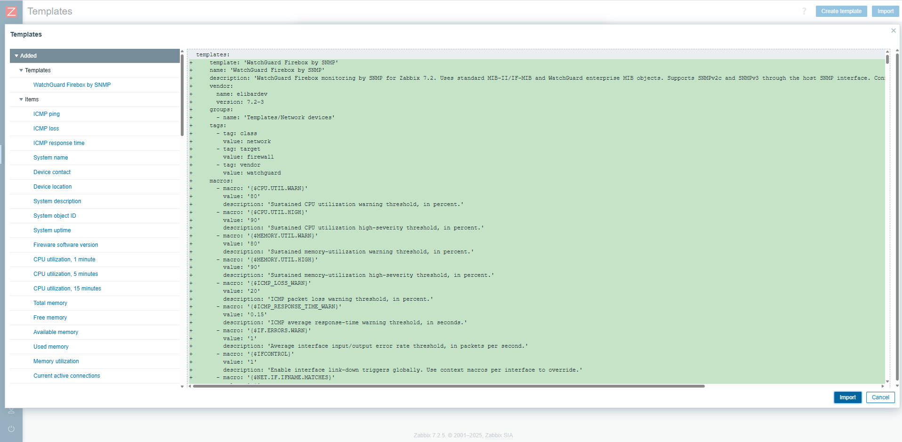
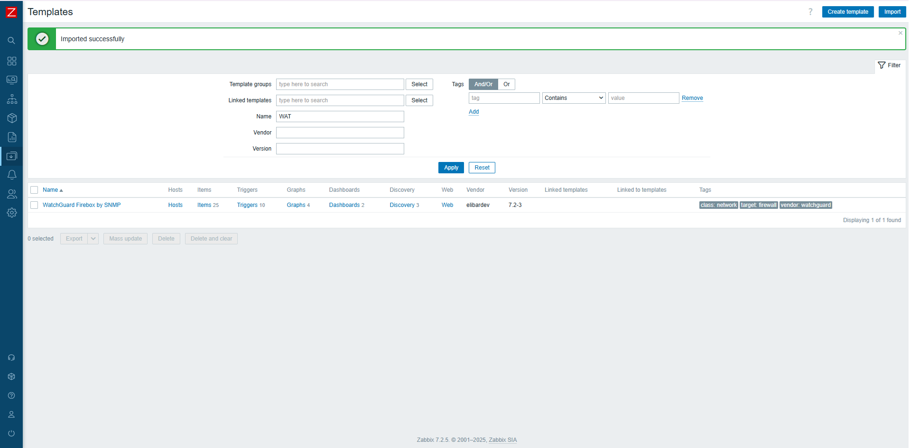
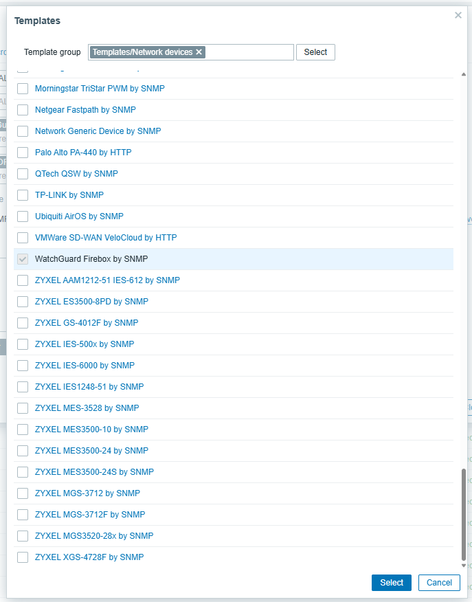
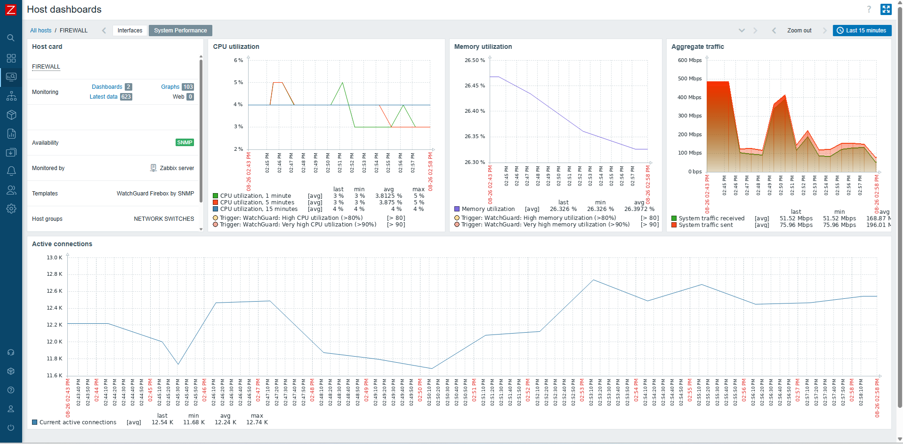
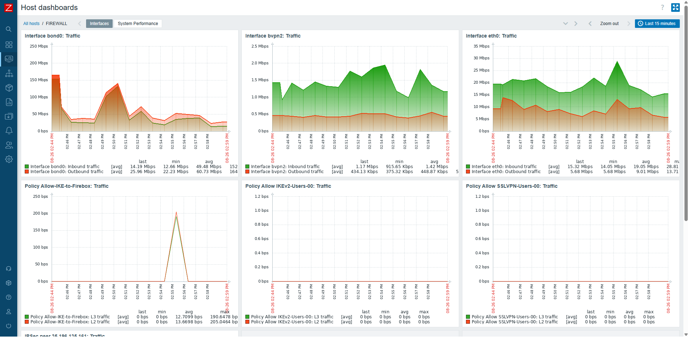

# WatchGuard Firebox by SNMP

Community template for monitoring WatchGuard Firebox appliances with **Zabbix 7.2**.

It uses the host SNMP interface, numeric OIDs, asynchronous `get[]` / `walk[]`, dependent items, and low-level discovery (LLD). No credentials are stored in the template.

> **Author:** [@elibardev](https://github.com/elibardev)  
> **Zabbix version:** 7.2  
> **License:** MIT (same license as the Zabbix Community Templates repository)

## Highlights

| Area | Included monitoring |
|---|---|
| 🟢 Availability | ICMP reachability, loss, response time, uptime and restart detection |
| ℹ️ Device information | Name, description, object ID, contact, location and Fireware version |
| ⚙️ Resources | CPU 1/5/15-minute utilization and memory total/free/available/used/utilization |
| 🌐 Traffic | Aggregate traffic and active connections |
| 🔌 Interfaces | LLD, operational and administrative state, 64-bit traffic, errors and discards |
| 🔐 IPSec | Endpoint-pair LLD, SAs, traffic, authentication and replay errors |
| 🛡️ Policies | Policy LLD, L2/L3 traffic, packet rate, active connections, discards and logging |

## Requirements

- Zabbix **7.2**.
- A WatchGuard Firebox with SNMP enabled and reachable from the Zabbix server or proxy.
- A host-level SNMP interface configured for SNMPv2c or SNMPv3.

## Installation

1. Go to **Data collection → Templates → Import**.
2. Import `template_watchguard_firebox_by_snmp.yaml`.
3. Create or edit the Firebox host and add its SNMP interface.
4. Configure SNMPv2c or SNMPv3 credentials on that host interface.
5. Link **WatchGuard Firebox by SNMP** to the host.
6. Confirm the master walk items are supported under **Monitoring → Latest data**.

> Do not enable **Delete missing** during the first import against an existing environment.

## SNMP connectivity

### SNMPv2c

```bash
snmpwalk -v2c -c <community> <firebox-ip> 1.3.6.1.2.1.1
```

### SNMPv3

```bash
snmpwalk -v3 -u <user> -l authPriv -a SHA -A '<auth-pass>' -x AES -X '<priv-pass>' <firebox-ip> 1.3.6.1.2.1.1
```

## Default macros

| Macro | Default | Purpose |
|---|---:|---|
| `{$CPU.UTIL.WARN}` / `{$CPU.UTIL.HIGH}` | 80 / 90 | Sustained CPU utilization thresholds (%) |
| `{$MEMORY.UTIL.WARN}` / `{$MEMORY.UTIL.HIGH}` | 80 / 90 | Sustained memory utilization thresholds (%) |
| `{$ICMP_LOSS_WARN}` | 20 | Packet-loss warning threshold (%) |
| `{$ICMP_RESPONSE_TIME_WARN}` | 0.15 | Average ICMP response-time threshold (seconds) |
| `{$IF.ERRORS.WARN}` | 1 | Interface error-rate threshold (packets/s) |
| `{$IFCONTROL}` | 1 | Enables interface link-down triggers; supports context overrides |
| `{$VPN.MIN.ACTIVE}` | 0 | Minimum expected active IPSec endpoint pairs; `0` disables the alert |
| `{$POLICY.DISCARDS.WARN}` | 10 | Policy firewall-discard threshold (packets/s) |
| `{$POLICYCONTROL}` | 1 | Enables policy discard triggers; supports context overrides |

Examples of context overrides:

```text
{$IFCONTROL:"eth3"} = 0
{$POLICYCONTROL:"Branch-VPN"} = 0
```

## Dashboards

### System Performance

- Host card: monitoring state, host description, SNMP availability, monitoring server, linked template, host groups, and tags.
- CPU, memory utilization, and aggregate traffic.
- Active connections graph.

### Interfaces

- Three interface traffic graph-prototype cards per row.
- Three policy traffic graph-prototype cards per row.
- Three IPSec peer traffic graph-prototype cards per row.

## Alerts

Includes alerts for unavailable ICMP, sustained packet loss and latency, restart, Fireware version change, sustained CPU/memory use, interface link down, interface errors, missing IPSec SAs, IPSec authentication/replay errors, low endpoint-pair baseline, and sustained policy firewall discards.

Thresholds are deliberately conservative; establish normal baselines before changing them.

## Memory source

Memory uses the Firebox-verified UCD-SNMP objects below. The device returns kB, so the template converts the values to bytes with a `1024` multiplier.

| Object | OID | Used for |
|---|---|---|
| `memTotalRealX.0` | `1.3.6.1.4.1.2021.4.20.0` | Total memory |
| `memSysAvail.0` | `1.3.6.1.4.1.2021.4.27.0` | Available memory used for utilization |

Used memory and utilization are calculated from total minus available memory.

## Notes

- Connected-user monitoring is intentionally out of scope.
- Policy monitoring uses the supported `WATCHGUARD-POLICY-MIB` branch `1.3.6.1.4.1.3097.4.2`; unsupported `wgPolicyToTunnel` objects are not used.
- Numeric OIDs allow the template to work without installing WatchGuard MIB files on the Zabbix server.
- Validate interface, IPSec, and policy discovery after import against a real Firebox.

## Screenshots

### Import and setup

The template preview shows the configuration that will be imported into Zabbix.



After import, Zabbix confirms the template and its monitoring components.



Link the template to the target Firebox host from the **Templates** selector.



### Dashboards

**System Performance** provides a compact view of host status, CPU and memory utilization, aggregate traffic, and active connections.



**Interfaces** displays the discovered interface, policy, and IPSec traffic graphs.



Only commit images that are public, relevant, and free of sensitive hostnames, IP addresses, credentials, or operational data.

## License

This template is provided under the same license as the Zabbix Community Templates repository.
