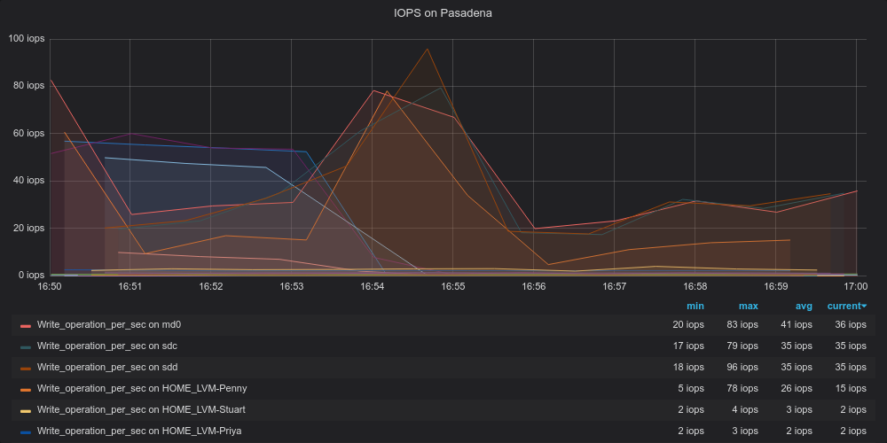
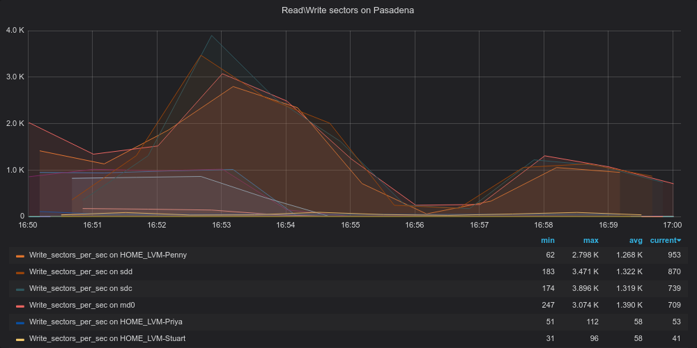
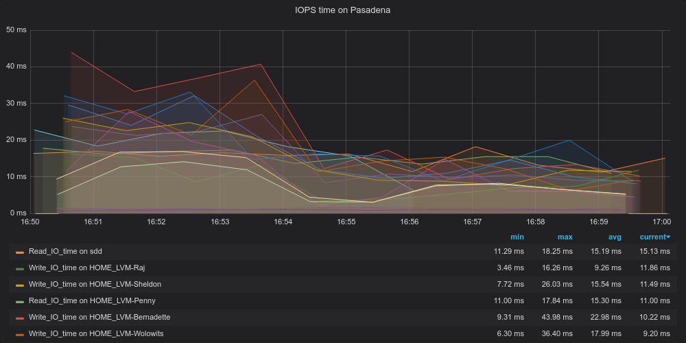
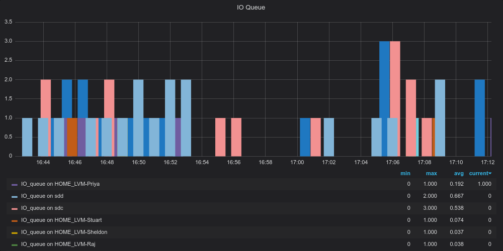

# ZBX_Disk_Stat
Send statistic from /proc/diskstats to Zabbix

This is small project for my Home server

# Source
[github: dusharu/ZBX_Disk_Stat](https://github.com/dusharu/ZBX_Disk_Stat)


# Features
  * AutoDiscovery BlockDev and Filter by [LLD Override](https://www.zabbix.com/documentation/current/manual/discovery/low_level_discovery#override) 
  * Collect Read\Write Operations per second
  * Collect Read\Write Sectors per second
  * Calculate Time for 1 Read\Write Operations
    * Trigger when IO_Time >30ms at 10 times per 20min
  * Collect IO Queue
  * Convert DM(Device Mapper) device to pretty Name
    * Get stat for `dm-1` but print for user `vg00-lv_root`
    * After reboot `dm-1` may change to `dm-2`, but stat will be correct

# Requires

# Install
  1. Add script to server

```
# Create dir for zabbix sript
mkdir -p /usr/libexec/zabbix/

# Copy script to your server
curl 'https://raw.githubusercontent.com/dusharu/ZBX_Disk_Stat/master/scripts/disk_stat.sh' -o /usr/libexec/zabbix/disk_stat.sh
chmod 755 /usr/libexec/zabbix/disk_stat.sh
```
  2. [Import](https://www.zabbix.com/documentation/current/ru/manual/xml_export_import) [Template_ZBX/ZBX_Disk_Stat.xml](ZBX_Disk_Stat.xml)
  3. Check [LLD Override](https://www.zabbix.com/documentation/current/manual/discovery/low_level_discovery#override). Default value:
     * ^$ - result FALSE - device was remove
     * .*snapshot.* - result FALSE - filter LVM snapshot
     * -real$ - result FALSE - [filter LVM snapshot](https://rwmj.wordpress.com/2010/09/28/how-lvm-does-snapshots/)
     * -cow$ - result FALSE - [filter LVM snapshot](https://rwmj.wordpress.com/2010/09/28/how-lvm-does-snapshots/)
     * ^xvd[a-z]*[0-9]+$ - result FALSE - filter partitions
     * ^[hs]d[a-z]*[0-9]+$ - result FALSE - filter partitions
     * ^loop[0-9]*$ - result FALSE - filter loop device
     * ^sr[0-9]*$ - result FALSE - filter CD-ROM
  4. Add host to group "Disk_Stat: io_block_dev"
  5. Wait before Zabbix Discovery and Get Some Data


# Screenshoot
Graph create by [Grafana](https://grafana.com/) and [Zabbix plugin](https://grafana.com/grafana/plugins/alexanderzobnin-zabbix-app)





Graph create by Zabbix


# Debug Command
## Print HELP
```
zabbix_get -s <HOST> -k 'system.run[ "/usr/libexec/zabbix/disk_stat.sh" ]'
```
## Discovery
```
zabbix_get -s <HOST> -k 'system.run[ "/usr/libexec/zabbix/disk_stat.sh blkdev_discovery" ]'
```
## Get statistic
```
zabbix_get -s <HOST> -k 'system.run[ "/usr/libexec/zabbix/disk_stat.sh blkdev_all_stat <DISK>" ]'
```


# Docs
  1. [kernel.org: Describe /proc/diskstats](https://www.kernel.org/doc/Documentation/ABI/testing/procfs-diskstats)
  2. [kernel.org: I/O statistics fields](https://www.kernel.org/doc/Documentation/admin-guide/iostats.rst)
  3. [Wikipedia.org: maximum IOPS on different Disk](https://en.wikipedia.org/wiki/IOPS)
  4. [RAID calcuator](https://wintelguy.com/raidperf.pl)
  5. [Linux Filesystem Hierarchy Standard: /usr/libexec](https://refspecs.linuxfoundation.org/FHS_3.0/fhs/ch04s07.html)

# ToDo
  1. Add link with information about maximum IO_time
  2. Add plugin for zabbix_agent2
