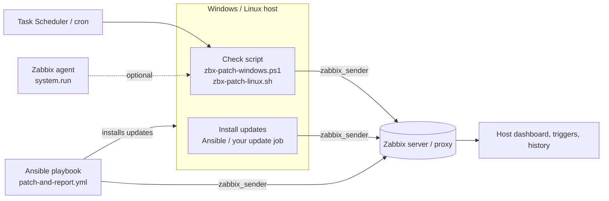
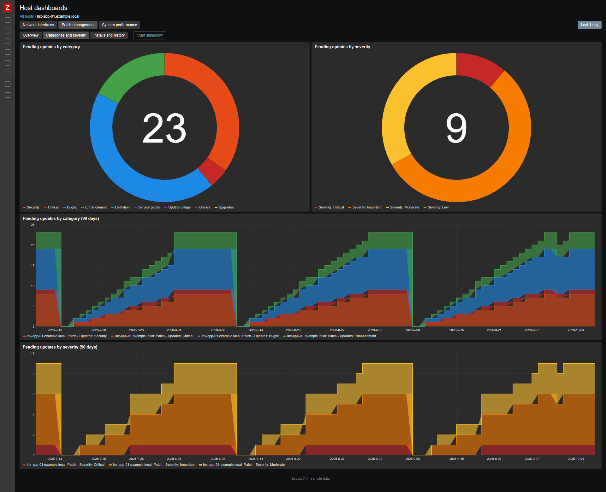
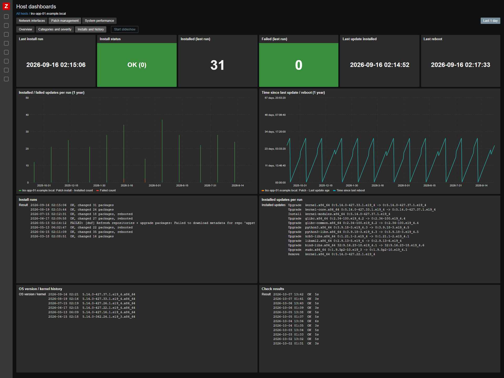

# Zabbix – Patch management for Windows and Linux (template, host dashboard, check scripts, Ansible)

One Zabbix 7.4 template to see the **update status of all your Windows and Linux servers in one place**, with the **same keys on every OS**: how many updates are pending (security, critical, by severity, kernel, …), which ones, what was installed recently, whether a reboot is needed, when the host was last patched and with what result.


*Host dashboard **Patch management**, included in the template (sample data). More screenshots, including the global dashboard of all hosts, are in [Dashboards](#dashboards).*

## ✨ Highlights

- 🪟🐧 **One template for Windows and Linux**: Windows Update, apt (Debian, Ubuntu), dnf / yum (RHEL, Rocky, Alma, Oracle, Fedora). The same keys (`patch.*`), so dashboards, triggers and reports work the same for every OS.
- 📋 **Pending updates** by category (security, critical, bugfix, enhancement, kernel, definition, drivers, …) and **severity** (critical / important / moderate / low), plus the **list of pending updates**
- 📜 **Update history** like a log: what was installed / upgraded / removed and when (Windows Update history, apt history, rpm)
- 🔁 **Reboot required and why**, last reboot time, uptime
- 🛠️ **Last update installed** (detected on the host) and its **patch day** (for example *2.Tue* = 2nd Tuesday), result of the last install run (Ansible or your own job)
- 🖥️ **OS name and version / kernel**, update source and its availability, automatic updates, Windows Update service
- 📊 **Host dashboard** included in the template: tiles, pending updates list, update history, graphs by category and severity, install runs
- 🚨 **Triggers**: critical / security updates pending, reboot required / pending too long, update source unavailable, check failed, install run failed, **no data from a host**
- 🧰 **Works your way**: the check runs from cron / Task Scheduler (or the Zabbix agent) with zabbix_sender. Updates are installed by **Ansible** (playbook included) or any other tool – or use **only the reporting** with the one-command install scripts.
- 🤝 **Support and complete deployment** available – see [Support](#support-deployment--custom-work).

## How it works



1. **Check** (`patch.*` items): the check script runs on the host every few hours and sends everything with zabbix_sender.
2. **Install** (`patch.install.*` items): the Ansible playbook from this repository, or your own update job, installs the updates and sends the result.

The check and the install are independent: you can use **only the check (reporting)**, see [Check only](#check-only-reporting).

## Contents

| File | Description |
|------|-------------|
| `template_patch_management.yaml` | Zabbix **7.4** export with the template `APP Patch management all OS` (items, triggers, host dashboard) |
| `scripts/zbx-patch-windows.ps1` | Windows check script (PowerShell, Windows Update Agent API) |
| `scripts/zbx-patch-linux.sh` | Linux check script (bash, apt / dnf / yum) |
| `scripts/install-check-windows.ps1` | Check only: installs the Windows check script, schedules it (Task Scheduler) and runs it |
| `scripts/install-check-linux.sh` | Check only: installs the Linux check script, schedules it (cron) and runs it |
| `ansible/check-windows.yml`, `ansible/check-linux.yml` | Check only with Ansible: the same for many hosts at once |
| `ansible/patch-and-report.yml` | Ansible playbook: install updates on Windows and Linux, report to Zabbix |
| `ansible/inventory.example.ini` | Example inventory |
| [`old/`](old/README.md) | The original Windows only template `APP Winupdates check` (legacy) |

## Items

Values that exist on only one OS are kept too: on the other OS they are sent as `0` (for example *definition* on Linux, *kernel* on Windows). Values that can't be determined are not sent, so the item stays empty (for example severity on Debian / Ubuntu, because apt has no severity).

| Item | Key | Windows | Linux |
|------|-----|---------|-------|
| Updates: All | `patch.updates.all` | updates and drivers (not hidden) | packages to upgrade / install |
| Updates: Security | `patch.updates.security` | Security Updates | security advisory (dnf / yum), `*-security` suite (apt) |
| Updates: Critical | `patch.updates.critical` | Critical Updates | security advisory with severity Critical (dnf / yum), not sent on apt |
| Updates: Bugfix / Enhancement | `patch.updates.bugfix`, `.enhancement` | Updates / Feature Packs | bugfix / enhancement advisory (dnf / yum), not sent on apt |
| Updates: Kernel | `patch.updates.kernel` | 0 | pending kernel packages |
| Updates: Held / hidden | `patch.updates.held` | hidden updates | `apt-mark hold`, versionlock |
| Updates: Definition, Service packs, Update rollups, Drivers, Upgrades | `patch.updates.definition`, `.servicepacks`, `.updaterollups`, `.drivers`, `.upgrades` | by classification | 0 |
| Severity: Critical / Important / Moderate / Low | `patch.updates.severity.critical`, `.important`, `.moderate`, `.low` | MSRC severity | advisory severity (dnf / yum), not sent on apt |
| Pending updates list | `patch.updates.list` | `[security] [Critical] KB… - title` | `[security] [Important] package version` |
| Update history | `patch.history` | Windows Update history (without definition updates) | `/var/log/apt/history.log`, rpm install time |
| Reboot required / reason | `patch.reboot.required`, `patch.reboot.reason` | Windows Update, Component Based Servicing | `reboot-required`, `needs-restarting`, newer kernel installed |
| Last reboot time / time since | `patch.lastboot`, `patch.lastboot.age` | ✔ | ✔ |
| Last update installed / age / patch day | `patch.lastupdate.timestamp`, `.age`, `.patchday` | detected on the host | detected on the host |
| OS family / name / version | `patch.os`, `patch.os.name`, `patch.os.version` | build with UBR | distribution, running kernel |
| Update source / availability | `patch.source`, `patch.source.available` | Windows Update, search succeeded | package manager, repositories reachable |
| Automatic updates | `patch.autoupdate` | automatic updates policy | unattended-upgrades, dnf-automatic, yum-cron |
| Windows Update service startup type | `patch.service.startup` | ✔ | not sent |
| Last check time / age / duration / result | `patch.check.timestamp`, `.age`, `.duration`, `.result` | ✔ | ✔ |
| Install run: time, age, status, result, count, failed, list | `patch.install.timestamp`, `.age`, `.status`, `.result`, `.count`, `.failed`, `.list` | install job, Ansible | install job, Ansible |

**Triggers**: critical updates (High), security updates (Warning), reboot required (Info), reboot pending for more than `{$PATCH.REBOOT.MAXAGE}` (Warning), update source unavailable (Warning), update check failed (Warning), no data for `{$PATCH.NODATA}` (Warning), Windows Update service disabled (Warning), last install run failed (Warning); *disabled by default*: updates available (Info), automatic updates disabled (Info), no updates installed for `{$PATCH.LASTUPDATE.MAXAGE}` and updates pending (Warning). All triggers have the tag `service: patch-management`.

All times are sent as unix timestamps, so no time zone macros are needed. The patch day is stored in the host inventory field *Type (Full details)* and used in the trigger tag `UpdatePlan`, so you can filter problems by patch window.

## Dashboards

> 🕵️ The screenshots below show **sample data** (anonymized host names like *SRV-SQL-01* or *lnx-web-02.example.local*). In your Zabbix you see your own hosts; click a host to open its details and history.

### Host dashboard – part of the template ✅

The **host dashboard is included in the template** and is imported with it. Zabbix shows it for every host with the template (*Monitoring → Hosts → Dashboards → Patch management*), with the same widgets on Windows and Linux.

| Overview | Categories and severity | Installs and history |
|:---:|:---:|:---:|
| [](images/host_dashboard_1.png) | [](images/host_dashboard_2.png) | [](images/host_dashboard_3.png) |

### Global dashboard – on request 📨

The **global dashboard of all hosts is not part of this repository** and is not imported with the template (Zabbix can't export a global dashboard together with a template). **I can send it to you on request**, or help you fit it to your environment: 📧 [info@duprtech.sk](mailto:info@duprtech.sk)

| Overview | All hosts | Reboot and installs |
|:---:|:---:|:---:|
| [](images/global_dashboard_1.png) | [](images/global_dashboard_2.png) | [](images/global_dashboard_3.png) |

- **Overview**: hosts, compliance, hosts with pending / security / critical updates, reboot required, failed installs, no data, pending updates totals, hosts not updated for 45+ days, automatic updates off, update source down, average uptime and time since update; hosts by OS, update compliance, honeycomb of hosts by pending security updates; 1 year trends; patch management problems
- **All hosts**: one table of all Windows and Linux hosts – OS, pending updates by category, reboot, uptime, last update, patch day, automatic updates, update source, last check, check and install result
- **Reboot and installs**: longest uptime with the reboot reason, longest without installed updates, results of the last install runs

### Host dashboard pages

The template contains the dashboard **Patch management**, shown for every host with the template (*Monitoring → Hosts → Dashboards*):

| Page | Widgets |
|------|---------|
| **Overview** | Tiles: pending / security / critical / kernel / held updates, reboot required, last update installed, time since reboot, OS, OS version / kernel, patch day, automatic updates, last check, check result. Pending updates list, update history (recent installs), graphs of pending updates and reboot / uptime (30 days), patch management problems |
| **Categories and severity** | Pie charts of pending updates by category and by severity, stacked graphs of both (90 days) |
| **Installs and history** | Last install run, status, installed / failed count, last update installed, last reboot; installed / failed updates per run and time since update / reboot (1 year); history of install runs, installed updates, OS version / kernel and check results |


## Requirements

- Zabbix server / proxy **7.4** or newer, reachable from the hosts on port **10051** (zabbix_sender)
- **Windows**: Zabbix agent 2 (includes `zabbix_sender.exe`), Windows PowerShell 5.1
- **Linux**: `zabbix_sender` (package `zabbix-sender`), bash; `needs-restarting` (dnf-utils / yum-utils) on RHEL for the reboot check
- **Ansible** (optional): `zabbix_sender` on the controller, collection `ansible.windows` for Windows hosts
- The **host name in Zabbix** must match the `Hostname` in the agent config. When the config has no `Hostname` (for example `HostnameItem=system.hostname`), the scripts send `uname -n` (Linux) / the computer name (Windows), or set it yourself (`ZABBIX_HOST` / `-HostName`).

## Installation

### Zabbix
1. Import `template_patch_management.yaml` (*Data collection → Templates → Import*).
2. Link `APP Patch management all OS` to Windows and Linux hosts.

### Windows
1. Copy `scripts/zbx-patch-windows.ps1` to `C:\Program Files\Zabbix Agent 2\scripts\`.
2. Create a scheduled task (as SYSTEM), for example every 6 hours:
   ```powershell
   schtasks /Create /TN "Zabbix patch check" /SC HOURLY /MO 6 /RU SYSTEM /TR "powershell.exe -NoProfile -ExecutionPolicy Bypass -File \"C:\Program Files\Zabbix Agent 2\scripts\zbx-patch-windows.ps1\""
   ```
3. Test it: `powershell -NoProfile -ExecutionPolicy Bypass -File "C:\Program Files\Zabbix Agent 2\scripts\zbx-patch-windows.ps1"`. The update search can take a few minutes.

Parameters: `-SenderPath`, `-ConfigPath` (agent config with `Hostname` and `ServerActive`), `-ZabbixServer`, `-HostName`, `-HistoryLines` (default 50), `-IncludeDefinitionHistory`.

### Linux
1. Copy the script and make it executable:
   ```bash
   install -m 755 zbx-patch-linux.sh /usr/local/bin/zbx-patch-linux.sh
   ```
2. Run it from **cron as root** (root can refresh the package lists), for example `/etc/cron.d/zbx-patch-linux`:
   ```
   0 */6 * * * root /usr/local/bin/zbx-patch-linux.sh >/dev/null 2>&1
   ```
3. Test it: `/usr/local/bin/zbx-patch-linux.sh`

Environment variables: `ZABBIX_SENDER`, `ZABBIX_CONF`, `ZABBIX_SERVER`, `ZABBIX_HOST`, `HISTORY_LINES` (default 50).

### Check only (reporting)

The check scripts **only read the update status and send it to Zabbix – they don't install or change anything** (on Linux they refresh the package lists, like the system does itself). So you can use them on their own:

- if you **only want the reporting**, because updates are installed by another tool (WSUS, SCCM, Intune, AWX, unattended-upgrades, dnf-automatic, …) or by hand,
- to **run the check more often** than your install job (for example every 4 hours, while patching runs once a month).

The install scripts below do the whole setup on one host: install the check script, schedule it every N hours (default 12, shifted by a fixed per-host offset of ±30 min, so the hosts don't run at the same time) and run the check right away. Running them again updates the script and the schedule.

**Windows** (as administrator, in the folder with both scripts, or alone – it downloads the check script from GitHub):
```powershell
powershell.exe -NoProfile -ExecutionPolicy Bypass -File install-check-windows.ps1
powershell.exe -NoProfile -ExecutionPolicy Bypass -File install-check-windows.ps1 -IntervalHours 4
```
Parameters: `-IntervalHours` (1, 2, 3, 4, 6, 8, 12, 24), `-AgentDir`, `-ZabbixServer`, `-HostName`, `-NoRun`. Creates the scheduled task *Zabbix patch check* (SYSTEM).

**Linux** (as root; installs `zabbix-sender` when missing, if the Zabbix repository is configured):
```bash
sudo ./install-check-linux.sh
sudo INTERVAL_HOURS=4 ./install-check-linux.sh
curl -fsSL https://raw.githubusercontent.com/DuprTECH/Zabbix-Patch-Management-Windows-Linux/main/scripts/install-check-linux.sh | sudo bash
```
Environment variables: `INTERVAL_HOURS`, `RUN_NOW=0`, `INSTALL_SENDER=0`, `ZABBIX_SERVER`, `ZABBIX_HOST`. Creates `/etc/cron.d/zbx-patch-linux`.

**Many hosts with Ansible**: `ansible/check-windows.yml` and `ansible/check-linux.yml` do the same (the check script is downloaded on the controller, so the hosts don't need internet access):
```bash
ansible-playbook -i inventory.ini ansible/check-linux.yml
ansible-playbook -i inventory.ini ansible/check-windows.yml -e zabbix_check_interval_hours=4
```

### Zabbix agent instead of cron / Task Scheduler (optional)
The item *Patch - Run update check* (disabled) starts the script through the agent with the command in `{$PATCH.CHECK.CMD}` (needs `AllowKey=system.run[*]`). The default is the Linux script; on Windows hosts set the host macro to `start /low powershell -NoProfile -ExecutionPolicy Bypass -File "C:\Program Files\Zabbix Agent 2\scripts\zbx-patch-windows.ps1"`. Running the Linux script as the zabbix user can't refresh the package lists, so cron as root is recommended.

### Ansible (optional)
1. Copy `ansible/inventory.example.ini` to `inventory.ini` and fill in your hosts.
2. Set `zabbix_server` in the playbook (or with `-e zabbix_server=…`).
3. Run:
   ```bash
   ansible-galaxy collection install ansible.windows
   ansible-playbook -i inventory.ini ansible/patch-and-report.yml
   ansible-playbook -i inventory.ini ansible/patch-and-report.yml -e patch_reboot=false   # no automatic reboot
   ```
The playbook patches 25 % of the hosts at a time (`patch_serial`), reboots when needed (`patch_reboot`), sends the result to the `patch.install.*` items and runs the check script again, so the dashboard shows the new state right away. With `-e zabbix_keys=legacy` (or `both`) it sends to the legacy Windows template in [`old/`](old/README.md).

## Macros

| Macro | Default | Description |
|-------|---------|-------------|
| `{$PATCH.NODATA}` | `2d` | Alert when the check script sends no data for this time |
| `{$PATCH.REBOOT.MAXAGE}` | `7d` | Alert when a reboot is pending for this time |
| `{$PATCH.LASTUPDATE.MAXAGE}` | `45d` | Alert when no updates were installed for this time and updates are pending (trigger disabled by default) |
| `{$PATCH.CHECK.CMD}` | `/usr/local/bin/zbx-patch-linux.sh` | Command of the agent item *Patch - Run update check* |

## Notes

- **Test on a few hosts first**, especially on your distributions and Windows versions.
- *Security* on Linux: on Debian / Ubuntu the packages from a `*-security` suite, on RHEL the packages with a security advisory (`updateinfo`).
- The Windows update categories are detected by their classification ID, so it works on Windows in any language.
- The patch day is the day of the **last package change** on the host, so manual installs or daily unattended-upgrades move it too.

## Support, deployment & custom work

🤝 **I provide support for this solution, including a complete deployment** in your environment: Zabbix template and dashboards, check scripts on Windows and Linux hosts, scheduling, Ansible patching with reporting, and the global dashboard of all hosts.

Need something extra? I can extend or customize it for your company's needs, for example maintenance windows, approval workflows, reporting or integration with WSUS, SCCM, Intune or AWX. Feel free to get in touch: 📧 [info@duprtech.sk](mailto:info@duprtech.sk)

If this work makes sense to you, give the repo a ⭐ star or support me on Ko-fi ☕

I'm adding more tools and templates over time, so feel free to [follow me on GitHub](https://github.com/DuprTECH) to see what's new.

[](https://ko-fi.com/duprtech)

## More scripts, improvements and frequent updates

This folder holds a snapshot of the template. **More scripts, improvements and frequent updates are on my GitHub:**

- 🆕 newer versions and frequent updates
- 🐞 bug fixes
- 🧩 extra scripts and improvements for the template

👉 **Repository:** https://github.com/DuprTECH/Zabbix-Patch-Management-Windows-Linux  
👤 **My GitHub:** https://github.com/DuprTECH
