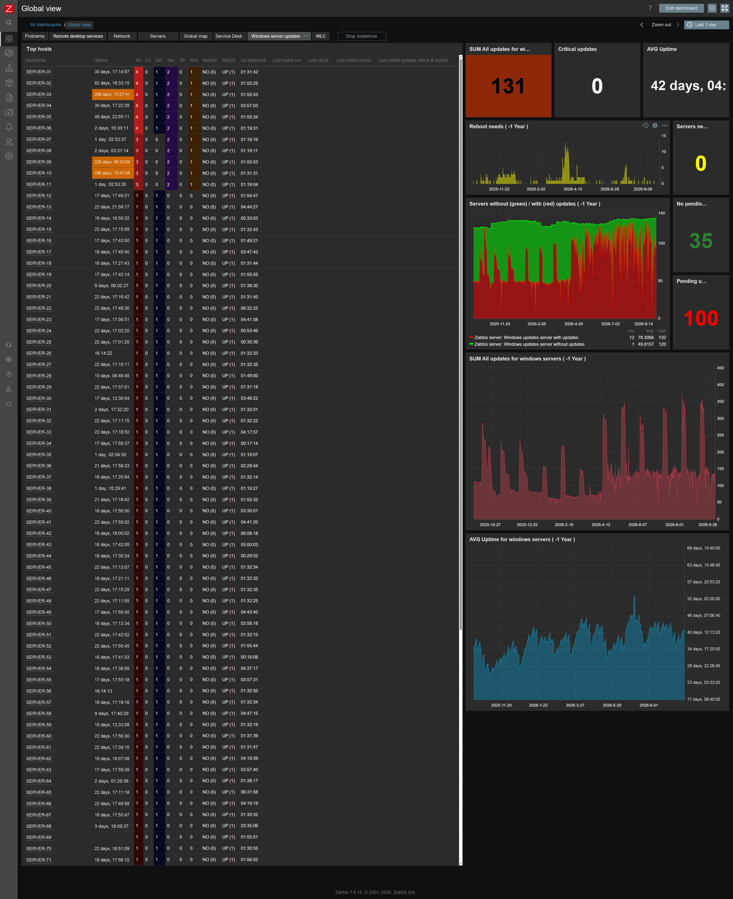

# Legacy: Windows Update template `APP Winupdates check`

> ⚠️ **This is the original Windows only template.** For new installations use the OS independent template
> [`APP Patch management all OS`](../README.md) (Windows and Linux, the same keys, host dashboard included).
> This folder is kept for existing installations.



*Example global dashboard built from the data of this template: all hosts with pending updates by category, reboot needed, WSUS status, last check, last install run and result; totals, servers with / without updates over a year, average uptime. The screenshot is anonymized, the dashboard is not part of the template.*

## Contents

| File | Description |
|------|-------------|
| `template_winupdates.yaml` | Zabbix **7.4** export with the template `APP Winupdates check` |
| `scripts/zbx-windows-updates.ps1` | Windows check script (PowerShell, Windows Update Agent API) |

## Items

| Item | Key | Sent by |
|------|-----|---------|
| WU - All / Critical / Security / Definition / ServicePacks / UpdateRollups | `zbx.winupdate.vbs.all`, `.critical`, `.security`, `.definition`, `.servicepacks`, `.updaterollups` | check script |
| WU - Pending updates list | `zbx.winupdate.vbs.list` | check script |
| WU - Reboot required | `zbx.winupdate.vbs.rebootrequired` | check script, Ansible |
| WU - WSUS availability | `zbx.winupdate.vbs.wsusavailability` | check script |
| WU - Last check date / age | `zbx.winupdate.vbs.datetime` / `.datetime.timestamp` | check script / calculated |
| WU - Service startup type | `service.info[wuauserv,startup]` | Zabbix agent |
| WU install - Last install date / age / patch day | `zbx.winupdate.vbs.install.datetime`, `.install.datetime.timestamp`, `.install.datetime.day_of_mounth` | install job / calculated |
| WU install - Search / Download / Install result, Installed updates, Last restart | `zbx.winupdate.vbs.install.search`, `.install.download`, `.install.install.res`, `.install.install`, `.install.lastrestart` | install job, Ansible |

Triggers: critical updates (High), security updates (Warning), reboot required (Info), Windows Update service disabled / manual / unknown (Warning), no data for `{$WU.NODATA}` (Warning), WSUS unavailable and any updates available (*disabled by default*).

> The keys keep the prefix `zbx.winupdate.vbs.` for compatibility with existing installations.

## Installation

1. Import `template_winupdates.yaml` (*Data collection → Templates → Import*) and link `APP Winupdates check` to Windows hosts.
2. Check the macros, mainly `{$WU.TIMEZONE}`.
3. Copy `scripts/zbx-windows-updates.ps1` to `C:\Program Files\Zabbix Agent 2\scripts\` and choose how the check runs:
   - **Zabbix agent**: add `AllowKey=system.run[*]` to `zabbix_agent2.conf` and restart the agent. The item *WU - Run update check* starts the script (every 12 h, and every 3 h on working days 07:00–17:00).
   - **Task Scheduler**: disable the item *WU - Run update check* and create a task, for example:
     ```powershell
     schtasks /Create /TN "Zabbix Windows Update check" /SC HOURLY /MO 3 /RU SYSTEM /TR "powershell.exe -NoProfile -ExecutionPolicy Bypass -File \"C:\Program Files\Zabbix Agent 2\scripts\zbx-windows-updates.ps1\""
     ```
4. Test it: `powershell -NoProfile -ExecutionPolicy Bypass -File "C:\Program Files\Zabbix Agent 2\scripts\zbx-windows-updates.ps1"`. The update search can take a few minutes.

Script parameters: `-SenderPath`, `-ConfigPath` (agent config with `Hostname` and `ServerActive`), optionally `-ZabbixServer` and `-HostName`.

The Ansible playbook [`ansible/patch-and-report.yml`](../ansible/patch-and-report.yml) sends the install results to this template with `-e zabbix_keys=legacy` (or `both` during the migration to the new template).

## Macros

| Macro | Default | Description |
|-------|---------|-------------|
| `{$WU.SCRIPT.PATH}` | `C:\Program Files\Zabbix Agent 2\scripts\zbx-windows-updates.ps1` | Check script path (agent option) |
| `{$WU.TIMEZONE}` | `Europe/Bratislava` | Time zone of the Windows hosts, used for the *age* items. **Set your own.** |
| `{$WU.TIMEZONE.CORRECTION}` | `3600` | Extra correction in seconds for the *age* items. Set `0` if the age is 1 hour off. |
| `{$WU.NODATA}` | `2d` | No data alert |

## Migration to `APP Patch management all OS`

Both templates use different keys and a different inventory field, so they can be linked to the same host at the same time. Install the new check script, link the new template, run the Ansible playbook with `-e zabbix_keys=both`, and unlink `APP Winupdates check` when the new data look good.

## Support & deployment

🤝 I provide support for this solution, including a complete deployment (template, dashboards, check scripts, Ansible patching with reporting) and the migration to the new template. Get in touch: 📧 [info@duprtech.sk](mailto:info@duprtech.sk)
