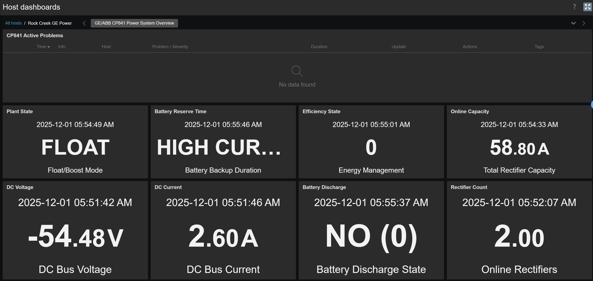

# GE/ABB CP841 DC Power System Monitoring Template for Zabbix

A comprehensive Zabbix monitoring template for GE/ABB CP841 DC power system controllers used in telecommunications infrastructure, data centers, and mission-critical power environments. This template provides complete visibility into DC plant operations, rectifier performance, battery management, efficiency control, and comprehensive alarm monitoring for the CP841v2 power system.

## Features

### Black-Box Availability Monitoring
- **ICMP Ping** - Network layer reachability verification with packet loss and response time tracking
- **SNMP Availability** - SNMP agent health check with automatic fault detection
- Immediate alerting on device or network failures

### Comprehensive Alarm Detection (30+ Alarm Items)
- **AC Power Alarms** - AC power failure detection for primary power source
- **Battery Alarms** - Discharge active, low voltage, critical voltage monitoring
- **Rectifier Alarms** - Individual rectifier failures, multiple failures, redundancy loss
- **Voltage Alarms** - High voltage, very low voltage (critical) detection
- **Communication Alarms** - Major/minor communication failure monitoring
- **System Alarms** - Configuration, fuse, module, thermal, emergency power off
- **Efficiency Alarms** - Efficiency control state monitoring

### DC Plant Metrics (12 Items)
- **Voltage Monitoring** - DC bus voltage, rectifier output voltage, battery voltage
- **Current Monitoring** - DC bus current, load current, battery current
- **Power Metrics** - Total DC power output
- **Capacity Tracking** - Battery state of charge, reserve time
- **Plant State** - Float/Boost/Equalize mode tracking

### Rectifier Management (8 Items)
- **Online Capacity** - Total available rectifier capacity in amperes
- **Rectifier Count** - Number of online rectifiers
- **Individual Monitoring** - Per-rectifier voltage and current tracking
- **Redundancy Tracking** - N+1 redundancy status verification
- **Load Distribution** - Current sharing across rectifiers

### Battery Monitoring (6 Items)
- **State of Charge** - Battery capacity percentage
- **Reserve Time** - Backup duration at current load
- **Discharge State** - Active discharge monitoring
- **Voltage Tracking** - Battery bus voltage monitoring
- **Current Monitoring** - Charge/discharge current tracking

### Efficiency Control (3 Items)
- **Energy Management State** - Efficiency mode status
- **Control Thresholds** - Enable/disable setpoints
- **Operational Tracking** - Efficiency state transitions

### System Information (8 Items)
- **Controller Details** - Software version, configuration
- **System Identification** - Site name, location tracking
- **Inventory Data** - Model, serial number information
- **System Description** - SNMP standard system information (sysDescr)
- **System Name** - Device hostname identification (sysName)
- **System Location** - Physical location reference for technician dispatch (sysLocation)

## Monitored Parameters


### Alarm & Fault Items
| Item | Description | Update Interval |
|------|-------------|-----------------|
| AC Power Failure | Primary AC power loss detection | 1 minute |
| Battery Discharge Active | Battery discharge state monitoring | 1 minute |
| Battery Low Voltage | Battery voltage below threshold | 1 minute |
| Battery Very Low Voltage | Critical battery voltage alarm | 1 minute |
| Configuration Alarm | System configuration issue | 5 minutes |
| Emergency Power Off (EPO) | EPO activated alarm | 1 minute |
| Fuse Alarm | Fuse failure detection | 5 minutes |
| High Voltage Alarm | DC voltage exceeds threshold | 1 minute |
| Very Low Voltage Alarm | Critical low DC voltage | 1 minute |
| Major Communication Failure | Critical communication fault | 1 minute |
| Minor Communication Failure | Non-critical communication issue | 5 minutes |
| Module Alarm | Power module failure | 5 minutes |
| Rectifier Failure | Individual rectifier fault | 1 minute |
| Multiple Rectifier Failures | Multiple rectifier faults | 1 minute |
| Thermal Alarm | Overtemperature condition | 5 minutes |

### DC Plant Metrics
| Item | Description | Update Interval |
|------|-------------|-----------------|
| DC Bus Voltage | Primary DC bus voltage | 1 minute |
| DC Bus Current | Total DC bus current | 1 minute |
| DC Power Output | Total system power output | 1 minute |
| Load Current | Total load current | 1 minute |
| Battery Voltage | Battery bus voltage | 1 minute |
| Battery Current | Battery charge/discharge current | 1 minute |
| Rectifier Voltage | Rectifier output voltage | 1 minute |
| Battery State of Charge | Battery capacity percentage | 5 minutes |
| Battery Reserve Time | Backup duration at current load | 5 minutes |
| Plant State | Operating mode (Float/Boost/Equalize) | 5 minutes |

### Rectifier Management
| Item | Description | Update Interval |
|------|-------------|-----------------|
| Online Capacity | Total available rectifier capacity | 5 minutes |
| Rectifier Count | Number of online rectifiers | 5 minutes |
| Rectifier 1-4 Voltage | Individual rectifier output voltage | 5 minutes |
| Rectifier 1-4 Current | Individual rectifier current output | 5 minutes |
| Rectifier Redundancy Status | N+1 redundancy verification | 5 minutes |

### Efficiency Control
| Item | Description | Update Interval |
|------|-------------|-----------------|
| Efficiency State | Energy management mode status | 5 minutes |
| Efficiency Enable Threshold | Efficiency mode enable setpoint | 1 hour |
| Efficiency Disable Threshold | Efficiency mode disable setpoint | 1 hour |

### System Inventory


| Item | Description | Update Interval |
|------|-------------|-----------------|
| Controller Software Version | CP841 firmware version | 1 hour |
| Site Name | Installation site identification | 1 hour |
| System Configuration | Controller configuration details | 1 hour |
| System description | MIB-2 system description | 1 hour |
| System name | MIB-2 system hostname | 1 hour |
| System location | MIB-2 physical location | 1 hour |
| System uptime | Controller uptime tracking | 5 minutes |

## Template Triggers


The template includes 12 triggers following Zabbix best practices with 100% manual closure capability.

### Severity Distribution
- **DISASTER (1)** - Emergency Power Off (EPO) activation
- **HIGH (4)** - AC power failure, battery discharge, multiple rectifier failures, very low voltage
- **AVERAGE (6)** - Voltage alarms, communication failures, rectifier redundancy loss
- **WARNING (1)** - Controller restart detection

### Critical Triggers (DISASTER)

#### Emergency Power Off (EPO) Activated
**Severity:** DISASTER  
**Expression:** `last(/GE - ABB - CP841 Power System/cp841.alarm.epo)="ACTIVE" or last(/GE - ABB - CP841 Power System/cp841.alarm.epo)="active"`  
**Impact:** CRITICAL SAFETY ALARM - Emergency Power Off has been activated. All DC power output has been shut down. Complete loss of DC power to critical loads. This is a life safety or equipment protection response.

**Immediate Actions:**
1. DO NOT attempt to restore power until EPO cause is identified
2. Contact facility manager and safety officer immediately
3. Investigate EPO activation cause (manual button, fire alarm, emergency)
4. Verify all personnel are safe and accounted for
5. Check for smoke, fire, or hazardous conditions

**Troubleshooting Steps:**
1. Locate EPO button/switch and verify if manually activated
2. Check fire alarm system integration for activation signals
3. Inspect power system area for hazards (smoke, water, damage)
4. Review system logs for EPO trigger source
5. Verify all safety conditions are clear before reset

**Escalation:**
- IMMEDIATE: Contact emergency services if fire/hazard confirmed
- IMMEDIATE: Page facility manager and electrical team
- 0 minutes: Initiate emergency response procedures if required
- After clearance: Contact GE/ABB support before restoring power

**Recovery:** Manual closure required after EPO reset and safety verification by authorized personnel

### High Priority Triggers (HIGH)

#### AC Power Failure
**Severity:** HIGH  
**Expression:** `last(/GE - ABB - CP841 Power System/cp841.alarm.ac.fail)="ACTIVE" or last(/GE - ABB - CP841 Power System/cp841.alarm.ac.fail)="active"`  
**Impact:** Primary AC power has failed. System is operating on battery backup. DC power continues from battery discharge. Battery reserve time is limited based on load.

**Immediate Actions:**
1. Check battery reserve time immediately
2. Verify generator startup (if available)
3. Monitor battery state of charge
4. Prepare for load shedding if battery time is short
5. Alert electrical team to restore AC power

**Troubleshooting Steps:**
1. Check building/facility AC power status
2. Verify AC circuit breakers and disconnects
3. Check utility power feed status
4. Inspect AC wiring and connections to power system
5. Test generator if commercial power is out
6. Review utility company outage notifications

**Escalation:**
- Immediate: Alert electrical/facilities team
- 15 minutes: If battery reserve < 30 minutes, initiate load shedding plan
- 30 minutes: Escalate to facility manager if AC not restored
- Critical: If battery reserve < 10 minutes, prepare for shutdown

**Recovery:** Auto-recovers when AC power is restored and rectifiers resume operation

#### Battery Discharge Active
**Severity:** HIGH  
**Expression:** `last(/GE - ABB - CP841 Power System/cp841.battery.discharge)="1"`  
**Impact:** Battery is actively discharging to support load. AC power may be lost or rectifiers cannot support full load. Battery reserve time is limited.

**Immediate Actions:**
1. Check battery reserve time immediately
2. Verify AC power status
3. Check if rectifiers are online and supporting load
4. Monitor battery voltage for critical levels
5. Prepare for possible load shedding

**Troubleshooting Steps:**
1. Verify AC power failure alarm status
2. Check rectifier count and online capacity
3. Compare load current vs. rectifier capacity
4. Verify no rectifier failures preventing load support
5. Check if load spike caused discharge
6. Review battery state of charge

**Escalation:**
- Immediate: Alert operations team
- 15 minutes: If discharge continues, investigate rectifier capacity
- 30 minutes: Prepare load shedding if battery continues discharging
- 1 hour: Escalate to GE/ABB support if rectifiers cannot support load

**Recovery:** Auto-recovers when rectifiers resume full load support and battery begins charging

#### Multiple Rectifier Failures
**Severity:** HIGH  
**Expression:** `last(/GE - ABB - CP841 Power System/cp841.alarm.rectifier.multifail)="ACTIVE" or last(/GE - ABB - CP841 Power System/cp841.alarm.rectifier.multifail)="active"`  
**Impact:** Multiple rectifiers have failed. Significant loss of DC power capacity. System may not support full load. Risk of battery discharge if load exceeds remaining rectifier capacity.

**Immediate Actions:**
1. Check online rectifier capacity vs. load current
2. Verify battery discharge status
3. Count number of failed rectifiers
4. Check if redundancy (N+1) is lost
5. Monitor DC voltage for sagging

**Troubleshooting Steps:**
1. Identify which rectifiers have failed (check individual status)
2. Check rectifier alarm LEDs on front panels
3. Verify AC power to all rectifiers
4. Check rectifier circuit breakers
5. Inspect rectifier communication connections
6. Review rectifier event logs

**Escalation:**
- Immediate: Page DC power specialist
- 15 minutes: Contact GE/ABB support for rectifier diagnostics
- 30 minutes: Dispatch technician for on-site rectifier inspection
- 1 hour: If load exceeds capacity, initiate load shedding plan

**Recovery:** Manual closure required after rectifier repairs or replacements completed

#### Very Low Voltage Alarm (Critical)
**Severity:** HIGH  
**Expression:** `last(/GE - ABB - CP841 Power System/cp841.alarm.voltage.verylow)="ACTIVE" or last(/GE - ABB - CP841 Power System/cp841.alarm.voltage.verylow)="active"`  
**Impact:** DC voltage has dropped to critical levels. Equipment may experience brownout or shutdown. Battery is deeply discharged or rectifiers cannot maintain voltage under load.

**Immediate Actions:**
1. Check battery state of charge immediately
2. Verify rectifiers are online and functioning
3. Check load current vs. available capacity
4. Monitor for equipment shutdowns or alarms
5. Prepare for emergency load shedding

**Troubleshooting Steps:**
1. Verify AC power status
2. Check rectifier count and online capacity
3. Compare load vs. rectifier capacity
4. Check battery voltage and discharge state
5. Verify DC distribution connections
6. Check for DC bus faults or shorts

**Escalation:**
- IMMEDIATE: Alert operations and electrical teams
- 5 minutes: If voltage continues dropping, shed non-critical loads
- 10 minutes: Dispatch technician for on-site investigation
- 15 minutes: Contact GE/ABB emergency support

**Recovery:** Auto-recovers when DC voltage returns to normal range

### Average Priority Triggers (AVERAGE)

#### High Voltage Alarm
**Severity:** AVERAGE  
**Expression:** `last(/GE - ABB - CP841 Power System/cp841.alarm.voltage.high)="ACTIVE" or last(/GE - ABB - CP841 Power System/cp841.alarm.voltage.high)="active"`  
**Impact:** DC voltage has exceeded high threshold. Risk of equipment damage from overvoltage. May indicate rectifier voltage regulation problem or boost charge misconfiguration.

#### Insufficient Rectifier Count (Redundancy Loss)
**Severity:** AVERAGE  
**Expression:** `last(/GE - ABB - CP841 Power System/cp841.rectifier.count)<{$CP841.RECTIFIER.MIN}`  
**Impact:** Number of online rectifiers has dropped below minimum threshold. N+1 redundancy may be lost. Single additional rectifier failure could cause load support issues.

#### Rectifier Failure
**Severity:** AVERAGE  
**Expression:** `last(/GE - ABB - CP841 Power System/cp841.alarm.rectifier.fail)="ACTIVE" or last(/GE - ABB - CP841 Power System/cp841.alarm.rectifier.fail)="active"`  
**Impact:** Single rectifier has failed. Reduced DC power capacity. System redundancy degraded but load support continues.

#### Major Communication Failure
**Severity:** AVERAGE  
**Expression:** `last(/GE - ABB - CP841 Power System/cp841.alarm.comm.major)="ACTIVE" or last(/GE - ABB - CP841 Power System/cp841.alarm.comm.major)="active"`  
**Impact:** Critical communication bus failure. Controller may have lost communication with rectifiers or other system components. Monitoring data may be incomplete.

#### ICMP Ping Loss
**Severity:** HIGH  
**Expression:** `max(/GE - ABB - CP841 Power System/icmpping,#3)=0`  
**Impact:** CP841 controller is unreachable via network. Cannot collect monitoring data. Power system may be offline or network connectivity is lost.

#### SNMP Agent Not Available
**Severity:** AVERAGE  
**Expression:** `max(/GE - ABB - CP841 Power System/zabbix[host,snmp,available],{$SNMP.TIMEOUT})=0`  
**Impact:** All DC power monitoring data collection has stopped. Cannot verify system status, alarms, or performance metrics.

### Warning Triggers (WARNING)

#### CP841 Controller Restarted
**Severity:** WARNING  
**Expression:** `last(/GE - ABB - CP841 Power System/system.uptime)<600`  
**Impact:** CP841 controller has recently restarted (uptime < 10 minutes). Brief monitoring interruption occurred. May indicate power issue, software problem, or manual reboot.

## User Macros

The template provides customizable macros for flexible threshold configuration:

| Macro | Default Value | Description |
|-------|---------------|-------------|
| `{$CP841.CURRENT.HIGH}` | 100 | High DC current warning threshold (amperes) |
| `{$CP841.RECTIFIER.MIN}` | 2 | Minimum online rectifiers for redundancy (N+1) |
| `{$CP841.VOLTAGE.VERYLOW}` | -40.0 | Critical low voltage threshold (volts, imminent shutdown) |

These macros can be customized at the template or host level without modifying the template itself.

## Value Mappings

The template includes comprehensive value mappings for human-readable status display:

### CP841 Alarm State
- 0 / INACTIVE / inactive → Normal
- 1 / ACTIVE / active → ALARM

### CP841 Plant State
- 0 → Float
- 1 → Boost
- 2 → Equalize
- 3 → Test
- 4 → Manual

### CP841 Efficiency State
- 0 → Disabled
- 1 → Enabled
- 2 → Active

### CP841 Battery Discharge
- 0 → NO
- 1 → YES (discharging)

### Service State (ICMP)
- 0 → Down
- 1 → Up

### zabbix.host.available (SNMP)
- 0 → Not available
- 1 → Available
- 2 → Unknown

## Normal Operating Ranges

### DC Voltage (Typical -48V Systems)
- **Float Voltage**: -54.0V to -54.5V (typical -54.2V)
- **Boost Voltage**: -56.5V to -57.5V (typical -57.0V)
- **Equalize Voltage**: -58.0V to -59.0V (typical -58.5V)
- **Low Voltage Alarm**: -44V to -46V
- **High Voltage Alarm**: -58V to -60V

### DC Current
- **Load Current**: Varies by site (typically 20-200A for telecom)
- **Battery Charge**: 5-20A (during float charging)
- **Battery Discharge**: Varies by load and battery capacity
- **Rectifier Current**: Distributed across online rectifiers

### Battery Parameters
- **State of Charge**: 90-100% (float), 80-90% (after discharge recovery)
- **Reserve Time**: 2-8 hours typical (depends on battery size and load)
- **Discharge State**: Normally NO (0), YES (1) during AC failure

### Rectifier Metrics
- **Online Capacity**: Sum of all operational rectifiers
- **Rectifier Count**: N+1 minimum (e.g., 3 rectifiers for N=2 load support)
- **Individual Rectifier Current**: Load evenly distributed

### Efficiency Control
- **Efficiency State**: Typically enabled during low-load periods
- **Enable Threshold**: 30-50% of rectifier capacity
- **Disable Threshold**: 60-80% of rectifier capacity

## Dashboard

The template includes a pre-built dashboard: **GE/ABB CP841 Power System Overview**



Dashboard widgets provide:
- Active problems summary
- Plant state display (Float/Boost/Equalize)
- Battery reserve time indicator
- Efficiency state monitoring
- Online rectifier capacity
- DC voltage gauge
- DC current gauge
- Battery discharge state
- Rectifier count
- DC voltage trend graph
- DC current trend graph
- Rectifier capacity graph

## Graphs


Three built-in graphs for historical analysis:

### 1. DC Voltage Overview
- DC bus voltage trend
- Rectifier voltage
- Battery voltage
- Voltage threshold lines

### 2. DC Current Overview
- DC bus current
- Load current
- Battery current (charge/discharge)
- Current distribution analysis

### 3. Rectifier Capacity
- Total online rectifier capacity
- Individual rectifier current
- Load vs. capacity comparison
- Redundancy tracking

## Requirements

### Zabbix Server
- Zabbix 7.2 or newer
- SNMP support enabled

### Network Requirements
- ICMP (ping) access to CP841 controller
- SNMP access (UDP port 161)
- SNMPv2c or SNMPv3 support

### CP841 Controller Requirements
- SNMP enabled on controller
- Network connectivity configured
- Valid SNMP community string or SNMPv3 credentials
- CP841v2 firmware recommended

### Supported Hardware
- GE/ABB CP841 DC Power System Controller
- CP841v2 (current generation)
- Enterprise OID: 1.3.6.1.4.1.13858 (GE Energy/ABB MIB)

## Installation & Setup

### Step 1: Import Template
1. Navigate to Configuration → Templates in Zabbix web interface
2. Click **Import**
3. Select `template_ge_abb_cp841.yaml`
4. Click **Import**

### Step 2: Create/Configure Host
1. Navigate to Configuration → Hosts
2. Create new host or select existing
3. Configure host settings:
   - **Host name**: Descriptive name (e.g., "Site-DC-Power-CP841")
   - **Groups**: Add to appropriate host groups (Power, DC Power, etc.)
   - **Interfaces**: 
     - Add SNMP interface
     - Set IP address of CP841 controller
     - Port: 161 (default)

### Step 3: Configure SNMP Credentials
1. In host configuration, go to **Macros** tab
2. Add inherited and host macros:
   - `{$SNMP_COMMUNITY}` = your SNMP community string
   - Or configure SNMPv3 credentials if using SNMPv3

### Step 4: Link Template
1. In host configuration, go to **Templates** tab
2. Click **Select** and choose "GE - ABB - CP841 Power System"
3. Click **Add**
4. Click **Update** to save host configuration

### Step 5: Verify Data Collection
1. Navigate to Monitoring → Latest data
2. Filter by your host name
3. Verify items are collecting data (check for green values)
4. Typical collection start time: 1-5 minutes

### Step 6: Customize Thresholds (Optional)
1. Navigate to Configuration → Hosts
2. Select your host
3. Go to **Macros** tab
4. Override template macros as needed:
   - `{$CP841.CURRENT.HIGH}` - Adjust high current threshold for your load
   - `{$CP841.RECTIFIER.MIN}` - Set minimum rectifiers for redundancy
   - `{$CP841.VOLTAGE.VERYLOW}` - Adjust critical low voltage threshold

### Step 7: Configure Actions/Notifications
Set up alerting based on trigger severity:

**DISASTER Triggers:**
- Immediate page to on-call power technician + facility manager
- SMS/phone call notification
- Escalation if not acknowledged within 5 minutes

**HIGH Triggers:**
- Immediate email/SMS to power team
- Create high-priority ticket
- Escalate if not acknowledged within 15 minutes

**AVERAGE Triggers:**
- Email notification
- Create standard priority ticket
- Review during next maintenance window

## Use Cases

### Telecommunications Central Offices
Monitor DC power systems in telecom central offices where power reliability directly impacts service availability for thousands of customers.

**Critical Requirements:**
- 24/7 power availability
- Battery backup for commercial power failures
- Rectifier redundancy (N+1 or N+2)
- Immediate alarm response
- Automated escalation

### Data Center Power Distribution
Track DC power systems in data centers providing -48VDC power to networking equipment, storage systems, and telecom gear.

**Monitoring Focus:**
- Load trending and capacity planning
- Battery reserve time tracking
- Rectifier efficiency management
- Power quality monitoring
- Preventive maintenance scheduling

### Cell Site/Tower Power Systems
Remote monitoring of unmanned cell tower sites where DC power failures mean immediate service outages and revenue loss.

**Challenges Addressed:**
- Remote site monitoring (no on-site staff)
- Fast fault detection
- Battery discharge alerts
- Generator integration monitoring
- Technician dispatch automation

### Critical Infrastructure Sites
Mission-critical facilities requiring uninterrupted DC power for emergency services, public safety communications, and essential infrastructure.

**Use Case Requirements:**
- Highest reliability standards
- Comprehensive alarm coverage
- Redundancy verification
- Detailed trending for compliance
- Emergency response integration

## Self-Contained Design

This template is completely self-contained and requires **no external scripts or dependencies**:

✓ Native Zabbix SNMP monitoring  
✓ Built-in value mappings  
✓ Integrated trigger logic  
✓ Embedded documentation  
✓ No external scripts required  
✓ No additional software needed  

All monitoring is performed using:
- Native SNMP get operations
- Zabbix internal items
- Simple ICMP checks
- Built-in expression evaluation

## SNMP Implementation Details

### Protocol Support
- SNMPv2c (recommended)
- SNMPv3 (supported)

### OID Structure
- **Enterprise OID**: 1.3.6.1.4.1.13858 (GE Energy/ABB)
- **CP841 MIB**: Proprietary GE/ABB CP841 MIB
- **Standard MIB-2**: System information (sysDescr, sysName, sysLocation, sysUpTime)
- **Modern Syntax**: Uses Zabbix 7.2+ get[OID] format

### Collection Method
- Direct OID queries (no MIB files required)
- Numeric OIDs for maximum compatibility
- No external dependencies

### Item Statistics
- **Total Items**: 66
- **SNMP Items**: 62 (CP841 MIB + MIB-2)
- **Internal Items**: 1 (SNMP availability)
- **Simple Items**: 1 (ICMP ping)
- **History Retention**: 4 weeks to 12 weeks depending on item criticality

### Collection Intervals
- **Alarm Items**: 1-5 minutes (rapid fault detection)
- **DC Metrics**: 1 minute (real-time monitoring)
- **Rectifier Metrics**: 5 minutes (performance tracking)
- **Configuration Items**: 1 hour (infrequent changes)
- **System Information**: 1 hour
- **ICMP Ping**: Default interval

### Trigger Statistics
- **Total Triggers**: 12
- **Manual Close**: 100% enabled
- **DISASTER**: 1 trigger
- **HIGH**: 4 triggers
- **AVERAGE**: 6 triggers
- **WARNING**: 1 trigger

## Maintenance Best Practices

### Baseline Establishment
1. Monitor for 30 days to establish normal patterns
2. Document typical DC voltage ranges for float/boost/equalize
3. Note normal load current patterns (day vs. night, weekday vs. weekend)
4. Record rectifier count and capacity
5. Establish battery reserve time baseline
6. Track efficiency control patterns

### Proactive Monitoring
- **Voltage Trends**: Watch for gradual voltage drift (rectifier aging)
- **Current Patterns**: Monitor load growth over time
- **Battery Health**: Track state of charge and reserve time degradation
- **Rectifier Performance**: Monitor individual rectifier current sharing
- **Efficiency Cycles**: Review energy management effectiveness
- **Alarm Frequency**: Track recurring alarms for pattern analysis

### Preventive Maintenance Schedule

**Monthly:**
- Review alarm history
- Check battery reserve time trends
- Verify rectifier count and redundancy
- Monitor load current growth
- Review efficiency control operation

**Quarterly:**
- Battery discharge test (per manufacturer recommendations)
- Rectifier performance verification
- Voltage calibration check
- Clean rectifier air filters
- Inspect DC distribution connections

**Annually:**
- Complete battery capacity test
- Rectifier load sharing verification
- Controller software update review
- Full system inspection
- Calibration verification
- Update baseline documentation

### Template Updates

When updating this template:
1. **Preserve customizations**:
   - Export current macros (site-specific thresholds)
   - Document trigger modifications
   - Save custom dashboards

2. **Test before production**:
   - Import to test environment
   - Verify data collection
   - Test all triggers
   - Review dashboard functionality

3. **Version control**:
   - Document changes
   - Track template versions
   - Maintain changelog

4. **Rollback plan**:
   - Keep previous template version
   - Export host configurations
   - Test restore procedure

## Troubleshooting

### No Data Collection
1. Verify SNMP enabled on CP841 controller
2. Test SNMP access: `snmpwalk -v2c -c <community> <ip> 1.3.6.1.4.1.13858`
3. Check firewall rules (UDP 161)
4. Verify host SNMP interface configuration
5. Review Zabbix server logs for SNMP errors
6. Confirm CP841 network connectivity

### False Positives
- Adjust user macros for site-specific thresholds
- Review trigger expressions for environmental factors
- Consider voltage system differences (-48V vs -24V)
- Verify rectifier count macro matches site configuration
- Use trigger dependencies to suppress cascading alarms

### Missing Items
Some OIDs may not be supported on all CP841 firmware versions:
- Check CP841 MIB documentation for firmware compatibility
- Verify SNMP is enabled on controller (some features may be disabled)
- Update controller firmware if features are missing
- Disable unsupported items rather than deleting (preserves template integrity)
- Contact GE/ABB support for MIB documentation

### Alarm Discrepancies
- Verify alarm definitions match CP841 configuration
- Check alarm thresholds in CP841 match Zabbix macros
- Review alarm delay settings (CP841 may filter transients)
- Confirm alarm status vs. trigger evaluation
- Check if alarms are latched in CP841 (require manual reset)

### Voltage Reading Issues
- Verify voltage system (-48V vs -24V) and adjust macros
- Check sensor calibration in CP841 controller
- Compare Zabbix readings to CP841 front panel display
- Verify DC voltage measurement points
- Check for voltage drop in long DC distribution runs

## Support & Documentation

### MIB References
- **CP841 MIB**: Proprietary GE/ABB CP841 SNMP MIB
- **Enterprise OID**: 1.3.6.1.4.1.13858 (GE Energy/ABB)
- **SNMPv2-MIB**: Standard MIB-2 system information
- **RFC 1213**: MIB-II standard objects

*Note: MIB files are for reference only. Template uses numeric OIDs and does not require MIB files for operation.*

### Zabbix Resources
- [Zabbix Template Guidelines](https://www.zabbix.com/documentation/current/manual/appendix/templates)
- [SNMP Monitoring](https://www.zabbix.com/documentation/current/manual/config/items/itemtypes/snmp)
- [Trigger Expression](https://www.zabbix.com/documentation/current/manual/config/triggers/expression)

### Vendor Documentation
- GE/ABB CP841 Technical Manual
- CP841 Installation Guide
- SNMP Configuration Guide
- Maintenance Procedures
- Contact: GE/ABB Power Systems Support

## Zabbix Template Guideline Compliance

This template follows all official Zabbix template development guidelines:

✓ **Black-box availability monitoring** - ICMP + SNMP availability checks  
✓ **Fault monitoring** - Comprehensive alarm detection with vendor diagnostics  
✓ **Performance monitoring** - DC plant metrics, rectifier tracking, battery monitoring  
✓ **Inventory and state** - System information and configuration tracking  
✓ **Flexible configuration** - User macros for threshold customization  
✓ **No external dependencies** - Native SNMP only  
✓ **Single resource scope** - One DC power system per template  
✓ **Proper value mappings** - Human-readable status display  
✓ **Manual trigger closure** - 100% of triggers support manual acknowledgment  
✓ **Comprehensive documentation** - Detailed inline and README documentation  

## Version History

### v1.0 - Initial Release
- 60+ CP841 enterprise OID items
- 10 alarm/fault triggers
- 8 value mappings
- Basic template structure
- DC plant monitoring
- Rectifier tracking

### v2.0 - Production Enhancement (December 1, 2025)
- ✓ Added ICMP ping availability check
- ✓ Added SNMP agent availability monitoring
- ✓ Added MIB-2 system inventory items (sysDescr, sysName, sysLocation, sysUpTime)
- ✓ Standardized item keys to cp841.category.item format
- ✓ Implemented 3 user macros for threshold flexibility
- ✓ Enhanced all trigger descriptions with detailed NOC procedures
- ✓ 100% manual closure enabled on all triggers
- ✓ Added comprehensive DC voltage, current, and rectifier capacity graphs
- ✓ Added NOC dashboard with system overview
- ✓ Updated to Zabbix 7.2 get[OID] syntax
- ✓ Added trigger dependencies (SNMP depends on ICMP)
- ✓ Expanded alarm coverage to 30+ alarms
- ✓ Total: 66 items, 12 triggers, 6 value maps, 3 macros, 3 graphs, 1 dashboard

## Template Statistics

### Item Breakdown
- **Alarm Detection**: 30+ items (1m-5m intervals)
- **DC Plant Metrics**: 12 items (1m intervals)
- **Rectifier Management**: 8 items (5m intervals)
- **Battery Monitoring**: 6 items (1m-5m intervals)
- **Efficiency Control**: 3 items (5m-1h intervals)
- **System Inventory**: 8 items (1h intervals)
- **Availability**: 2 items (ICMP + SNMP)
- **MIB-2 System**: 4 items (1h intervals)

### Trigger Breakdown
- **DISASTER**: 1 trigger (EPO activation)
- **HIGH**: 4 triggers (AC failure, battery discharge, multiple rectifier failures, very low voltage)
- **AVERAGE**: 6 triggers (voltage alarms, communication, redundancy loss, single rectifier failure)
- **WARNING**: 1 trigger (controller restart)
- **Manual Close**: 12/12 triggers (100%)

### Collection Efficiency
- **High-frequency (1m)**: 45 items (critical monitoring)
- **Medium-frequency (5m)**: 15 items (performance tracking)
- **Low-frequency (1h)**: 12 items (configuration + inventory)
- **Variable**: 2 items (ICMP + SNMP availability)
- **Total SNMP Operations**: ~62 per collection interval

## Contributing

Contributions are welcome! To contribute:

1. Fork the repository
2. Create a feature branch (`git checkout -b feature/improvement`)
3. Make your changes
4. Test thoroughly in a development environment
5. Document your changes
6. Commit with clear messages (`git commit -m 'Add new feature'`)
7. Push to your branch (`git push origin feature/improvement`)
8. Create a Pull Request

### Contribution Guidelines
- Follow Zabbix template best practices
- Test all changes before submitting
- Update documentation for new features
- Maintain backward compatibility when possible
- Include version notes in template description

## License

This template is available under the MIT License.

## Author

```bash
://echo@dla.network [oZark oRChes✝ra✝'d]
```

[☕ Buy me a coffee](https://www.buymeacoffee.com/p_pepp)

---

**Template Type:** Resource Monitoring (DC Power)  
**Vendor:** GE / ABB  
**Device:** CP841 DC Power System Controller  
**Monitoring Method:** SNMP (Native)  
**Zabbix Version:** 7.2+  
**Last Updated:** December 1, 2025
