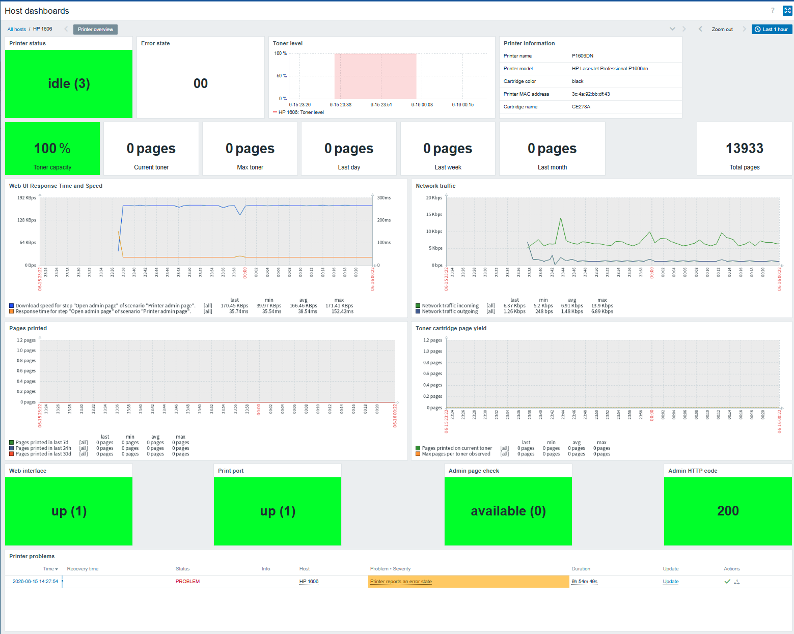

# Zabbix HP LaserJet P1606dn SNMP Monitoring


A reusable Zabbix 7.4 template for monitoring **HP LaserJet Professional P1606dn** network printers over SNMP.

The template collects printer status, toner information, printed page counters, web administration availability, TCP print port availability, network traffic, and provides a ready-to-use host dashboard.

The template was built and tested against **HP LaserJet Professional P1606dn** using SNMPv2.

---

## Template metadata

| Field | Value |
|---|---|
| Author | TyranR |
| Zabbix version | 7.4 |
| Template file | `template_hp_laserjet_p1606dn_by_snmp.yaml` |
| Community templates path | `Printers/HP/template_hp_laserjet_p1606dn_by_snmp/7.4/` |
| Tested device | HP LaserJet Professional P1606dn |
| Protocol | SNMPv2 |
| License | MIT |

## What this solves

Small network printers are often left outside infrastructure monitoring, even though they can still create operational noise: unavailable print ports, empty or low toner, unavailable web administration pages, and unknown page usage.

This template gives Zabbix a compact operational view of a home or small office HP LaserJet printer:

- Is the printer reachable?
- Is SNMP responding?
- Is the TCP print port available?
- Is the web administration page loading?
- Is the printer reporting an error state?
- How much toner is left?
- How many pages were printed recently?
- How many pages were printed on the current toner cartridge?
- What was the best observed toner page yield?

---

## Project status

This project is usable and tested with HP LaserJet Professional P1606dn.

The template intentionally focuses on stable, useful metrics for a single monochrome printer. Some values are model/index dependent and may require adjustment for other printers.

---

## Current limitations

- Tested with **HP LaserJet Professional P1606dn** only.
- The template uses mostly standard SNMP MIBs, but several OIDs rely on fixed indexes used by this printer.
- Toner and page counter OIDs may need adjustment for other printer models.
- The template assumes one primary marker/page counter and one toner supply.
- Paper tray level is not included because this printer returned static/capacity-like values instead of reliable live paper remaining.
- Serial number is not included because it was not exposed through the tested standard SNMP OID set.
- The TCP print port check confirms that port `9100/tcp` is reachable, but does not verify a successful print job.
- Web scenario checks the printer web page and expects HTTP `200`; some devices may require changing `{$PRINTER_WEB_PATH}` or redirect handling.
- “Max pages per toner observed” depends on Zabbix history retention and is not a permanent cartridge archive.
- If the printer enters deep sleep or powers off automatically, web/SNMP/TCP checks may temporarily fail depending on the device behaviour.

---

## Screenshots



---

## Features

### Printer health

- Printer status via HOST-RESOURCES-MIB
- Printer error state via HOST-RESOURCES-MIB
- Web interface availability
- Printer web administration page scenario
- TCP print port `9100` availability
- Trigger dependencies to avoid duplicate web alarms

### Toner and cartridge

- Toner level
- Toner max capacity
- Cartridge name
- Cartridge color
- Pages printed on current toner
- Maximum observed pages per toner cartridge
- Low toner trigger with configurable problem and recovery thresholds

### Page counters

- Total printed pages
- Pages printed in the last 24 hours
- Pages printed in the last 7 days
- Pages printed in the last 30 days
- Toner cartridge page yield graph

### Network

- Incoming network traffic
- Outgoing network traffic
- MAC address
- Web response time and download speed graph

### Dashboard

Included host dashboard:

```text
Printer overview
```

The dashboard includes:

- Problems widget
- Printer status
- Error state
- Toner level
- Current toner pages
- Maximum observed toner yield
- Total pages
- Pages printed in the last 24h / 7d / 30d
- Web interface availability
- Print port availability
- Admin page status
- Admin HTTP code
- Printer information table
- Toner, page, network, and web graphs

---

## Tested with

- Zabbix Server 7.4
- Zabbix web dashboard widgets from Zabbix 7.4
- SNMPv2
- HP LaserJet Professional P1606dn
- Zabbix Proxy in the same LAN as the printer
- Printer IP monitored through an SNMP interface
- Web interface over HTTP
- RAW printing port `9100/tcp`

---

## Repository structure

This template is intended for the Zabbix community templates repository.

```text
Printers/
└── HP
	└──template_hp_laserjet_p1606dn_by_snmp/
    	└── 7.4/
        	├── README.md
        	├── template_hp_laserjet_p1606dn_by_snmp.yaml
        	└── files/
            	└── dashboard-printer-overview.png
```

---

## Requirements

- Zabbix 7.4 or newer
- Network printer with SNMP enabled
- SNMPv2 community configured on the printer
- Zabbix Server or Zabbix Proxy must be able to reach the printer on:
  - UDP `161` for SNMP
  - TCP `80` for printer web interface
  - TCP `9100` for RAW printing port
- Optional: ICMP reachability if you also use an ICMP template

If your Zabbix Server is outside the printer LAN, use a **Zabbix Proxy** inside the local network and assign the printer host to that proxy.

---

## Installation

### 1. Enable SNMP on the printer

Enable SNMP on the HP LaserJet P1606dn web interface.

Typical settings:

```text
SNMP version: v2c
Community: public
```

Use your own community string if required.

---

### 2. Test SNMP manually

From the Zabbix Server or Zabbix Proxy network:

```bash
snmpwalk -v2c -c public <printer_ip> 1.3.6.1.2.1.1
```

Expected result should include system information, for example:

```text
SNMPv2-MIB::sysName.0 = STRING: P1606DN
```

Check the total printed pages counter:

```bash
snmpget -v2c -c public <printer_ip> 1.3.6.1.2.1.43.10.2.1.4.1.1
```

Check toner level:

```bash
snmpget -v2c -c public <printer_ip> 1.3.6.1.2.1.43.11.1.1.9.1.1
```

---

### 3. Import the template

Import the template in Zabbix:

```text
Data collection → Templates → Import
```

Import:

```text
Printers/template_hp_laserjet_p1606dn_by_snmp/7.4/template_hp_laserjet_p1606dn_by_snmp.yaml
```

---

### 4. Create the printer host

Create a Zabbix host for the printer.

Example:

```text
Host name: HP 1606
Visible name: HP 1606
Groups: Printers
Templates: HP LaserJet P1606dn by SNMP
```

Add an SNMP interface:

```text
Type: SNMP
IP address: <printer_ip>
Port: 161
SNMP version: SNMPv2
SNMP community: {$SNMP_COMMUNITY}
```

Set the host macro if you use a macro in the interface:

```text
{$SNMP_COMMUNITY}=public
```

If the printer is in a local network and Zabbix Server is remote, set:

```text
Monitored by proxy: <your local Zabbix Proxy>
```

---

### 5. Configure host macros

The template defines these macros:

| Macro | Default | Description |
|---|---:|---|
| `{$PRINTER_PRINT_PORT}` | `9100` | TCP port used for RAW printing checks. |
| `{$PRINTER_TONER_LOW_INFO}` | `5` | Toner percentage threshold for the low toner Information trigger. |
| `{$PRINTER_TONER_RECOVERY_INFO}` | `10` | Recovery threshold for low toner trigger. |
| `{$PRINTER_TONER_START_PAGES}` | `0` | Total page counter value when the current toner cartridge was installed. |
| `{$PRINTER_WEB_PATH}` | `/` | Printer web admin path. |
| `{$PRINTER_WEB_PORT}` | `80` | Printer web interface port. |
| `{$PRINTER_WEB_TIMEOUT}` | `5s` | Web scenario step timeout. |

For accurate current-toner page counting, override this macro on the printer host:

```text
{$PRINTER_TONER_START_PAGES}=<current Printed pages total value>
```

Set it when a new toner cartridge is installed.

Example:

```text
Printed pages total = 13933
{$PRINTER_TONER_START_PAGES}=13933
```

Then `Pages printed on current toner` starts from `0`.

---

## Items

| Item | Type | Key | Units / Value |
|---|---|---|---|
| Web interface availability | Simple check | `net.tcp.service[http,,{$PRINTER_WEB_PORT}]` | `0/1` |
| Print port availability | Simple check | `net.tcp.service[tcp,,{$PRINTER_PRINT_PORT}]` | `0/1` |
| Admin page availability status | Calculated | `printer.web.admin.status` | `0 = available` |
| Printer status | SNMP agent | `printer.status` | mapped enum |
| Printer error state | SNMP agent | `printer.error` | hex string |
| Printer name | SNMP agent | `printer.name` | text |
| Printer model | SNMP agent | `printer.model` | text |
| Printer MAC address | SNMP agent | `printer.mac.address` | text |
| Cartridge name | SNMP agent | `printer.cartridge.name` | text |
| Cartridge color | SNMP agent | `printer.cartridge.color` | text |
| Toner level | SNMP agent | `printer.toner.level` | `%` |
| Toner max capacity | SNMP agent | `printer.toner.max_capacity` | `%` |
| Printed pages total | SNMP agent | `printer.pages.total` | pages |
| Pages printed in last 24h | Calculated | `printer.pages.last24h` | pages |
| Pages printed in last 7d | Calculated | `printer.pages.last7d` | pages |
| Pages printed in last 30d | Calculated | `printer.pages.last30d` | pages |
| Pages printed on current toner | Calculated | `printer.toner.pages.current` | pages |
| Max pages per toner observed | Calculated | `printer.toner.pages.max_observed` | pages |
| Network traffic incoming | SNMP agent | `printer.net.if.in` | bps |
| Network traffic outgoing | SNMP agent | `printer.net.if.out` | bps |

---

## Important OIDs

| Purpose | OID |
|---|---|
| Printer name | `1.3.6.1.2.1.1.5.0` |
| Printer model | `1.3.6.1.2.1.25.3.2.1.3.1` |
| Printer status | `1.3.6.1.2.1.25.3.5.1.1.1` |
| Printer error state | `1.3.6.1.2.1.25.3.5.1.2.1` |
| Total printed pages | `1.3.6.1.2.1.43.10.2.1.4.1.1` |
| Cartridge name | `1.3.6.1.2.1.43.11.1.1.6.1.1` |
| Toner level | `1.3.6.1.2.1.43.11.1.1.9.1.1` |
| Toner max capacity | `1.3.6.1.2.1.43.11.1.1.8.1.1` |
| Cartridge color | `1.3.6.1.2.1.43.12.1.1.4.1.1` |
| MAC address | `1.3.6.1.2.1.2.2.1.6.2` |
| Incoming traffic | `1.3.6.1.2.1.2.2.1.10.2` |
| Outgoing traffic | `1.3.6.1.2.1.2.2.1.16.2` |

---

## Calculated items

### Admin page availability status

```text
Name: Admin page availability status
Key: printer.web.admin.status
Formula:
last(//web.test.fail[Printer admin page])
```

Value mapping:

```text
0 = available
1 = failed
```

The source web scenario item is generated by Zabbix automatically. A calculated item is used so that the dashboard can display a mapped value such as `available (0)`.

---

### Pages printed in last 24h

```text
Name: Pages printed in last 24h
Key: printer.pages.last24h
Formula:
max(//printer.pages.total,1d)-min(//printer.pages.total,1d)
```

This is a rolling last-24-hours value, not a calendar-day counter starting at midnight.

---

### Pages printed in last 7d

```text
Name: Pages printed in last 7d
Key: printer.pages.last7d
Formula:
max(//printer.pages.total,7d)-min(//printer.pages.total,7d)
```

---

### Pages printed in last 30d

```text
Name: Pages printed in last 30d
Key: printer.pages.last30d
Formula:
max(//printer.pages.total,30d)-min(//printer.pages.total,30d)
```

---

### Pages printed on current toner

```text
Name: Pages printed on current toner
Key: printer.toner.pages.current
Formula:
last(//printer.pages.total)-{$PRINTER_TONER_START_PAGES}
```

Set `{$PRINTER_TONER_START_PAGES}` to the current total page counter when installing a new toner cartridge.

---

### Max pages per toner observed

```text
Name: Max pages per toner observed
Key: printer.toner.pages.max_observed
Formula:
max(//printer.toner.pages.current,365d)
```

This item shows the maximum observed value of `Pages printed on current toner` over the last 365 days. It is useful for estimating real toner cartridge yield.

Important notes:

- It is not a permanent cartridge archive.
- It depends on `printer.toner.pages.current` history retention.
- The template stores `printer.toner.pages.current` history for 365 days and trends for 730 days.

---

## Web scenario

The template includes one web scenario:

```text
Printer admin page
```

Step:

```text
Open admin page
```

URL:

```text
http://{HOST.CONN}:{$PRINTER_WEB_PORT}{$PRINTER_WEB_PATH}
```

Expected status code:

```text
200
```

Timeout:

```text
{$PRINTER_WEB_TIMEOUT}
```

If the scenario fails with HTTP `301` or `302`, either:

1. Enable following redirects in the web scenario step.
2. Set `{$PRINTER_WEB_PATH}` to the final printer admin page path.
3. Allow redirect codes only if you intentionally want to treat redirects as successful.

Recommended validation in Latest data:

```text
Failed step of scenario "Printer admin page" = 0
Response code for step "Open admin page" of scenario "Printer admin page" = 200
Admin page availability status = available (0)
```

---

## Triggers

| Trigger | Severity | Expression / logic |
|---|---|---|
| Printer web interface is unavailable | Warning | `net.tcp.service[http,,{$PRINTER_WEB_PORT}] = 0` |
| Printer admin page is unavailable | Warning | `web.test.fail[Printer admin page] <> 0` |
| Printer TCP print port is unavailable | Warning | `net.tcp.service[tcp,,{$PRINTER_PRINT_PORT}] = 0` |
| Printer reports an error state | Warning | `printer.error <> "00"` |
| Printer toner level is low | Information | `printer.toner.level <= {$PRINTER_TONER_LOW_INFO}` |

Recovery logic:

| Trigger | Recovery |
|---|---|
| Printer admin page is unavailable | `web.test.fail[Printer admin page] = 0` |
| Printer reports an error state | `printer.error = "00"` |
| Printer toner level is low | `printer.toner.level > {$PRINTER_TONER_RECOVERY_INFO}` |

Trigger dependency:

```text
Printer admin page is unavailable
depends on
Printer web interface is unavailable
```

This prevents duplicate alarms when the HTTP port itself is down.

---

## Value mappings

### Printer status

| Value | Meaning |
|---:|---|
| `1` | other |
| `2` | unknown |
| `3` | idle |
| `4` | printing |
| `5` | warmup |

### Web interface availability

| Value | Meaning |
|---:|---|
| `0` | down |
| `1` | up |

### Web scenario status

| Value | Meaning |
|---:|---|
| `0` | available |
| `1` | failed |

---

## Graphs

The template includes these graphs:

| Graph | Items |
|---|---|
| Network traffic | `printer.net.if.in`, `printer.net.if.out` |
| Pages printed | `printer.pages.last24h`, `printer.pages.last7d`, `printer.pages.last30d` |
| Toner cartridge page yield | `printer.toner.pages.current`, `printer.toner.pages.max_observed` |
| Web UI Response Time and Speed | `web.test.time[...]`, `web.test.in[...]` |

---

## Dashboard layout

Included dashboard:

```text
Printer overview
```

Recommended dashboard blocks:

### Row 1: Status and overview

- Printer status
- Error state
- Toner level
- Printer information
- Printer problems

### Row 2: Services

- Web interface availability
- Print port availability
- Admin page availability status
- Admin HTTP response code

### Row 3: Printing usage

- Total pages
- Pages printed in last 24h
- Pages printed in last 7d
- Pages printed in last 30d
- Pages printed on current toner
- Max pages per toner observed

### Row 4: Graphs

- Toner level
- Toner cartridge page yield
- Pages printed
- Network traffic
- Web UI response time and speed

---

## How to replace toner correctly

When installing a new toner cartridge:

1. Open the printer host in Zabbix.
2. Check the current value of:

```text
Printed pages total
```

3. Set the host macro:

```text
{$PRINTER_TONER_START_PAGES}=<current Printed pages total>
```

4. Wait for the next calculated item update.
5. Verify:

```text
Pages printed on current toner = 0 pages
```

The item `Max pages per toner observed` will continue to show the maximum observed page yield over the last 365 days.

---

## Notes about compatibility with other printers

This template may partially work with other monochrome SNMP printers because it uses mostly standard MIBs:

- `SNMPv2-MIB`
- `HOST-RESOURCES-MIB`
- `Printer-MIB`
- `IF-MIB`

However, it is not a universal printer template.

The following may require changes:

- Toner supply index `.1.1`
- Marker/page counter index `.1.1`
- Network interface index `.2`
- Cartridge color OID
- Web admin path
- Print port
- Printer error state interpretation

For colour printers, multi-cartridge devices, multifunction devices, or printers with multiple network interfaces, this template should be treated as a starting point rather than a finished universal template.

---

## Troubleshooting

### SNMP availability is not green

Check that the host has:

```text
SNMP interface
Correct printer IP
Port 161
SNMPv2
Correct community
Assigned proxy if the printer is in a remote LAN
```

Test manually:

```bash
snmpwalk -v2c -c public <printer_ip> 1.3.6.1.2.1.1
```

If Zabbix Server runs remotely and the printer is in a local network, run the check from the Zabbix Proxy or from the LAN where the proxy runs.

---

### Items are unsupported

Check whether the printer returns the expected OID.

Example:

```bash
snmpget -v2c -c public <printer_ip> 1.3.6.1.2.1.43.10.2.1.4.1.1
```

If the item returns `No Such Instance`, the printer may use another index or may not expose this metric.

---

### Toner data is wrong or missing

Check:

```bash
snmpwalk -v2c -c public <printer_ip> 1.3.6.1.2.1.43.11
```

The template expects one toner supply at index:

```text
.1.1
```

Other printers may use different indexes or multiple supplies.

---

### Current toner pages are wrong

Check the host macro:

```text
{$PRINTER_TONER_START_PAGES}
```

It must be set to the value of `Printed pages total` at the moment the current toner cartridge was installed.

If it is left at `0`, `Pages printed on current toner` will equal the total lifetime page counter.

---

### Max pages per toner observed stays at zero

Check that:

```text
printer.toner.pages.current
```

is collecting data and has enough history.

This metric uses:

```text
max(//printer.toner.pages.current,365d)
```

It needs history from the current toner page counter.

---

### Web interface availability is up, but admin page check fails

Check the web scenario generated items:

```text
Failed step of scenario "Printer admin page"
Response code for step "Open admin page" of scenario "Printer admin page"
Last error message of scenario "Printer admin page"
```

If the response code is `301` or `302`, enable redirects or set `{$PRINTER_WEB_PATH}` to the final URL.

If the response code is not `200`, adjust the web scenario only if the response is expected and safe to treat as successful.

---

### Print port is down

Check that RAW printing is enabled and reachable:

```bash
nc -vz <printer_ip> 9100
```

Or override the macro if the printer uses another port:

```text
{$PRINTER_PRINT_PORT}=<port>
```

---

### Network traffic looks wrong

The template uses 32-bit interface counters:

```text
ifInOctets.2
ifOutOctets.2
```

and converts bytes per second to bits per second.

For this printer and low traffic volume, this is usually sufficient. On devices with higher traffic or different interface indexes, the OIDs may need to be adjusted.

---

### Paper tray level is missing

This is intentional. During testing, the printer returned static values that looked like tray capacities rather than reliable live paper remaining. The template avoids exposing misleading paper-level data.

---

### Serial number is missing

This is intentional. The tested standard SNMP walk did not expose a reliable serial number for this printer.

---

## Security notes

- The template uses SNMPv2c, which is community-string based and not encrypted.
- Use a read-only SNMP community where possible.
- Do not expose printer SNMP or web administration ports to the public Internet.
- Prefer monitoring through a local Zabbix Proxy inside the printer LAN.
- Do not store sensitive credentials in unprotected macros.
- Restrict printer web administration access at the network level if possible.

---

## Contributing

Issues and pull requests are welcome through the Zabbix community templates repository.

Useful contributions include:

- Testing with other HP LaserJet models
- OID index adjustments for related printers
- Support for multiple supplies/colour printers
- Improved error state decoding
- Dashboard screenshots
- Documentation improvements

---

## Roadmap

Possible future improvements:

- Optional serial number detection if a reliable OID is found
- Better printer error state decoding
- LLD for toner supplies
- LLD for network interfaces
- Optional paper tray monitoring for printers that return real paper level
- Optional Grafana dashboard
- Tests with more HP LaserJet models

---

## License

This template is provided under the MIT License used by the Zabbix community templates repository.
