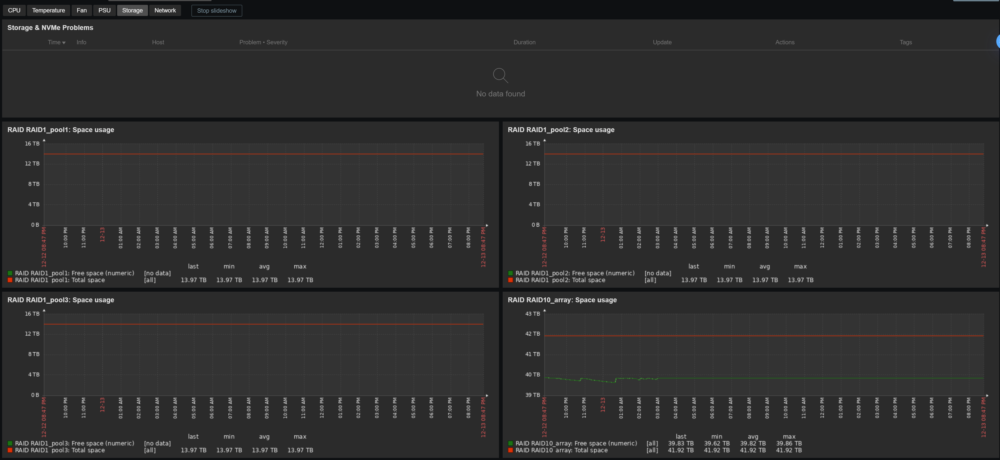
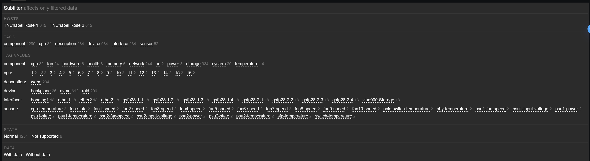

# MikroTik RDS2216 ROSE Storage Monitoring Template for Zabbix 7.4

[](https://www.zabbix.com/)
[](https://mikrotik.com/)
[]()

**Author:** `://echo@dla.network [oZark oRChes✝ra✝'d]` | [](https://github.com/DLA-neTWorK)

**Version:** 2.0.1 (2025-12-13)

## Overview

Enterprise-grade monitoring template for **MikroTik RDS2216-2XG-4S+4XS-2XQ ROSE** (RouterOS Enhanced Storage) storage switches. Provides comprehensive visibility into high-capacity NVMe RAID storage systems through dual monitoring methods: **SNMP** for system health and **REST API** for advanced 64-bit storage metrics.

### Key Features

- ✅ **64-bit Storage Metrics** - Accurate monitoring of 60TB+ RAID volumes (REST API eliminates SNMP 32-bit overflow)
- ✅ **Comprehensive NVMe SMART Monitoring** - 51 items per drive including temperature, wear level, critical warnings, data integrity
- ✅ **Advanced RAID Health Tracking** - State monitoring, space utilization, I/O performance, filesystem integrity
- ✅ **Complete System Health** - CPU, memory, temperatures, fan speeds, power consumption, network interfaces
- ✅ **Zabbix 7.4 Optimized** - Uses graph prototypes (no deprecated template-level graphs)
- ✅ **Interactive Dashboard** - 6 category-specific pages with 12 widgets, tag-based problem filtering, and dynamic graph prototypes
- ✅ **NOC-Ready Triggers** - 27 triggers with manual_close, severity-based alerting, detailed problem descriptions
- ✅ **Auto-Discovery** - 10 LLD rules for CPU cores, network interfaces, sensors, backplane, RAID arrays, NVMe drives

---


### Tested RAID Configurations

This template has been validated on the following RAID configurations:
- ✅ **RAID 0** - Striping for maximum performance
- ✅ **RAID 1+0 (RAID10)** - Mirrored stripes for performance and redundancy  
- ✅ **RAID 5** - Distributed parity for capacity and redundancy

All RAID types are fully supported with accurate health monitoring, capacity tracking, and failure detection.

### Tested NVMe Drives

- **SAMSUNG MZQL215THBLA-00A07** - Fully validated with all SMART metrics
- **Compatibility Note:** Any NVMe drive should work from a template compatibility perspective, however some SMART data may not be presented by certain vendor products due to differences in vendor-specific attribute implementations

---

## Monitoring Capabilities

### Black-Box Availability (SNMP)
- **ICMP Ping** - Network reachability with packet loss and latency tracking
- **SNMP Agent Health** - Availability monitoring with automatic fault detection
- **Uptime Tracking** - System and network uptime with restart detection

### Storage Monitoring (REST API - 64-bit Metrics)

#### Backplane PCIe Bridge Discovery (13 items per device)
- Model and PCIe interface identification (generation/speed)
- Interface speed monitoring (8GT/s tracking)
- I/O throughput (read/write bytes and operations)
- I/O performance (operation merges, in-flight operations)
- Queue statistics (wait time, active time)

#### RAID Array Discovery (36 items per array)
- **Health & State** - Active/degraded/resyncing/clean monitoring
- **Capacity** - Total/free space with 64-bit integer support (no overflow on 60TB+ volumes)
- **Utilization** - Space usage percentage with configurable threshold alerts
- **Configuration** - RAID type, UUID, chunk size, device count
- **Filesystem** - Type, mount point, read-only detection, inode tracking
- **I/O Performance** - Read/write operations/bytes/time/merges
- **Queue Statistics** - In-flight operations, wait time, active time, flush operations
- **TRIM/Discard** - Bytes/operations/merges/time for SSD lifetime tracking

#### NVMe Drive Discovery (51 items per drive)
- **Identification** - Model, serial number, firmware version, capacity
- **Interface** - PCIe type and speed in bps
- **Temperature** - Current, all sensors, critical/warning thresholds and timers
- **Health Metrics** - Available spare %, spare threshold, wear level, percentage used
- **Critical Warnings** - Data integrity errors, persistent memory region failures
- **SMART Statistics** - Power-on time, power cycles, controller busy time
- **Host I/O** - Read/write bytes and commands
- **RAID Membership** - Member state, failed status, role, master device
- **I/O Performance** - Read/write ops/bytes/time/merges, queue statistics
- **TRIM/Discard** - Bytes/operations/merges/time
- **Security** - TCG Opal self-encryption support and enabled status
- **Parent Device** - Device hierarchy tracking

### System Health Monitoring (SNMP)

#### Hardware Sensors (Auto-Discovery)
- **Temperature** - Board, CPU, fan, PSU, PCIe, PHY, SFP, switch (with critical/warning thresholds)
- **Fan Speed** - All fans and PSU fans in RPM
- **Voltage** - PSU input voltage monitoring
- **Power** - Per-PSU wattage consumption
- **Hardware State** - Fan/PSU failure detection

#### CPU and Memory
- Multi-core CPU load average per processor
- Memory utilization (used/total/percentage)
- High CPU and memory exhaustion alerts

#### Network Interfaces (Auto-Discovery)
- Operational status and link speed
- Traffic statistics (inbound/outbound octets)
- Error counters (inbound/outbound errors and discards)
- Interface utilization percentage
- Link status change and high error rate detection

#### System Information
- System description, firmware version, hardware model
- Serial number, system name, location, contact
- Firmware and configuration change detection

---

## Dashboard

**MikroTik RDS2216 ROSE Storage Overview** - Category-organized dashboard with 6 pages and 12 widgets, compatible with Zabbix 7.4



### Dashboard Structure

The dashboard is organized into **6 category-specific pages**, each containing:
- **Problems Widget** (top) - Filtered by component tag to show only relevant issues
- **Graph Prototype Widget** (bottom) - Displays all discovered metrics for that category

### Pages & Widgets

| Page | Problems Filter | Graph Prototype | Layout |
|------|----------------|-----------------|--------|
| **CPU** | `component:cpu` | CPU Utilization (8 columns) | 2 widgets (4+10 rows) |
| **Temperature** | `component:temperature` | Temperature Sensors (4 columns, 2 rows) | 2 widgets (4+10 rows) |
| **Fan** | `component:fan` | Fan Speeds (6 columns, 2 rows) | 2 widgets (4+10 rows) |
| **PSU** | `component:power` | Power Consumption (full width) | 2 widgets (4+10 rows) |
| **Storage** | `component:storage` | RAID Space Usage (full width, 2 rows) | 2 widgets (4+10 rows) |
| **Network** | `component:network` | Network Interface Traffic (4 columns, 3 rows) | 2 widgets (4+10 rows) |

### Dashboard Benefits

✅ **Category Isolation** - Each page shows only problems and graphs for that specific component  
✅ **Tag-Based Filtering** - Problems widgets use component tags for precise filtering  
✅ **Clean Organization** - No clutter, easy navigation between hardware categories  
✅ **Operational Focus** - NOC operators can quickly drill down to specific subsystems  
✅ **Scalability** - Adding new metrics automatically populates the relevant page  

### Tags Structure

The template uses component tags for organizing items and dashboard filtering:



---

## Trigger Summary (27 Total)

All triggers include `manual_close=YES` for NOC acknowledgment tracking.

### Storage Triggers

| Severity | Count | Examples |
|----------|-------|----------|
| **DISASTER** | 4 | RAID not active/clean, NVMe RAID member failed, critical warnings, data integrity errors |
| **HIGH** | 4 | NVMe spare critically low, temperature critical, filesystem read-only, hardware sensor failure |
| **AVERAGE** | 4 | RAID disk critically low (>90%), NVMe temp high, wear level high, SNMP unavailable |
| **WARNING** | 3 | RAID disk low (>80%), NVMe unsafe shutdown, high ICMP response time |

### System Triggers

| Severity | Count | Examples |
|----------|-------|----------|
| **HIGH** | 2 | ICMP unreachable, interface down, CPU critical |
| **AVERAGE** | 1 | Memory utilization high |
| **WARNING** | 5 | System restart, firmware changed, ICMP loss, interface speed degraded, interface errors |

### Trigger Design Philosophy

✅ **Manual Closure** - All triggers support manual acknowledgment for NOC tracking  
✅ **Clear Descriptions** - NOC-optimized problem/impact/actions sections for critical triggers  
✅ **Dependency Chains** - Prevents alarm floods during cascading failures  
✅ **Recovery Expressions** - Automatic clearing when values return to normal  

---

## Installation Guide

### Prerequisites

- ✅ Zabbix Server **7.4** or higher
- ✅ SNMP access to MikroTik RDS2216 (SNMPv2c or SNMPv3)
- ✅ HTTP/HTTPS access to MikroTik REST API (port 80 or 443)
- ✅ Network connectivity: ICMP, UDP 161, TCP 80/443
- ✅ Valid SNMP community string or SNMPv3 credentials
- ✅ Valid REST API user credentials

### Step 1: Import Template

1. Download `template_mikrotik_rose_rds2216.yaml`
2. Zabbix web interface → **Configuration** → **Templates** → **Import**
3. Select the template file
4. Verify import success (template ID will be assigned)

### Step 2: Configure MikroTik Device

```bash
# Enable SNMP
/snmp set enabled=yes

# Set SNMP community (replace with your Zabbix server IP)
/snmp community add name=public addresses=YOUR_ZABBIX_IP/32 read-access=yes

# Enable REST API
/ip service enable www
# Note: For production, consider using www-ssl instead (not covered in this tutorial)

# Create API user (use strong password)
/user add name=apiuser password=STRONG_PASSWORD group=read

# Configure system info (optional)
/snmp set contact="NOC Team" location="DataCenter-01"
```

### Step 3: Create Zabbix Host

1. **Configuration** → **Hosts** → **Create host**
2. **Host name:** `mikrotik-rds2216-01` (or your naming convention)
3. **Groups:** Add to appropriate host groups
4. **Interfaces:**
   - **SNMP Interface:** IP address, port 161, SNMPv2 with community string
5. **Templates:** Link template `MikroTik ROSE RDS2216`

### Step 4: Configure Macros

Set the following macros at **Host** or **Template** level:

#### Required API Macros

| Macro | Default | Description |
|-------|---------|-------------|
| `{$MIKROTIK.API.SCHEME}` | `http` | REST API protocol (`http` or `https`) |
| `{$MIKROTIK.API.PORT}` | `80` | REST API port (`80` for HTTP, `443` for HTTPS) |
| `{$MIKROTIK.API.USER}` | `apiuser` | REST API username |
| `{$MIKROTIK.API.PASSWORD}` | `changeme` | REST API password (**change this!**) |

#### Optional Threshold Macros

<details>
<summary>Click to expand threshold macros (18 total)</summary>

**Network:**
- `{$ICMP_LOSS_WARN}` = `20` - ICMP packet loss warning (%)
- `{$ICMP_RESPONSE_TIME_WARN}` = `0.15` - ICMP response time warning (s)
- `{$IF.ERRORS.WARN}` = `2` - Interface error rate warning
- `{$IF.UTIL.MAX}` = `90` - Interface utilization max (%)

**System:**
- `{$CPU.UTIL.CRIT}` = `90` - CPU utilization critical (%)
- `{$MEMORY.UTIL.MAX}` = `90` - Memory utilization max (%)
- `{$TEMP_WARN}` = `70` - Temperature warning (°C)
- `{$TEMP_CRIT}` = `80` - Temperature critical (°C)

**Storage:**
- `{$VFS.FS.PUSED.MAX.WARN}` = `80` - Disk space warning (%)
- `{$VFS.FS.PUSED.MAX.CRIT}` = `90` - Disk space critical (%)
- `{$VFS.FS.FREE.MIN.WARN}` = `20` - Free space warning (%)
- `{$VFS.FS.FREE.MIN.CRIT}` = `10` - Free space critical (%)
- `{$VFS.FS.WEAR.MAX.WARN}` = `80` - NVMe wear level warning (%)

</details>

### Step 5: Verify Data Collection

1. **Monitoring** → **Hosts** → Select your host → **Latest data**
2. ✅ Verify ICMP ping = `1` (up)
3. ✅ Verify SNMP data: System description, uptime, memory
4. ✅ Verify REST API discoveries:
   - **Backplane PCIe Bridge Discovery** (1 device, 13 items)
   - **RAID Array Discovery** (varies, 36 items per array)
   - **NVMe Drive Discovery** (5 drives, 51 items per drive)
5. ✅ Check **Monitoring** → **Dashboards** → **MikroTik RDS2216 ROSE Storage Overview**
6. ✅ Review graph prototypes for proper visualization

---

## Troubleshooting

### No SNMP Data Collected

**Symptoms:** System description, uptime, CPU, memory showing "No data"

**Solutions:**
1. Verify SNMP enabled: `/snmp print` (should show `enabled=yes`)
2. Test SNMP access from Zabbix server:
   ```bash
   snmpwalk -v2c -c public DEVICE_IP 1.3.6.1.2.1.1
   ```
3. Check firewall rules (allow UDP 161 from Zabbix server IP)
4. Verify SNMP community string matches Zabbix configuration
5. Review Zabbix server logs: `grep SNMP /var/log/zabbix/zabbix_server.log`

### No REST API Data (Storage Metrics)

**Symptoms:** Backplane, RAID, NVMe discoveries show no items

**Solutions:**
1. Verify API service enabled:
   ```bash
   /ip service print
   # Look for "www" service with enabled=yes
   # Note: For production, www-ssl is recommended (not covered in this tutorial)
   ```
2. Test REST API access from Zabbix server:
   ```bash
   curl -u apiuser:password http://DEVICE_IP/rest/disk
   ```
   Should return JSON array of disk objects
3. Check firewall rules (allow TCP 80/443 from Zabbix server IP)
4. Verify API credentials in Zabbix macros (check for typos)
5. Review Zabbix preprocessing errors:
   - **Configuration** → **Templates** → **MikroTik ROSE RDS2216** → **Discovery rules**
   - Click on discovery rule → **Item prototypes** → Check for red error icons
6. Check JavaScript errors in Zabbix server logs

### REST API Returns Empty Array

**Symptoms:** API works but returns `[]`

**Solutions:**
1. Verify storage devices exist:
   ```bash
   /disk print
   ```
2. Check if RAID array is created and active:
   ```bash
   /disk print detail
   ```
   Should show `type=raid` entries
3. Ensure NVMe drives are detected:
   ```bash
   /disk print where type=hardware
   ```
   Should show `slot-default=nvme0`, `nvme1`, etc.

### False Positive: RAID Array Not Active

**Symptoms:** Trigger fires with message "RAID {#RAID_SLOT} is not in active state"

**Normal State:** RAID state `clean` is **normal** and excluded from trigger expression

**Investigation:**
1. Check actual RAID state in **Latest data**:
   - Item: `RAID {#RAID_SLOT}: State`
   - Normal values: `active`, `clean`
   - Problem values: `degraded`, `resyncing`, `recovering`, `inactive`
2. If trigger fires on `clean`, verify trigger expression includes:
   ```
   {TEMPLATE:vfs.fs.raid.state[...].str(clean)}=0
   ```

### NVMe Critical Warning False Positives

**Symptoms:** Trigger fires but Latest Data shows empty value

**Normal State:** Empty string `""` or `none` indicates no warning (normal)

**Investigation:**
1. Check item value in **Latest data**:
   - Item: `NVMe {#NVME_DEVICE}: Critical warning`
   - Normal: Empty string or `none`
   - Problem: Any non-empty string (e.g., `pmr_unreliable`, `media_readonly`)
2. Trigger expression should include:
   ```
   {TEMPLATE:nvme.critical.warning[...].strlen()}>0 AND
   {TEMPLATE:nvme.critical.warning[...].str(none)}=0
   ```

### Incorrect Storage Capacity (Negative Values)

**Cause:** 32-bit SNMP integer overflow on volumes >2TB

**Solution:** This template uses **REST API** with 64-bit integers specifically to avoid this issue

**Verification:**
1. Check item configuration:
   - **Configuration** → **Templates** → **MikroTik ROSE RDS2216**
   - **Discovery rules** → **RAID array discovery**
   - **Item prototypes** → `RAID {#RAID_SLOT}: Total space`
   - **Type:** `Dependent item`
   - **Master item:** Should reference REST API HTTP agent item
2. If seeing negative values, ensure using REST API item (not SNMP hrStorage)

### Missing Temperature/Fan Sensors

**Cause:** Not all sensors available on all hardware revisions

**Solutions:**
1. Check available sensors on device:
   ```bash
   /system health print
   ```
2. Sensors are auto-discovered via LLD - only available sensors will be created
3. If sensors exist but not discovered:
   - Check **Temperature sensor discovery** LLD rule filters
   - Verify SNMP walk returns sensor data:
     ```bash
     snmpwalk -v2c -c public DEVICE_IP 1.3.6.1.4.1.14988.1.1.3
     ```

### High CPU Usage on Zabbix Server

**Cause:** Too many items polled too frequently

**Solutions:**
1. Increase polling intervals:
   - Navigate to template item prototypes
   - Change update intervals from `1m` to `5m` for non-critical items
2. Adjust history/trend retention:
   - Reduce storage period for high-volume items (network traffic)
3. Enable SNMP bulk requests (if supported by device)
4. Consider SNMP traps for event-driven monitoring (firmware changes, reboots)

---

## Technical Architecture

### Monitoring Methods

| Method | Purpose | Metrics | Advantages | Limitations |
|--------|---------|---------|------------|-------------|
| **SNMP** | System health | CPU, memory, sensors, interfaces | Standard protocol, universal support | 32-bit integers (2TB limit) |
| **REST API** | Storage metrics | Backplane, RAID, NVMe SMART | 64-bit integers, JSON format | MikroTik-specific |

### Data Collection Flow

```
┌───────────────────────────────────────────────────────────────┐
│                   MikroTik RDS2216 Device                     │
│  ┌───────────┐    ┌────────────┐     ┌────────────────────┐   │
│  │   SNMP    │    │  REST API  │     │    ICMP (ping)     │   │
│  │  Agent    │    │  Endpoint  │     │                    │   │
│  │ (UDP 161) │    │  (TCP 80)  │     │                    │   │
│  └─────┬─────┘    └──────┬─────┘     └──────────┬─────────┘   │
│        │                 │                      │             │
└────────┼─────────────────┼──────────────────────┼─────────────┘
         │                 │                      │
         ▼                 ▼                      ▼
┌───────────────────────────────────────────────────────────────┐
│                     Zabbix Server 7.4                         │
│  ┌────────────┐    ┌──────────────────┐     ┌──────────────┐  │
│  │   SNMP     │    │   HTTP Agent     │     │ Simple Check │  │
│  │  Poller    │    │ (JavaScript LLD) │     │ (ICMP Ping)  │  │
│  └─────┬──────┘    └─────────┬────────┘     └───────┬──────┘  │
│        │                     │                      │         │
│        ▼                     ▼                      ▼         │
│  ┌─────────────────────────────────────────────────────────┐  │
│  │            Database (PostgreSQL/MySQL)                  │  │
│  │  • 19 base items + ~110 discovered items                │  │
│  │  • 27 triggers with manual_close                        │  │
│  │  • 10 LLD rules (1h discovery interval)                 │  │
│  │  • 8 graph prototypes                                   │  │
│  │  • 1 dashboard (17 widgets)                             │  │
│  └───────────────────────────┬─────────────────────────────┘  │
│                              │                                │
│                              ▼                                │
│  ┌─────────────────────────────────────────────────────────┐  │
│  │          Frontend (Zabbix Web Interface)                │  │
│  │   • Latest Data • Graphs • Dashboards • Problems        │  │
│  └─────────────────────────────────────────────────────────┘  │
└───────────────────────────────────────────────────────────────┘
```

### Device Type Classification (REST API)

The template uses JavaScript preprocessing to classify devices from `/rest/disk`:

| Device Type | Filter Logic | Items/Device | Examples |
|-------------|--------------|--------------|----------|
| **Backplane** | `type=hardware` AND `slot-default=backplane` | 13 | PCIe bridge |
| **RAID Array** | `type=raid` | 36 | md0, md1, md2 |
| **NVMe Drive** | `type=hardware` AND `slot-default=nvme[0-9]+` | 51 | nvme0, nvme1, nvme2 |

### Discovery Rules (10 Total)


| LLD Rule | Method | Interval | Items | Graphs | Triggers |
|----------|--------|----------|-------|--------|----------|
| CPU discovery | SNMP | 1h | 2/core | 1 | 1 |
| Network interfaces | SNMP | 1h | 10/interface | 1 | 3 |
| Temperature sensors | SNMP | 1h | 1/sensor | 1 | 2 |
| Fan speed sensors | SNMP | 1h | 1/fan | 1 | 0 |
| Voltage sensors | SNMP | 1h | 1/sensor | 1 | 0 |
| Power sensors | SNMP | 1h | 1/sensor | 1 | 0 |
| Hardware state | SNMP | 1h | 1/sensor | 1 | 1 |
| Backplane discovery | REST API | 1h | 13/device | 0 | 0 |
| RAID array discovery | REST API | 1h | 36/array | 1 | 4 |
| NVMe drive discovery | REST API | 1h | 51/drive | 0 | 8 |

### Item Statistics

| Category | Base Items | Discovered Items | Total |
|----------|-----------|------------------|-------|
| ICMP | 3 | 0 | 3 |
| SNMP | 16 | ~30 (varies) | ~46 |
| REST API | 0 | 100 (1 backplane + 2 RAID + 5 NVMe) | ~100 |
| **TOTAL** | **19** | **~130** | **~149** |

### Polling Intervals

| Criticality | Interval | Item Types |
|-------------|----------|------------|
| **Critical** | 1m | ICMP ping, SNMP availability, system uptime |
| **High** | 5m | CPU, memory, temperatures, network traffic |
| **Normal** | 30m | Storage metrics, I/O statistics |
| **Low** | 1h | Inventory (model, serial, firmware), discovery rules |

### History & Trend Retention

| Data Type | History | Trends | Rationale |
|-----------|---------|--------|-----------|
| **High-frequency** (network traffic, I/O) | 7d | 365d | Reduce database size, keep long-term trends |
| **Medium-frequency** (CPU, memory) | 30d | 365d | Balance detail and storage |
| **Low-change** (inventory, config) | 90d | None | Reference data, no trending needed |

---

## Use Cases

### 🏢 Enterprise Storage Arrays
- Monitor high-capacity NVMe storage systems (60TB+ RAID arrays)
- Track RAID health and rebuild status in real-time
- Predict drive failures through SMART data trends (wear level, temperature, critical warnings)
- Monitor storage I/O performance for SLA compliance
- Capacity planning with historical space usage trends

### Data Center Infrastructure
- Centralized storage monitoring for virtualization clusters (VMware, Proxmox, Hyper-V)
- Track storage I/O latency and throughput for performance optimization
- Ensure redundancy and failover readiness with RAID state monitoring
- Environmental monitoring (temperature, power consumption) for cooling optimization
- Multi-tenant storage visibility with per-RAID capacity tracking

### High-Availability Systems
- Real-time RAID degradation and drive failure alerting
- Proactive NVMe replacement based on wear level thresholds
- Unsafe shutdown detection indicating power stability issues
- Critical warning monitoring (data integrity errors, persistent memory failures)
- Ensure 99.99%+ storage uptime for mission-critical workloads

### Network Operations Center (NOC)
- Clear fault identification with 4-tier severity system (DISASTER → WARNING)
- Manual acknowledgment tracking for incident management
- Comprehensive SMART data for Level 2/3 escalation
- Historical trending for root cause analysis
- Detailed troubleshooting data with 51 items per NVMe drive
- Dashboard-based overview for at-a-glance system health

---

## Version History

### v2.0.1 - Dashboard Reorganization (2025-12-13)

**Dashboard Enhancement:**
- ✅ Reorganized dashboard into 6 category-specific pages (CPU, Temperature, Fan, PSU, Storage, Network)
- ✅ Added tag-based problem filtering to each page (component:cpu, component:temperature, etc.)
- ✅ Improved operational focus with dedicated pages per subsystem
- ✅ Reduced from 17 widgets (mixed categories) to 12 widgets (organized by category)
- ✅ Each page contains: 1 problems widget (filtered) + 1 graph prototype widget
- ✅ Enhanced NOC workflow with cleaner navigation and category isolation

**Testing & Validation:**
- ✅ Validated on RAID 0, RAID 1+0 (RAID10), and RAID 5 configurations
- ✅ Confirmed accurate health monitoring across all RAID types
- ✅ Verified 64-bit capacity tracking on large volumes

**Author:** `://echo@dla.network [oZark oRChes✝ra✝'d]` | [](https://github.com/DLA-neTWorK)

### v2.0.0 - Production Release (2025-12-06)

**Major Rewrite:**
- ✅ Migrated from single SNMP discovery to type-specific REST API discoveries
- ✅ Added 3 separate LLD rules: Backplane (13 items), RAID (36 items), NVMe (51 items)
- ✅ Implemented 64-bit storage metrics via MikroTik REST API (eliminates 32-bit overflow)
- ✅ Fixed 32-bit INTEGER overflow on 60TB+ RAID volumes
- ✅ Added comprehensive NVMe SMART monitoring (51 items per drive):
  - Temperature (current, all sensors, critical/warning thresholds/timers)
  - Health (available spare, spare threshold, wear level, percentage used)
  - Critical warnings and data integrity errors
  - SMART stats (power-on time, power cycles, controller busy time)
  - Host I/O (read/write bytes and commands)
  - RAID membership (state, failed status, role, master device)
  - Security (TCG Opal encryption support/enabled)
- ✅ Added RAID health monitoring:
  - State detection (active, clean, degraded, resyncing, recovering)
  - Filesystem monitoring (type, UUID, mount point, read-only status, inodes)
  - I/O performance (ops, bytes, time, merges, queue stats, flush ops)
  - TRIM/discard tracking for SSD lifetime optimization
- ✅ Enhanced trigger logic:
  - RAID clean state properly excluded from "not active" trigger
  - NVMe empty critical warnings excluded (empty string = normal)
  - Manual_close=YES added to ALL 27 triggers
- ✅ Fixed data types:
  - Time values changed to TEXT (MikroTik format "11w2d17h")
  - Interface speed changed to FLOAT/bps for Gbps conversion
- ✅ Added comprehensive template documentation (15,515 characters)
- ✅ Created interactive dashboard (6 pages, 12 widgets, Zabbix 7.4 compatible)
- ✅ Removed deprecated template-level graphs (Zabbix 7.4 uses graph prototypes only)
- ✅ NOC-enhanced trigger descriptions for 12 critical triggers (RAID + NVMe)
- ✅ Total: ~149 items, 27 triggers, 5 value maps, 34 macros, 8 graph prototypes, 1 dashboard

**Author:** `://echo@dla.network [oZark oRChes✝ra✝'d]` | [](https://github.com/DLA-neTWorK)

### v1.0.0 - Initial SNMP Release

- Basic SNMP monitoring with HOST-RESOURCES-MIB
- Single storage discovery with 20 items
- Limited to 32-bit storage metrics (overflow on large volumes >2TB)
- Basic system health monitoring (CPU, memory, uptime)
- No REST API integration
- No NVMe SMART monitoring
- No comprehensive dashboard

---

## Support & Resources

### Template Maintainer

**Author:** `://echo@dla.network [oZark oRChes✝ra✝'d]` | [](https://github.com/DLA-neTWorK)

For template issues, customization requests, or enhancement suggestions, please contact the template maintainer.

### MikroTik Resources

- [RouterOS Documentation](https://help.mikrotik.com/docs/)
- [REST API Documentation](https://help.mikrotik.com/docs/display/ROS/REST+API)
- [MikroTik Support Portal](https://www.mikrotik.com/support)
- [MikroTik Forum](https://forum.mikrotik.com/)

### Zabbix Resources

- [Zabbix 7.4 Documentation](https://www.zabbix.com/documentation/7.4/)
- [Template Guidelines](https://www.zabbix.com/documentation/7.4/manual/appendix/templates)
- [JavaScript Preprocessing](https://www.zabbix.com/documentation/7.4/manual/config/items/preprocessing/javascript)
- [HTTP Agent Items](https://www.zabbix.com/documentation/7.4/manual/config/items/itemtypes/http)
- [LLD (Low-Level Discovery)](https://www.zabbix.com/documentation/7.4/manual/discovery/low_level_discovery)
- [Graph Prototypes](https://www.zabbix.com/documentation/7.4/manual/config/visualization/graphs/graph_prototypes)

### Community

- [Zabbix Share Templates](https://share.zabbix.com/)
- [Zabbix Community Forum](https://www.zabbix.com/forum/)
- [GitHub - Zabbix](https://github.com/zabbix)

---

## License & Usage

This template is provided for monitoring MikroTik RDS2216 ROSE storage switches in production environments. 

**License:** Community template - free to use, modify, and distribute  
**Attribution:** Please retain author attribution when sharing or modifying

Customize macros and thresholds as needed for your specific deployment. Share improvements with the Zabbix community.

---

## Quick Reference

### Template Metadata

| Property | Value |
|----------|-------|
| **Template Name** | MikroTik ROSE RDS2216 |
| **Template Groups** | MikroTik ROSE, Templates/Network devices |
| **Zabbix Version** | 7.4+ |
| **Monitoring Type** | SNMP + REST API + ICMP |
| **Device Type** | Storage/Network |
| **Vendor** | MikroTik |
| **Model** | RDS2216-2XG-4S+4XS-2XQ |

### Key Metrics at a Glance

| Metric | Source | Update Interval |
|--------|--------|-----------------|
| ICMP Ping | Simple check | 1m |
| SNMP Availability | SNMP | 1m |
| CPU Utilization | SNMP (per core) | 1m |
| Memory Utilization | SNMP | 5m |
| Temperature | SNMP | 5m |
| RAID State | REST API | 1m |
| RAID Space | REST API | 30m |
| NVMe Temperature | REST API | 5m |
| NVMe Wear Level | REST API | 1h |
| Network Traffic | SNMP | 5m |

### Macro Quick Reference

```bash
# Required API Configuration
{$MIKROTIK.API.SCHEME} = http
{$MIKROTIK.API.PORT} = 80
{$MIKROTIK.API.USER} = apiuser
{$MIKROTIK.API.PASSWORD} = your_password_here

# Common Threshold Adjustments
{$CPU.UTIL.CRIT} = 90              # CPU critical (%)
{$MEMORY.UTIL.MAX} = 90            # Memory max (%)
{$TEMP_WARN} = 70                  # Temp warning (°C)
{$TEMP_CRIT} = 80                  # Temp critical (°C)
{$VFS.FS.PUSED.MAX.WARN} = 80      # Disk space warning (%)
{$VFS.FS.PUSED.MAX.CRIT} = 90      # Disk space critical (%)
{$VFS.FS.WEAR.MAX.WARN} = 80       # NVMe wear warning (%)
```

### SNMP Test Commands

```bash
# Test SNMP access (replace with your community and IP)
snmpwalk -v2c -c public DEVICE_IP 1.3.6.1.2.1.1

# Get system description
snmpget -v2c -c public DEVICE_IP 1.3.6.1.2.1.1.1.0

# Get uptime
snmpget -v2c -c public DEVICE_IP 1.3.6.1.2.1.25.1.1.0

# Get CPU load
snmpwalk -v2c -c public DEVICE_IP 1.3.6.1.2.1.25.3.3.1.2

# Get memory
snmpwalk -v2c -c public DEVICE_IP 1.3.6.1.2.1.25.2.3.1

# Get temperature sensors (MikroTik MIB)
snmpwalk -v2c -c public DEVICE_IP 1.3.6.1.4.1.14988.1.1.3
```

### REST API Test Commands

```bash
# Test API authentication and disk data
curl -u apiuser:password http://DEVICE_IP/rest/disk

# Pretty print JSON
curl -u apiuser:password http://DEVICE_IP/rest/disk | python3 -m json.tool

# Get specific RAID array
curl -u apiuser:password http://DEVICE_IP/rest/disk | jq '.[] | select(.type=="raid")'

# Get all NVMe drives
curl -u apiuser:password http://DEVICE_IP/rest/disk | jq '.[] | select(.type=="hardware" and .["slot-default"] | test("nvme"))'

# Check backplane device
curl -u apiuser:password http://DEVICE_IP/rest/disk | jq '.[] | select(.["slot-default"]=="backplane")'
```

---

**Template Type:** Resource Monitoring (Storage/Network)  
**Vendor:** MikroTik  
**Device:** RDS2216-2XG-4S+4XS-2XQ ROSE Storage Switch  
**Monitoring Method:** SNMP + REST API  
**Zabbix Version:** 7.4+  
**Last Updated:** December 13, 2025

---

*Designed for enterprise storage monitoring with NOC-optimized alerting and comprehensive SMART data tracking.*
