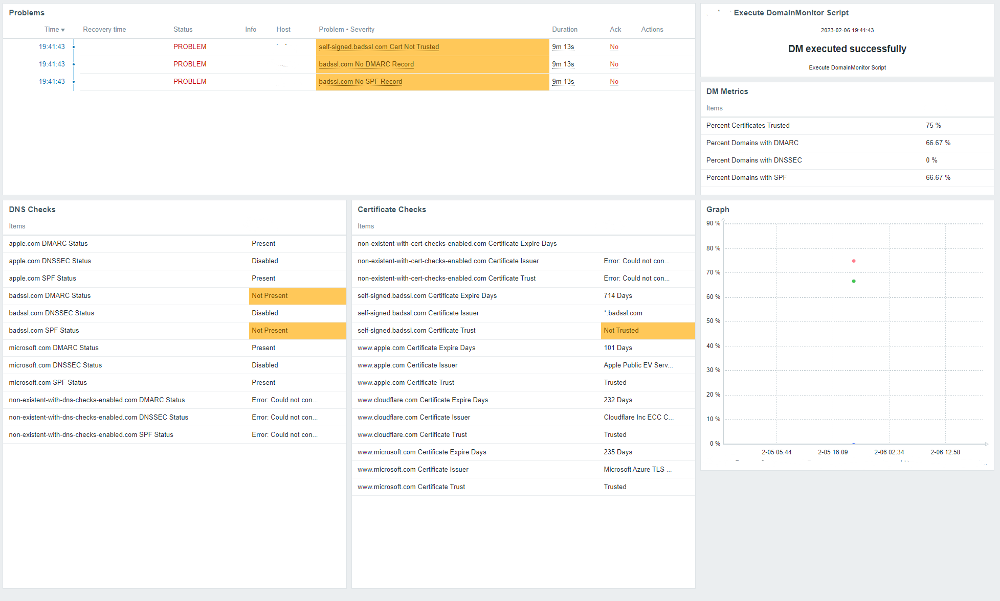
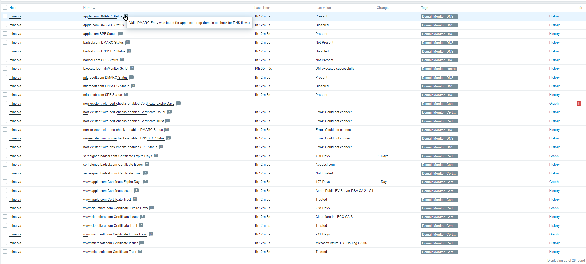
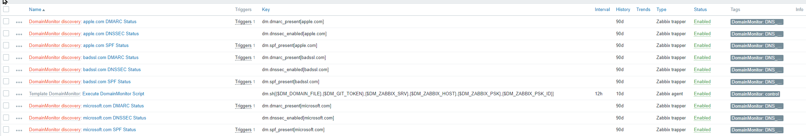

- [Overview](#overview)
  - [Supported Checks](#supported-checks)
  - [:chart: Zabbix Monitoring](#chart-zabbix-monitoring)
    - [Trigger Overview](#trigger-overview)
    - [Latest Data](#latest-data)
    - [Host Config after LLD](#host-config-after-lld)
- [:triangular\_ruler: General Workflow](#triangular_ruler-general-workflow)
  - [Technical (Zabbix) Details](#technical-zabbix-details)
- [:computer: Setup](#computer-setup)
  - [Prerequisites](#prerequisites)
  - [Agent](#agent)
  - [Zabbix configuration](#zabbix-configuration)
    - [Template links](#template-links)
    - [Discovery rules](#discovery-rules)
    - [Items collected](#items-collected)
    - [Triggers](#triggers)
- [:fast\_forward: Python Script standalone](#fast_forward-python-script-standalone)
    - [Tested on](#tested-on)


# Overview

Zabbix Template and Script: Executes the following checks on a list of domains in JSON file, add check results to JSON and sends the result of each check to Zabbix, updating status of items.

## Supported Checks
- DNS Checks
  - SPF Record present
  - DMARC Record present
  - DNSSEC enabled
- SSL Checks
  - Trusted certificate
  - Days before cert expire
  - Certificate Issuer


Check results can be sent to Zabbix server updating items.


## :chart: Zabbix Monitoring

### Trigger Overview

### Latest Data

### Host Config after LLD
  
  
<br/>
<br/>

> :information_source:
Script can also run without Zabbix. Only JSON output is generated in log file then.

**Input**
```

  "domains": [
    {
      "domain": "www.apple.com",
      "description": "sample subdomain to check for certs",
      "cert_checks": true,
      "dns_checks": false
    },
    ...
  ]
}
```
**Output**
```
{
  "domains": [
    {
      "domain": "www.apple.com",
      "description": "sample subdomain to check for certs",
      "cert_checks": true,
      "dns_checks": false,
      "check_results": {
        "cert_expire_days": 107,
        "cert_issuer": "Apple Public EV Server RSA CA 2 G1",
        "cert_trusted": "True"
      }
    },
    ...
  ]
}
```


# :triangular_ruler: General Workflow


|No|Description|
|---|-----------|
|1| JSON file with domains on webserver. File can also exist on github in a public / private repository for supporting devops workflows. For each domain, check types can be enabled individually. `dns_checks: true`, `cert_checks: true`. See [example domains](example_domains.json).|
|2|Zabbix Server downloads and parses domain file regulary using "low level discovery (LLD)" **script** function of Zabbix template.|
|3| LLD creates (trapper) items for each check / domain, waiting to be populated by script.|
|4|Zabbix triggers script on Zabbix agent regualary using userparameter of agent.|
|5|Python Script executes checks.|
|6|Script downloads same JSON domain file|
|7|Script starts checking domains|
|8|Script outputs JSON enriched with check results and sends result (unencrypted or PSK-encrypted) of each check to Zabbix Server, populating item. |

## Technical (Zabbix) Details
- Zabbix Template contains JS script for downloading and parsing domain file. This sources the Low-Level discovery (LLD)
- LLD creates trapper items for each domain check, waiting to be populated by python script from agent
- For triggering script execution, template creates a control item of type __Zabbix Agent__ using userparameter on agent machine
- On agent, python script with venv and dependencies needs to be installed
- .sh wrapper script with Zabbix input parameters is used for executing python script
- Script Parameters can be configured by following Zabbix Macros
  
|Macro|Description|
|------|-----|
|{\$DM_DOMAIN_FILE}|URL where to download domain json file|
|{\$DM_GIT_TOKEN}|If github private repo is used to maintain json file, a token for authentication can be provided for authorizing download|
|{\$DM_ZABBIX_SRV}|IP address of Zabbix Server where to send check results to|
|{\$DM_ZABBIX_HOST}|Display Name of agent on Zabbix server where template is applied to|
|{\$DM_ZABBIX_PSK}|If communication from agent to server is PSK encrypted, provide PSK here|
|{\$DM_ZABBIX_PSK_ID}|PSK Identity|

<br/><br/>

# :computer: Setup

## Prerequisites
- Agent needs to be able to connect to Internet: DNS `udp/53`, HTTPS `tcp/443`
- Agent: python > 3.6 installed

<br/>

## Agent
<details>
Execute following scripts on command line to install Python Script on your Linux Agent


>Create dirs
```console
DMPATH=/opt/ZabbixDomainMonitor
sudo mkdir $DMPATH
DMTMP=$(mktemp -d)

```

>Download latest script files from this repository and install it in prepared path. Clean temp afterwards.
```console

curl -LkSs https://api.github.com/repos/gitbock/ZabbixDomainMonitor/tarball --output-dir $DMTMP -o dm.tgz
sudo tar xvzf $DMTMP/dm.tgz -C $DMPATH --strip-components 1
sudo rm -fR $DMTMP

```

> Install needed dev libraries. Needed to build requirements in next step
```console
# Ubuntu
sudo apt install libssl-dev python3-dev python3-venv gcc

# RedHat
?
```


>Install python venv and requirements. Prepare log path
```console
sudo python3 -m venv $DMPATH/.dmvenv
sudo $DMPATH/.dmvenv/bin/pip3 install -r $DMPATH/requirements.txt
sudo mkdir $DMPATH/log
```

>Make sure zabbix user can access and execute required scripts
```console
sudo chown zabbix.zabbix -R $DMPATH
sudo chmod 755 $DMPATH/dm.py
sudo chmod 755 $DMPATH/dm.sh
```

> Install Zabbix User Parameter so server is able to execute script with "key". 
Note: 
> * Make sure you enabled the Statement `Include=/etc/zabbix/zabbix_agentd.conf.d/*.conf` in your `zabbix_agentd.conf`
> * Adapt path when using agent2 accordingly
```console
sudo cp $DMPATH/zabbix/userparameter_dm.conf /etc/zabbix/zabbix_agentd.d/
sudo chown zabbix.zabbix /etc/zabbix/zabbix_agentd.d/userparameter_dm.conf
sudo systemctl restart zabbix-agent
```

> Unfortunately a [bug](https://github.com/drbild/sslpsk/issues/11) is in sslpsk lib which rises an `AttributeError: _ssl._SSLSocket object has no attribute '_sslobj`. To fix this use the following command. Only needed if you use PSK encrypted communication from agent to server.

```console
sudo find $DMPATH -name sslpsk.py -exec sed -i "s/if sys.version_info >= (3, 5)/if (3, 5) <= sys.version_info <= (3, 7)/g" '{}' \;
sudo chown zabbix.zabbix -R $DMPATH
```

> Do a testrun by executing bash script with at least download URL as the Zabbix user.

```console
zabbix@agent# /opt/ZabbixDomainMonitor/dm.sh <URL with domains.json>
```
If you receive a `DM executed successfully` agent is ready :thumbsup:

Additionally you can check the log file `log/dm.log`
</details> 

<br/><br/>


## Zabbix configuration
1. Install Template by downloading and importing the [latest template file from this repo](https://github.com/gitbock/ZabbixDomainMonitor/blob/master/zabbix/template_domain_monitor.yaml) to your Zabbix Server.
2. Link Template on host you installed the script
3. Overwrite the {$DM_*} Macros on this host, reflecting your needs
4. Execute "DomainMonitor discovery" manually with "Execute now" to populate the items immediately
5. Wait a few seconds. Sometimes I needed to execute it twice. If Zabbix server can download and parse your domain file, trapper items appear for this host
6. Trigger the script by selecting the item "Execute DomainMonitor Script" with "Execute now" on the host.
7. Watch Latest Data if items are populated

<br/>

### Template links
[Zabbix Template](zabbix/template_domain_monitor.yaml)

### Discovery rules
|Name|Description|Type|Variables|
|----|-----------|-----|--------|
|DomainMonitor discovery|Downloads and parses domain file. Starting LLD|Script (JS)|`DM_DOMAIN_FILE`, `DM_GIT_TOKEN`|

### Items collected
*Items collected once*
|Name|Description|
|----|-----------|
|Percent Certificates Trusted|% of checked Domains with trusted certificate|
|Percent Domains with DMARC|% of checked Domains with valid DMARC DNS entry|
|Percent Domains with DNSSEC|% of checked Domains where DNSSEC is enabled|
|Percent Domains with SPF|% of checked Domains with valid SPF DNS entry|

<br/>

*Items collected per domain (LLD)*

|Name|Description|
|----|-----------|
|Certificate Expire Days|Days before cert. expires. Can be configured by Macro `{$DM_CERT_EXPIRE_WARN_DAYS}` |
|Certificate Issuer|Name of Issuer in Cert|
|Certificate Trust|Status of Trust by common browsers (!= self signed)|
|DMARC Status|Status of valid DMARC entry|
|DNSSEC Status|Status of DNSSEC of domain|
|SPF Status|Status of SPF entry of domain|


<br/>

### Triggers
Each trigger is created per domain.
|Name|Description|Default Severity|
|----|-----------|-----------------|
|Cert expires < days| Threshold of cert expire. Can be configured by macro `{$DM_CERT_EXPIRE_WARN_DAYS}` |`Average`|
|Cert Not Trusted	|Cert not trusted by common browsers / self signed cert. detected|`Warning`|
|No DMARC Record|DMARC entry was not detected for domain|`Warning`|
|No SPF Record|No SPF record was detected for domain|`Warning`|
|Cert Issuer Changed|Issuer of Cert differs from last check|`Average`|

<br/>


# :fast_forward: Python Script standalone
You may run the python script standalone from command line for testing or for just getting JSON output.
```console
# /opt/ZabbixDomainMonitor/dm.py -f https://your-server.com/domains.json
```

Following parameters can be used
|Parameter|Description|Example|Required|
|---------|-----------------|----------------|--------|
|-f|Domain file to download|GitHub Private Repo (Token needed, see "-a") <br/>`https://api.github.com/repos/gitbock/ZabbixDomainMonitor/contents/example_domains.json` <br/><br/>GitHub Public Repo<br/> `https://github.com/gitbock/ZabbixDomainMonitor/raw/master/example_domains.json`<br/> <br/>Regular HTTPS Server<br/> `https://your-server.com/domains.json` |Yes|
|-a|Github Token to download from private repo. Will be added as Authorization header when trying to download file|`github_pat_xxxxxxxxxxxx`|No|
|-s|Zabbix Server IP to send results to|`127.0.0.1`|No|
|-d|Zabbix Hostname which template is linked|`myAgent`|No|
|--psk|The PSK needed to authenticate the agent against the server|`4DfD7fA90000000000000...00000000000`|No|
|--psk-id|Id of PSK encrypted host.|`myAgent`|No|
|--log-stdout|Logs not only go into log file `log/dm.log` but also printed to console while script is executing. Fur debug reaons||No|
|-v|Verbose. Debug output in log file and stdout||No|


### Tested on
- Ubuntu LTS 22
- Zabbix 6.2 Server
- Zabbix Agent1 / Agent2


